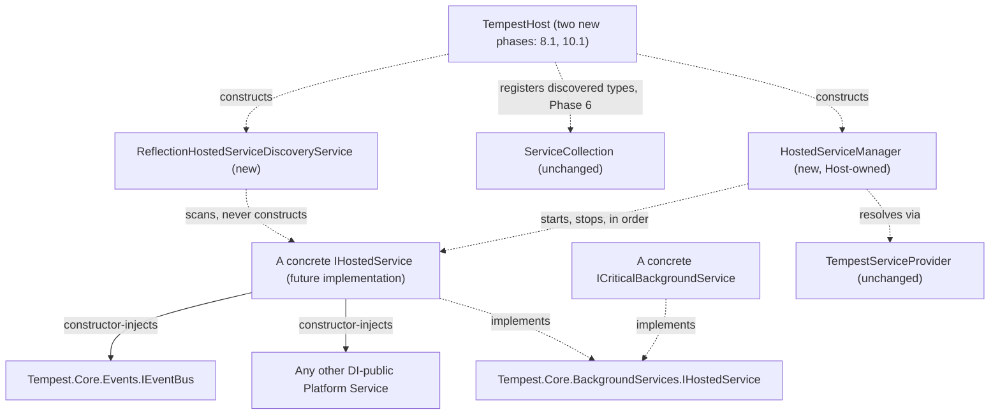

# Background Services Architecture

**Status: architecture only — WP 4.5 (design phase). No production code
exists yet.** This document is the design behind ADR-0029 and ADR-0030,
produced the same way `WP 2.7A`, `WP 4.2`, and `WP 4.4` each preceded their
own implementation phases: architecture first, implementation only once
every open question is actually settled, never implied.

## Objective

Design how long-running platform activities — background services —
integrate into the existing Runtime Host, completely: discovery, ownership,
construction, startup and shutdown ordering, failure classification,
threading, cancellation, diagnostics, and testing strategy, so that a
future implementation work package can proceed with every open question
already answered.

## Repository Investigation

Before proposing anything, this design traced exactly what already exists
and what a background service could, and could not, safely reuse.

**Two contracts already exist, unchanged since `WP 4.0`.**
`IHostedService` (`Tempest.Core.BackgroundServices`) — `StartAsync`/
`StopAsync`, each taking a `CancellationToken`. `ICriticalBackgroundService`
— an empty marker interface extending it, declaring Host-fatal treatment
per ADR-0021. Neither carries `Id`, `Name`, or `Version` — a hosted service
has no identity metadata at all, unlike `IModule`. Both remain untouched by
this design.

**Failure classification is already decided — ADR-0021.** Isolated by
default; Host-fatal only if a service declares itself critical. This
design does not reopen that decision; it mechanises it precisely (see
Failure Model, below).

**`TempestServiceProvider` has no multi-registration resolution.**
Confirmed directly against `TempestServiceProvider.cs`: `Resolve` looks up
exactly one `ServiceDescriptor` per requested `Type`. There is no
`IEnumerable<TService>` resolution capability, and RD-0019 already
establishes — for the Event Bus's own, structurally identical question —
that adding one would be a genuine, out-of-scope Dependency Injection
platform-service change. Any background-services design assuming the
container can enumerate "every registered `IHostedService`" would require
building this from scratch; this design does not.

**Reflection-based discovery is an established, twice-proven pattern.**
Module Discovery (`WP 2.1`) and Plugin Discovery (`WP 4.2`) both apply the
same four disciplines — filter before instantiating, impose deterministic
ordering, isolate per-candidate load failures, expose an `internal` test
seam — now named generally in `docs/academy/04 Design Patterns/
04-reflection-based-discovery.md`. This design reuses the pattern directly,
as a *new*, dedicated discovery service — never by extending
`ReflectionFrameworkDiscoveryService` itself (see Alternatives Considered).

**`IHostedService` carries no metadata, so discovery never needs to
instantiate a candidate.** `ReflectionFrameworkDiscoveryService`'s own
metadata probe exists *only* because `IModule` requires reading
`Id`/`Name`/`Version` before a `ModuleDescriptor` can be built — and that
probe is precisely what forced ADR-0027's `ModuleMetadataAttribute` to
exist, so a module needing constructor injection could avoid it. A hosted
service has no equivalent metadata to read, so its own discovery step
never instantiates anything at all — **a hosted service is constructor-
injectable from its first implementation, with no ADR-0027-shaped
prerequisite of its own.** This is a direct, concrete simplification this
investigation surfaced, not assumed going in.

**`Runtime Host Architecture.md`'s own Future Extensibility section already
named the intended phase placement**, since `WP 2.7A`: "would slot in
between Module Initialisation and Runtime Running at startup, and at the
front of Shutdown — started after modules are initialised, stopped before
modules are." ADR-0030 realises this sentence precisely.

**The Event Bus (`IEventBus`, ADR-0020/ADR-0028) already exists** as the
platform's one general-purpose, cross-component communication mechanism,
proven end-to-end (`WP 4.4D`/`WP 4.4E`). This design introduces no second
communication channel — a hosted service that needs to tell a module (or
another hosted service) something publishes through `IEventBus`, exactly
as `ClockModule` already does.

**Nothing in this investigation found a requirement this design would
need to duplicate.** Discovery, Registration, Dependency Injection, Module
Lifecycle, the Event Bus, Plugin infrastructure, cancellation, shutdown,
logging, and versioning are all reused exactly as they already exist —
this document introduces two new types (`IHostedServiceDiscoveryService`,
`IHostedServiceManager`) and two new Host Lifecycle phases, nothing more.

## Architecture

### Classification: a fourth, Host-owned category

Applying `docs/academy/02 Runtime Architecture/06-platform-layering.md`'s
own test — does this orchestrate the module pipeline, or does it merely
carry data/messages? — a background service is:

| Question | Answer |
|---|---|
| A Platform Service? | No. A module never resolves a *specific* `IHostedService` implementation via constructor injection — there is no legitimate reason for one module-facing component to hold a direct reference to another, exactly as ADR-0020 already forbids `Module A → Module B`. |
| A Module? | No. It does not implement `IModule`/`IModuleLifecycle`, is not driven by `ModuleLifecycleManager`, is not registered with `RuntimeModuleManager`, and has no `Id`. |
| A Host-owned runtime component? | **Yes.** Discovered via reflection, constructed via the DI container, orchestrated through a batch lifecycle with per-item failure isolation — structurally parallel to a Module, but a distinct kind of thing with its own, simpler contract and its own, new, Host-owned manager. |

The **orchestrator** (`IHostedServiceManager`) is Host-owned and never
DI-public — mirroring `ModuleLifecycleManager`'s own ADR-0017 status
exactly, for the identical reason: a module resolving it would gain a path
to start, stop, or enumerate background services directly. The
**individual hosted service instances** are ordinary DI-constructed
objects, free to consume any DI-public Platform Service, including
`IEventBus` — exactly as a module carrying `[ModuleMetadata]` already can.

### Ownership

| Concern | Owner | Notes |
|---|---|---|
| Discovering hosted service types | `IHostedServiceDiscoveryService` (Host-owned, constructed directly by `TempestHost`) | Never instantiates a candidate — no metadata to read. |
| Registering discovered types into the DI container | `TempestHost`, during the existing Platform Services Registered phase (Phase 6) | One new call, `services.Singleton(type, type)` per discovered type — the same Type-based overload `AddDiscoveredModules` already uses. No new phase. |
| Constructing the real, running instance | `TempestServiceProvider` | Resolved via `GetService(Type)`, exactly like any other self-registered singleton — including a module's own concrete type. |
| Starting and stopping, in order, with failure isolation | `IHostedServiceManager` (Host-owned, constructed directly by `TempestHost`) | Never registered into the `ServiceCollection` (ADR-0017's own reasoning, applied here). |
| A hosted service's own running work, once started | The service itself | Independent and concurrent with the Host's own `Running` state, with modules, and with every other hosted service. |
| Cross-component communication | `IEventBus` | Unchanged; no new channel introduced. |

No orchestration authority of any kind exists beyond `IHostedServiceManager`
itself — it cannot register a module, retrigger Discovery, or reach into
`ModuleLifecycleManager`, exactly as `ModuleLifecycleManager` itself cannot
reach into `RuntimeModuleManager`'s or Discovery's own internals beyond
their published contracts.

### Component Design

```csharp
namespace Tempest.Core.BackgroundServices;

public interface IHostedServiceDiscoveryService
{
    IReadOnlyList<Type> DiscoverHostedServiceTypes();
}

public sealed class ReflectionHostedServiceDiscoveryService : IHostedServiceDiscoveryService
{
    // Public constructor: scans AppDomain.CurrentDomain.GetAssemblies(), the
    // same default Module Discovery uses. Internal constructor: accepts an
    // explicit candidate-type list, mirroring
    // ReflectionFrameworkDiscoveryService's own established test seam.

    public IReadOnlyList<Type> DiscoverHostedServiceTypes()
    {
        // Filter: not an interface, not abstract, not an open generic type
        // definition, and typeof(IHostedService).IsAssignableFrom(type) - the
        // identical filter shape Module Discovery already applies, targeted at
        // a different candidate interface. Never instantiates a candidate:
        // there is no metadata to read, unlike Module Discovery's own probe.
        // Sorted ascending, ordinal, by Type.FullName - the deterministic
        // ordering key a hosted service has, since it carries no Id.
    }
}

public enum HostedServiceState
{
    Registered,
    Starting,
    Running,
    Stopping,
    Stopped,
    Failed,
}

public sealed class HostedServiceStatus
{
    // Immutable snapshot, mirroring ModuleLifecycleStatus's own shape.
    public Type ServiceType { get; }
    public HostedServiceState State { get; }
    public Exception? FailureReason { get; }
}

public interface IHostedServiceManager
{
    IReadOnlyCollection<HostedServiceStatus> Services { get; }

    Task StartAllAsync(CancellationToken cancellationToken);
    Task StopAllAsync(CancellationToken cancellationToken);
}

public sealed class HostedServiceManager : IHostedServiceManager
{
    // Constructed from the discovered Type list, the already-built
    // ITempestServiceProvider, and an optional ILogger? - the same shape
    // ModuleLifecycleManager's own constructor has, minus a RuntimeModuleManager
    // equivalent, since there is no separate "registration" stage or
    // duplicate-identity concept for this component to depend on.

    public Task StartAllAsync(CancellationToken cancellationToken)
    {
        // Sequential, ascending-by-FullName order, one service at a time,
        // awaited - mirroring ModuleLifecycleManager.RunBatchAsync exactly.
        // Isolated (non-critical) failure: caught, logged at Error, that
        // service's own HostedServiceStatus marked Failed, batch continues.
        // Critical failure (service is ICriticalBackgroundService): never
        // caught - propagates immediately, aborting the remainder of this
        // call, exactly as a platform-service failure aborts its own phase.
        // OperationCanceledException: never isolated, propagates uncaught,
        // checked between services, never mid-StartAsync call.
    }

    public Task StopAllAsync(CancellationToken cancellationToken)
    {
        // Identical shape to StartAllAsync, over the same list in reverse
        // order - mirroring modules' own StopAllAsync/DisposeAllAsync LIFO
        // teardown discipline.
    }
}
```

See ADR-0029 for the complete reasoning behind every one of these shapes,
and ADR-0030 for exactly where `StartAllAsync`/`StopAllAsync` are called
from within `TempestHost`'s own sequence.

### Dependency Diagram



Every arrow from a hosted service points down into `Tempest.Core` (Platform
APIs/Services layer) or across to `IEventBus`; nothing points back up. No
module, and no hosted service, ever references `HostedServiceManager` or
`ReflectionHostedServiceDiscoveryService` directly — both are Host-owned,
exactly as `RuntimeModuleManager`/`ModuleLifecycleManager` already are.

## Lifecycle Interaction

Two new phases, both occurring entirely within an existing `HostState`:

| Phase | Host State | Placement |
|---|---|---|
| 8.1 Hosted Services Started | `Starting` | Between Module Initialisation (8) and Runtime Running (9) |
| 10.1 Hosted Services Stopped | `Stopping` | Between Shutdown Requested (10) and Module Disposal (11) |

No new `HostState`, no new transition — see ADR-0030 for the complete
phase-by-phase entry/exit/failure specification, and `Runtime State
Machine.md` and `Host Lifecycle.md` (both updated as part of this design
phase) for the authoritative, current tables.

## Failure Model

Exactly ADR-0021, mechanised precisely:

- **Isolated (default).** A hosted service's `StartAsync`/`StopAsync`
  exception is caught, logged at `Error`, recorded on its own
  `HostedServiceStatus`, and the batch continues — identical in shape to
  `ModuleLifecycleManager`'s own per-module isolation.
- **Critical (`ICriticalBackgroundService`, opt-in).** The exception is
  never caught by the batch — it propagates immediately, resulting in
  `Starting → Faulted` (from `StartAllAsync`) or `Stopping → Faulted`
  (from `StopAllAsync`), exactly the transitions the Host's own failure
  model already defines for a platform-service failure or a genuine
  shutdown-time Host-level defect, respectively. No new Host-level
  catch/transition logic is required.
- **Cancellation.** `OperationCanceledException` is never isolated, from
  either method — checked between services, never mid-call.
- **Cleanup guarantees are unaffected.** `Faulted → Disposed` remains
  always legal (ADR-0004, ADR-0019); disposal of every module, and every
  hosted service that already started, is still attempted regardless of
  which phase produced the fault.

## Public Surface

| Type | Kind | New? |
|---|---|---|
| `Tempest.Core.BackgroundServices.IHostedServiceDiscoveryService` | Interface | Yes |
| `Tempest.Core.BackgroundServices.ReflectionHostedServiceDiscoveryService` | Sealed class | Yes |
| `Tempest.Core.BackgroundServices.HostedServiceState` | Enum | Yes |
| `Tempest.Core.BackgroundServices.HostedServiceStatus` | Sealed class | Yes |
| `Tempest.Core.BackgroundServices.IHostedServiceManager` | Interface | Yes |
| `Tempest.Core.BackgroundServices.HostedServiceManager` | Sealed class | Yes |

No change to `IHostedService`, `ICriticalBackgroundService`, or any other
existing public type. No new exception type: an isolated failure is caught
and recorded, never rethrown to anything that would need to catch it; a
critical failure propagates as whatever exception the service itself threw
— exactly how a platform-service failure already propagates unwrapped.

## Migration Strategy

**Nothing migrates — this is new capability.** No hosted service exists
today (the contracts are declared but unused); nothing needs to be
rewritten when this design is realised. Recommended implementation order,
mirroring `WP 4.4B`'s own precedent (prove a new mechanism against
dedicated test fixtures before touching the living reference module):

1. Implement `IHostedServiceDiscoveryService`/`ReflectionHostedServiceDiscoveryService`
   exactly as specified above, proven against dedicated test fixture types
   — never `ClockModule` or its companion.
2. Implement `IHostedServiceManager`/`HostedServiceManager` exactly as
   specified, proven against the same fixtures, including the isolated/
   critical failure distinction and reverse-order stop.
3. Wire both into `TempestHost.cs`'s existing sequence: one new call in
   Phase 6 (register discovered types), two new phases (8.1, 10.1) calling
   `StartAllAsync`/`StopAllAsync` respectively, and the Post-Fault Teardown
   path's own conditional `StopAllAsync` attempt.
4. Extend the sample module set (`WP 4.3`) with a background service
   demonstrating both the isolated-failure default and the critical
   opt-in, per `WorkPackages.md`'s own already-approved `WP 4.5`
   Deliverables — mirroring exactly how `WP 4.4E` extended `ClockModule`
   only after the Event Bus itself was implemented and proven.

## Testing Implications

Prospective — no test is written by this architecture-only work package.
When implemented, at minimum:

- **Discovery** finds hosted service types without constructing any of
  them (provable directly, since a candidate with a constructor that
  throws if ever invoked should discover successfully).
- **Deterministic ordering** — ascending by `FullName`, reproducible
  across repeated discovery passes.
- **Sequential start and stop**, proven the same way `WP 4.4D` proved
  `EventBus`'s own sequential dispatch: an in-flight-concurrency counter
  that never exceeds one, not merely call order.
- **Reverse stop order** relative to start order.
- **Isolated failure** — a throwing, non-critical service does not prevent
  its siblings from starting/stopping, and does not fault the Host.
- **Critical failure** — a throwing `ICriticalBackgroundService` results
  in `Starting → Faulted` (from start) or `Stopping → Faulted` (from
  stop), with disposal still reachable afterward.
- **Cancellation** propagates uncaught, checked between services.
- **Post-Fault Teardown** correctly tolerates `HostedServiceManager` never
  having been constructed (a fault occurred before Phase 8.1 ever ran).
- **End-to-end, through the real, unmodified `TempestHost`** — a hosted
  service starts after Module Initialisation and stops before Module
  Disposal, observably, mirroring `WP 4.4B`'s own `HostInjectedModule`
  console-capture proof pattern.

## Risks

- **This is the work package most likely to tempt a change to
  `TempestHost`'s core sequencing** (`WorkPackages.md`'s own, already-named
  risk for `WP 4.5`). Mitigated exactly as ADR-0026 mitigated the identical
  risk for Plugin Discovery/Loading: decimal sub-numbering, no
  renumbering, and every new phase's entry/exit/failure criteria specified
  with the same rigour every existing phase already has.
- **No monitoring of a hosted service's own work after `StartAsync`
  returns** — a disclosed, deliberate gap (ADR-0029's own Future
  Considerations), not an oversight. A service wanting to surface a later
  failure should do so via `IEventBus`.
- **No automatic restart/backoff for an isolated failure** — explicitly
  out of scope, per ADR-0021's own Future Considerations and RD-0029,
  below.

## Alternatives Considered

Recorded in full, with reasoning, in ADR-0029's own Decision and
Alternatives Considered sections, and permanently indexed as RD-0023
(DI multi-registration resolution), RD-0024 (a dedicated
`HostedServiceDescriptor` type), RD-0025 (extending
`ReflectionFrameworkDiscoveryService` itself), RD-0026 (active Host-level
monitoring of ongoing background work), RD-0027 (a new, dedicated
discovery/registration phase), RD-0028 (concurrent start of independent
services), and RD-0029 (automatic restart/backoff for isolated failures).

## Documentation Impact

- **New**: ADR-0029; ADR-0030; this document; a `WP 4.5` architecture-phase
  Academy retrospective; seven new Rejected Designs entries
  (RD-0023–RD-0029).
- **Updated**: `Host Lifecycle.md` (two new phases); `Runtime State
  Machine.md` (a short note confirming no new state/transition, mirroring
  ADR-0026's own equivalent update); `Failure Behaviour.md` (a new section
  and Required Behaviour Summary rows); `Ownership Matrix.md` (two new
  rows: `IHostedServiceDiscoveryService`, `IHostedServiceManager`);
  `Platform Service Map.md`'s Background Services entry; `Engineering
  Glossary.md`'s Background Service/Hosted Service entries;
  `docs/academy/Academy Index.md`; `docs/academy/Academy Masterclass
  Roadmap.md` (the "Background Services" candidate, if affected).
- **Not required**: no `Startup Sequence.md`/`Shutdown Sequence.md`
  sequence-diagram change beyond what a future implementation's own
  sequence-diagram update would add — this architecture-only phase does
  not redraw either diagram, since no code exists yet for either to depict
  precisely; both are flagged for the implementation phase's own
  Documentation Impact instead, exactly as `WP 4.2C`'s own architecture
  phase deferred `Startup Sequence.md`'s diagram update to `WP 4.2`'s
  implementation.

## Validation Against Governing Documents

- **`FOUNDATION.md`.** Every non-negotiable principle holds: one
  responsibility per component, unchanged (②) — `HostedServiceManager`
  starts and stops; it registers, discovers, or constructs nothing beyond
  what its own two methods do; no new externally-mutable state beyond an
  ordinary, immutable status snapshot (③); the platform-service/module
  failure boundary is extended, not reopened, by a fourth, precisely
  mechanised instance of the same pattern (④); disposal-order guarantees
  are preserved and extended symmetrically (⑤); dispatch is a batch
  operation with an Atomic-Phase-Principle-consistent cancellation
  boundary, identical in shape to the module pipeline's own (⑥); this is
  the release's ninth and tenth ADR-recorded decisions (⑦); dependencies
  flow downward only (⑨).
- **All existing ADRs.** ADR-0009 — not engaged; neither new type needs
  Composition Root treatment, since both are constructed with only what
  the container or the Host itself already has in hand. ADR-0013 —
  extended, not reopened, exactly as ADR-0021 already did. ADR-0017 —
  directly applied: `HostedServiceManager` is Host-owned and never
  DI-public, for the identical reason Discovery/Registration/Lifecycle
  are. ADR-0020/ADR-0023 — preserved; every dependency this design draws
  points downward. ADR-0021 — realised precisely, not altered. ADR-0026 —
  its own decimal sub-numbering precedent reused directly, exactly as that
  ADR's own Future Considerations anticipated. ADR-0027 — confirmed
  inapplicable here, for a stated, specific reason (no metadata to probe
  for), not silently assumed. ADR-0028 — the Event Bus reused as the one
  cross-component communication channel, not duplicated.
- **`Platform Services Architecture Review.md`.** Consistent with every
  strength that review confirmed; this document explicitly states which
  existing documents do and do not need updating, per that review's own
  Recommendation 3.

## Implementation Recommendation

**Design is sound; `WP 4.5` implementation may now begin.** No further
ADR is anticipated before it does. Recommended order: implement
`IHostedServiceDiscoveryService`/`ReflectionHostedServiceDiscoveryService`
and `IHostedServiceManager`/`HostedServiceManager` and prove both against
dedicated test fixtures first (mirroring `WP 4.4B`'s own precedent
exactly); wire both into `TempestHost.cs`'s existing sequence; only then
extend the sample module set with a background service demonstrating both
the isolated-failure default and the critical opt-in — the original
`WP 4.5` Deliverable, now fully specified.
