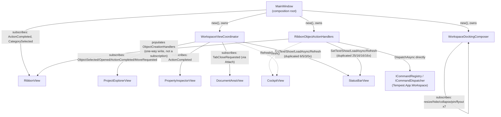

# Desktop Command & Event Wiring Architecture

**Status: Implemented — `WP 12.4A` (design, `ADR-0104`); `WP 12.4B`
(implementation). `WP 12.4B` applied this document's own
recommendations exactly: `RibbonObjectActionHandlers`'s own
report-then-refresh consolidation, and `WP 12.0B`'s own architecture
review Finding 5 closed in `UndoRedoCoordinator`/
`WorkspaceViewCoordinator`. No typed callback interface introduced —
`WorkspaceViewCoordinator`'s own genuine delegate-parameter count
reached `ADR-0104`'s own 3-callback threshold as a direct result of this
Work Package's own change, but introducing the interface in the same
change that crosses the threshold was assessed as speculative and
deliberately deferred; see the `WP12.4B` Academy retrospective §2.4.**

## Objective

Review the Desktop layer's own command, event, and UI-wiring
architecture as it stands *after* `WP 12.0B`'s `MainWindow`/
`EngineeringCockpit` decomposition (`ADR-0103`), to answer four
questions directly: what coupling and duplication remains; how Desktop
collaborators should communicate going forward, evaluated against six
named candidate mechanisms rather than assumed from precedent alone;
whether that evaluation rises to a genuine, lasting architectural rule
requiring a new ADR; and what — if anything — `WP 12.4B` should do about
the remaining duplication. This document is an investigation, a formal
evaluation, and a recommendation — it does not decide anything
`ADR-0103` has not already decided, and where it reaches a genuinely new
conclusion (see `ADR-0104`), that conclusion applies `ADR-0103`'s own
principles more specifically rather than replacing or narrowing them.

## Repository Investigation

**Every event declaration in `Tempest.Desktop`, catalogued directly**
(`grep -rn "public event" src/Tempest.Desktop/`): 25 plain
`Action`/`Action<T>` delegate-backed events across 13 files — `RibbonView`
(2), `ProjectExplorerView` (4), `PropertyInspectorView` (1),
`DocumentAreaView` (1), `CommandPaletteOverlay` (2), `ToastHost` (1),
`ObjectEditorView` (3), `DigitalThreadGraphView` (1), `DockingGrid` (3),
`PanelHostControl` (4), `CommandHistoryLog` (1), `BackgroundTaskRunner`
(1), `KeyboardCommandBindingProvider` (1) — plus `IUndoRedoStack.Changed`
in `Tempest.App.Workspace`. Zero custom `EventArgs` types anywhere;
every event is a bare delegate, consistent platform-wide.

**Zero event unsubscription anywhere in `Tempest.Desktop`** (`grep -rn "
-= " src/Tempest.Desktop/` — the only three matches are unrelated
`Vector` arithmetic in `DigitalThreadGraphModel`'s own force-directed
layout, not event handling). **Zero `IDisposable`/`IAsyncDisposable` on
any View or `Tempest.Desktop.Composition` collaborator** — the only
`IAsyncDisposable` in the entire project is `WorkspaceHost` itself,
disposed once, at process shutdown. Every `+=` subscription wired inside
`MainWindow`'s own constructor or a collaborator's own constructor lives
for exactly as long as `MainWindow` does.

**Command ownership is not one mechanism but four, each already
individually governed by an existing ADR, composing together for the
first time in one place after `WP 12.0B`:**

1. **`ICommandRegistry`/`ICommandDispatcher`** (`ADR-0036`–`ADR-0038`) —
   the canonical, discoverable command set, registered once per
   discipline inside `Tempest.App.Workspace.*.{Discipline}WorkspaceRegistration`
   (confirmed directly — zero `commandRegistry.Register` calls exist
   anywhere under `src/Tempest.Desktop/`). Invoked two ways: the Command
   Palette (`ADR-0070`) and the generic, user-configurable
   `KeyboardCommandBindingProvider`/`IInputBindingProvider` gesture-to-Id
   mechanism (`ADR-0100`).
2. **`RibbonView.ObjectCreationHandlers`** — a Desktop-local
   `Dictionary<string, Func<Task>>`, keyed by the identical
   `CommandDescriptor.Id` string, populated entirely by
   `RibbonObjectActionHandlers` (`WP 12.0B`). This is not a second
   registration mechanism for new commands — every handler in it
   collects the extra UI input (`InputDialog`/`ConfirmationDialog`) a
   *already-registered* command's own constructor needs, then dispatches
   that same command directly via `ICommandDispatcher.DispatchAsync`
   (never a second `ICommandRegistry.Register` call, never a duplicate
   `CommandDescriptor`). `RibbonView` itself falls back to an honest "needs
   additional input this ribbon does not yet collect" message for any
   `CommandDescriptor.Id` with no matching entry (confirmed directly,
   `RibbonView.cs`).
3. **`KeyboardShortcuts`/`KeyboardShortcutActions`** (`WP 10.0B`,
   extended `WP 10.2A`/`WP 10.6A`) — a small, fixed, hardcoded
   `KeyDown` handler for eight bindings (`Ctrl+K/Tab/Shift+Tab/W/F/Z/Y/D`)
   that are not Command Framework commands at all — pure Desktop UI
   actions (open palette, switch tab, close tab, focus filter, undo,
   redo, toggle favourite) invoked through a small delegate bundle
   `MainWindow` supplies once, at construction.
4. **`KeyboardCommandBindingProvider`** (`ADR-0100`) — the generic,
   additive `IInputBindingProvider` mechanism, handled deliberately
   *after* `KeyboardShortcuts` in `MainWindow`'s own `KeyDown` chain (a
   fixed binding always wins over a user-configured one for the same
   gesture, confirmed directly by source comment and ordering) — proof
   keyboard input is "just another" input-binding provider, not a
   fifth, special-cased mechanism.

None of these four is redundant with another; each answers a genuinely
different question ("what commands exist," "what does a Ribbon button
that needs input do," "what does a fixed navigation gesture do," "what
does a user-configurable gesture do"), and none was introduced or
changed by this investigation — `WP 12.4A` found this shape already in
place, spread across `WP 10.0B`–`WP 10.6A`'s own separate decisions, now
simply visible in one place because `WP 12.0B` gave each its own
collaborator instead of one shared 1,556-line file.

**A real, quantified duplication was found**, directly relevant to this
Work Package's own "duplicated event wiring" objective. The
four-statement sequence — report a result via `StatusBar.SetText` +
`ToastHost.Show`, then refresh `ProjectExplorerView.LoadAsync` +
`CockpitView.Refresh` — appears, by direct count:

| File | `SetText` | `Show` | `LoadAsync` | `Refresh` |
|---|---|---|---|---|
| `RibbonObjectActionHandlers.cs` | 25 | 16 | 16 | 16 |
| `WorkspaceViewCoordinator.cs` | 6 | 5 | 3 | 0 |
| `MainWindow.cs` | 4 | 2 | 4 | 3 |
| `QuickAccessToolbarFactory.cs` | 3 | 0 | 0 | 0 |
| `UndoRedoCoordinator.cs` | 2 | 2 | 2 | 0 |
| `WorkspaceLayoutPresetCoordinator.cs` | 2 | 0 | 0 | 0 |
| **Total** | **42** | **25** | **25** | **19** |

`RibbonObjectActionHandlers` alone accounts for well over half of every
column — expected, given it is the single largest, most mechanical
per-discipline extraction (`WP 12.0B`'s own retrospective already names
this), and every one of its ~29 handlers independently repeats the
identical four-line "report, then refresh" tail. This is real,
measured duplication, not a subjective impression.

## Architecture

### How interactions flow today, by surface

- **Explorer.** `ProjectExplorerView` raises `ObjectSelected`/
  `ObjectOpened`/`ActionCompleted`/`ObjectMoveRequested`, all consumed
  exclusively by `WorkspaceViewCoordinator` (`WP 12.0B`). `ObjectSelected`
  is the one genuinely cross-collaborator fan-out: it drives
  `PropertyInspectorView.SetCurrentSelection`/`Refresh` *and*
  `RibbonView.RefreshEnablement` *and* the composition root's own
  `RefreshStatusBar` delegate — three consumers from one selection
  change, all wired from the single `WorkspaceViewCoordinator`
  constructor, never duplicated elsewhere.
- **Inspector.** `PropertyInspectorView.ActionCompleted` is the only
  event it raises; consumed by `WorkspaceViewCoordinator` with the
  identical report-then-refresh tail named above. `PropertyInspectorView`
  itself exposes no other event — every other interaction (`SetCurrentSelection`,
  `Refresh`) is a `WorkspaceViewCoordinator`-initiated pull, not a push.
- **Document Area.** `DocumentAreaView.TabCloseRequested` is its only
  event, wired inside `WorkspaceViewCoordinator.Attach` (the two-phase
  construction point `WP 12.0B`'s own retrospective already documents).
  `DocumentAreaView` is otherwise a pure command target — `ShowTab`,
  `RemoveTab`, `MarkDirty`, `SetHomeTab`, `SelectNextTab`/
  `SelectPreviousTab` — called from `MainWindow`, `WorkspaceViewCoordinator`,
  `MainMenuFactory`, and `QuickAccessToolbarFactory` alike, never itself
  pushing state back except through that one event.
- **Ribbon.** `RibbonView.ActionCompleted`/`CategorySelected` are both
  consumed directly by `MainWindow` itself — the one place
  `Desktop Composition Architecture.md` already names as a genuine,
  irreducible cross-collaborator bridge (switching a Ribbon tab also
  switches the Navigation area, `BusyOverlay`-wrapped). `RibbonObjectActionHandlers`
  never subscribes to a `RibbonView` event at all — it only *populates*
  `ObjectCreationHandlers`, a one-way, constructor-time write, never a
  subscription.
- **Cockpit.** Never raises an event — every interaction is a
  constructor-supplied callback delegate (`onContinue`, `onOpenRecent`,
  `onOpenCommandPalette`, `onSwitchArea`, `onOpenFavourite`), and its own
  only externally-driven method is `Refresh()`, called from more call
  sites (19, per the table above) than any other single method in the
  Desktop layer — the closest thing this investigation found to a
  Desktop-local "everything changed" signal, always called explicitly,
  never implicitly propagated.
- **Status Bar.** A pure sink. Every one of its six public methods
  (`SetHint`/`SetText`/`SetProject`/`SetArea`/`SetDiagnostics`/
  `SetNotifications`) is a one-way write; it raises no event of its own
  and is never a source of coupling, only a (heavily-duplicated, see
  above) destination.
- **Menu / Quick Access Toolbar.** Both are stateless static factories
  (`MainMenuFactory`/`QuickAccessToolbarFactory`, `WP 12.0B`) — they
  raise no events (Avalonia `Click` handlers are wired, and discarded,
  entirely inside `Build`); every button's own action is either a
  directly-injected delegate (`applyPreset`, `resetLayout`,
  `navigateToObject`) or a direct call against an injected View/session
  object.
- **Docking.** `DockingGrid`/`PanelHostControl` raise seven events
  between them (resize × 3, hide/collapse/pin/flyout × 4 on each of
  three `PanelHostControl` instances) — all consumed exclusively by
  `WorkspaceDockingComposer` (`WP 12.0B`), which is itself the only
  collaborator that both raises no event of its own *and* is the sole
  subscriber to every Docking event that exists. This is the cleanest,
  most fully self-contained interaction surface found in this
  investigation.

### Wiring that remains in `MainWindow`, and why it should stay there

`ADR-0103`'s own Composition-root Responsibility 4 — "wires the
genuinely cross-collaborator bridges that have no single natural owner"
— is the direct test applied to every remaining `MainWindow`-level
subscription. Four survive it, and all four should remain exactly where
they are:

- `_ribbon.ActionCompleted`/`CategorySelected` — bridges Ribbon,
  `BusyOverlay`, Navigation, and `SetCurrentArea` (itself a bridge
  between `StatusBarView` and `RibbonView`); no single collaborator owns
  all three.
- `_commandPalette.InvokeOverride`/`CommandInvoked`/`CommandUnavailable`
  — bridges the Command Framework, the Macro/Background-Task subsystem,
  and Cockpit refresh; the identical shape.
- `_documentArea.PointerPressed`/`KeyDown` (`Escape`) — bridges Document
  Area input and `WorkspaceDockingComposer.CloseFlyout`; two-object
  bridge, correctly not owned by either object alone.
- `Opened`/`Closing` — the Window's own lifecycle, `ADR-0103`'s own
  Composition-root Responsibility 5 ("owns its own lifecycle"), naming
  no logic of its own beyond calling each collaborator's own save/
  refresh method.

No wiring found during this investigation belongs in a View instead of
a coordinator, and no coordinator was found holding wiring that
actually belongs in `MainWindow` — the composition-root/collaborator
boundary `WP 12.0B` drew holds up under this second, dedicated pass.

### Where delegates are preferable to events (and already are)

Every genuinely cross-collaborator need in the current codebase already
uses a delegate, not an event, exactly as `ADR-0103`'s own Dependency
rules require ("an event, a callback delegate, or a value passed once at
construction — never a direct field or constructor reference"):
`WorkspaceLayoutPresetCoordinator`'s `closeFlyout`, `MainMenuFactory`/
`QuickAccessToolbarFactory`'s `applyPreset`/`resetLayout`/
`navigateToObject`, `WorkspaceViewCoordinator`'s `refreshStatusBar`/
`recordHistory`. The one place this investigation found the *opposite*
choice — a genuine two-phase `Attach(...)` method taking a real object
reference where a delegate would have sufficed (`WorkspaceViewCoordinator`/
`UndoRedoCoordinator`'s own `CockpitView` dependency) — was already
identified and recorded as `WP 12.0B`'s own architecture review Finding
5, not rediscovered here; `WP 12.4B`, if commissioned, is the natural
place to apply that finding's own recommended fix.

### Remaining orchestration hotspots

**`WorkspaceViewCoordinator` remains the strongest candidate for further
decomposition** — already named as Finding 4 of `WP 12.0B`'s own
architecture review (five distinguishable reasons to change: navigation,
Object Editor content-building, drag-and-drop `Move*Command` dispatch,
Favourite toggling, dirty-aware document close, behind one 18-parameter
constructor). This investigation confirms that finding still holds and
adds one further, related observation: it is also where the highest
concentration of the report-then-refresh duplication *outside*
`RibbonObjectActionHandlers* lives (6/5/3/0 in the table above),
meaning any future split of this collaborator and any future
consolidation of the duplicated reporting tail are the same underlying
opportunity, not two independent ones.

**`RibbonObjectActionHandlers`, despite being the single largest file
(412 lines), is not a God Method by this project's own definition** —
`FOUNDATION.md` non-negotiable 2 names *exactly one reason to change*
as the test, and every one of its ~29 handlers changes for the
identical reason ("what a Ribbon button does per discipline," already
`ADR-0103`'s own illustrative characterisation, confirmed unchanged by
this investigation). Its size is the accepted cost `ADR-0103`'s own
Consequences section names directly ("more types, more files... is a
deliberate, accepted cost"), not a discovered defect.

**`MainWindow`'s own constructor (~370 lines) is not a God Method
either**, by the same test — every remaining line is either
collaborator construction (Composition-root Responsibility 3) or one of
the four sanctioned cross-collaborator bridges named above (Responsibility
4). `ADR-0103`'s own Consequences section already names the risk this
investigation was watching for directly: "a composition root's own
wiring code... can itself grow, if left unwatched, into the same kind of
sprawl this ADR is meant to prevent" — found not yet to have happened,
recorded here as a standing watch item for any future Work Package that
adds a new cross-collaborator bridge, not a present defect.

### Dependency Diagram

## Candidate Communication Mechanisms — Full Evaluation

Six mechanisms by which a Desktop collaborator could communicate with
another were evaluated directly, on their own individual merits, per
this Work Package's own explicit brief — not assumed settled by
`ADR-0103`'s more general "delegate over reference" rule alone. The
outcome of this evaluation is recorded formally in `ADR-0104`; this
section carries the full reasoning `ADR-0104` itself only summarises.

### 1. Direct delegates (the status quo since `WP 10.0B`)

`Action`/`Action<T>`/plain C# events — the mechanism every existing
cross-collaborator bridge catalogued above already uses.

- **Advantages.** Zero new abstraction. Compiler-checked — a missing or
  wrong-shaped delegate is a compile error, never a runtime discovery
  failure. A stack trace shows the real call chain directly, never
  dispatch machinery. Every collaborator's own dependency list is fully
  visible in its own constructor signature — nothing to go looking for
  in a separate registration site. Trivially testable: a plain lambda,
  no framework, matching this project's own "prefer real implementations
  over mocks" convention exactly.
- **Disadvantages.** The composition root's own wiring code grows
  linearly with the number of cross-collaborator bridges — `ADR-0103`'s
  own Consequences section already names this as an accepted, disclosed
  risk. No central place to discover "what wires to what" beyond reading
  `MainWindow`'s own constructor top to bottom. The report-then-refresh
  duplication this document's own Repository Investigation quantifies is
  a direct symptom.
- **Layering impact.** None — entirely internal to `Tempest.Desktop`'s
  own object graph.
- **Ownership/lifetime.** Exact match for `ADR-0103`'s own "Ownership
  and lifetime" section — a closure over composition-root-owned state,
  living exactly as long as the composition root.
- **Testing implications.** Simplest of all six options — construct with
  a test lambda directly.

### 2. Typed callback interfaces

A small, named interface (e.g. bundling several logically-related
callbacks one collaborator needs from another) in place of several
separate delegate parameters.

- **Advantages.** Self-documenting call sites. Bundles related operations
  behind one named contract, directly reducing constructor parameter
  count for a collaborator needing several related callbacks —
  `WorkspaceViewCoordinator`'s own 18-parameter constructor (`WP 12.0B`'s
  own architecture review Finding 4) is direct, present evidence of
  where this trade becomes worth making. Easier to stub with one test
  double for a multi-method bundle than several separate lambdas.
- **Disadvantages.** A new named type must be introduced and maintained
  per genuinely distinct bundle — more files, one more hop between a
  call site and its real implementation than a delegate's own inline
  lambda gives. Risks becoming a shadow, informal container of small
  interfaces if overused, in tension with `ADR-0103`'s own "smallest
  public surface... never a surface sized for a hypothetical future
  caller" collaborator responsibility. Does not, by itself, remove the
  composition root's own wiring burden — only renames it (someone must
  still implement and construct whatever satisfies the interface).
- **Layering impact.** None — entirely internal to `Tempest.Desktop`.
- **Ownership/lifetime.** Unchanged from Option 1 — whichever object
  implements the interface (typically `MainWindow` itself, or a thin
  adapter it owns) holds it for the identical lifetime.
- **Testing implications.** Slightly better than Option 1 for a genuine
  multi-callback bundle; unnecessary ceremony below that threshold, where
  a single delegate already reads at least as clearly.

### 3. Desktop-local Mediator

A hand-rolled or third-party (e.g. MediatR-shaped) in-process request/
handler dispatch mechanism — a collaborator "sends" a request; the
Mediator resolves and invokes the handler.

- **Advantages.** Removes the composition root from needing to know
  every concrete pairwise wiring directly; one discoverable dispatch
  point; can reduce `MainWindow`'s own constructor line count on paper.
- **Disadvantages.** Needs some mechanism to route a request to its
  handler — either a runtime registry the composition root must still
  populate handler-by-handler (moving `MainWindow`'s own wiring code
  sideways into a different collaborator's own constructor, in a more
  generic, harder-to-read shape, without actually removing it), or
  reflection-based auto-discovery of handler implementations, which *is*
  the "declarative/reflective composition" `ADR-0103` already rejects
  for lacking a genuine extensibility trigger — this platform has one
  fixed, small, compile-time-known Desktop composition root, not an
  open, third-party-extensible set of request handlers. Either shape
  directly regresses `ADR-0103`'s own named, structural testability
  benefit: a collaborator that "sends" through a Mediator needs a
  working, populated Mediator instance to test in isolation, not a plain
  lambda. A stack trace through generic dispatch machinery is strictly
  less debuggable than a direct call, the identical argument `ADR-0103`
  already makes for plain `new` construction over reflection.
- **Layering impact.** No hard violation required, but real risk: shared
  request/response contracts tend to accumulate in a common location,
  risking a de facto Platform API for something that is not a platform
  capability.
- **Ownership/lifetime.** A Mediator instance would itself need to be a
  `new`-constructed, `ADR-0103`-compliant collaborator — but its own
  internal handler registry is, in substance, the identical dictionary
  of handler delegates the composition root already populates one by
  one today, wearing a more generic, less direct shape.
- **Testing implications.** Materially worse than Options 1–2 for this
  project's own "prefer real implementations over mocks" convention —
  every test needs a real, populated Mediator instance, not a bare
  lambda.
- **Verdict: rejected** — `ADR-0104`.

### 4. Desktop-local Command Dispatcher

A second, Desktop-scoped `ICommandDispatcher`-shaped abstraction for
purely Desktop-local UI actions (open palette, switch tab, toggle
favourite), distinct from the real, platform-wide `ICommandDispatcher`.

- **Advantages.** Would unify `KeyboardShortcuts`' own eight fixed UI
  actions with the report-then-refresh pattern under one dispatch shape,
  giving every Desktop-local action a `CommandResult`-shaped return
  value consistent with the real Command Framework's own reporting
  shape.
- **Disadvantages.** The real `ICommandRegistry`/`ICommandDispatcher`
  already exists and already serves every genuinely discipline-facing
  command. A second, Desktop-scoped dispatcher directly risks the exact
  confusion `ADR-0070`'s own "no second registration mechanism" rule
  exists to prevent — a future contributor would need to learn which of
  two dispatchers a given action goes through, and why. `ADR-0099` (a
  Macro is a registered Command) already made the deliberate, general
  choice to route even a Desktop-triggered action through the *single*
  real Command Framework specifically to avoid inventing a parallel
  mechanism — a Desktop-local Command Dispatcher would directly
  contradict that already-established unification.
- **Layering impact.** No hard violation required, but real risk of the
  new dispatcher's own "command" contracts drifting toward looking like
  Platform API types, blurring the Platform-Service/Desktop-local
  boundary `ADR-0023` protects.
- **Ownership/lifetime.** Would be `ADR-0103`-compliant in shape as a new
  collaborator, but reduces no existing wiring — every UI action still
  needs individual registration into it by `MainWindow`, an equivalent
  amount of code moved sideways, not removed.
- **Testing implications.** Roughly neutral to slightly worse — a
  `CommandResult`-shaped return adds ceremony `KeyboardShortcutActions`'
  own plain `Action` bundle does not need for eight fixed,
  always-succeed UI gestures.
- **Verdict: rejected** — `ADR-0104`.

### 5. Desktop-local Event Dispatcher

A Desktop-scoped analogue to `Tempest.Core.Events.IEventBus`, for
purely Desktop-internal publish/subscribe.

- **Advantages.** Would let a collaborator publish a Desktop-local event
  without knowing its own consumers in advance — potentially useful if
  the number of cross-collaborator bridges keeps growing.
- **Disadvantages.** `Tempest.Core.Events.IEventBus` already exists,
  already a Platform Service (`ADR-0028`), already consumed by a real
  Desktop bridge (`PlatformNotificationToastBridge`) for the one
  genuinely platform-wide case. A second, Desktop-only event bus would
  either misuse that platform-wide channel for a purely Desktop-local
  concern it was never scoped for, or stand up an entirely new, parallel
  pub/sub mechanism for a fixed, small, known-in-advance set of
  publishers and subscribers — the identical "no genuine extensibility
  trigger" judgement `ADR-0103`/`ADR-0032` already reach, applied a
  further time. Publish/subscribe also structurally weakens `ADR-0103`'s
  own "smallest public surface... never a surface sized for a
  hypothetical future caller" rule: a published event's own consumer
  list becomes invisible at the publish site, the opposite of the
  delegate model's own "read the constructor, see every consumer"
  property this document's own Repository Investigation confirmed holds
  for every existing cross-collaborator bridge today.
- **Layering impact.** Real risk of misusing `IEventBus` for a
  Desktop-local concern, or duplicating platform-wide pub/sub machinery
  unnecessarily.
- **Ownership/lifetime.** `ADR-0103`-compliant in shape as a new
  collaborator, but every publish/subscribe pair still needs the
  composition root to wire at least the subscription side — moved, not
  removed.
- **Testing implications.** Worse than Options 1–2 — asserting "did the
  right handler run" through a generic bus requires inspecting its own
  internal subscriber list or triggering a real publish and observing
  side effects indirectly, both noisier than a direct lambda assertion.
- **Verdict: rejected** — `ADR-0104`.

### 6. Existing platform command/event abstractions, reused for Desktop-local wiring

Routing new, purely Desktop-local, single-consumer wiring through the
already-existing `ICommandRegistry`/`ICommandDispatcher` or `IEventBus`
directly, rather than a plain delegate.

- **Advantages.** Zero new abstraction — both already exist, already
  proven, already governed by their own ADRs.
- **Disadvantages.** Both are genuinely scoped to platform-wide concerns
  — discoverable commands any module could theoretically invoke;
  platform-wide notifications. Reusing either for a purely Desktop-local,
  UI-internal refresh signal would misclassify Desktop-local wiring as a
  platform capability — the identical misclassification `ADR-0103`'s own
  "Why this pattern is preferred over service extraction" section
  already warns a DI-registered collaborator against, reached here for
  reusing an *existing* platform service for the same wrong reason
  rather than registering a *new* one. `IEventBus` in particular is
  already consumed by real Modules platform-wide — publishing purely
  Desktop-internal UI refresh signals onto it would pollute a
  platform-wide channel with Desktop-only noise.
- **Layering impact.** Real risk of violating `ADR-0023`'s own layering
  if misapplied to new, Desktop-local wiring — **not** a criticism of the
  framework's own existing, genuinely platform-wide uses, which remain
  correct and unaffected.
- **Ownership/lifetime.** Both are Platform Services (`ADR-0009`-governed,
  DI-resolved) — routing new Desktop-only, single-consumer wiring through
  either repeats, on a technicality, the exact misclassification
  `ADR-0103`'s own "What must never be registered in DI" section already
  forecloses in spirit.
- **Testing implications.** Using the real `ICommandDispatcher`/
  `IEventBus` for a purely Desktop-local signal would require a real,
  running platform (or a stub of one) to test something that, as a plain
  delegate, needs neither.
- **Verdict: already correctly used exactly where it belongs** (real
  cross-discipline commands via `ICommandDispatcher`; the one genuinely
  platform-wide notification bridge via `IEventBus`); **should not be
  extended to new, purely Desktop-local wiring** — `ADR-0104`.

### Recommendation

**Options 1 and 2, combined, as codified in `ADR-0104`: direct delegates
as the default, a small typed callback interface only at three or more
genuinely related, bundled callbacks. Options 3, 4, and 5 rejected
outright. Option 6's existing, correct uses are unaffected; it is not
extended to new Desktop-local wiring.** This is not a restatement of the
status quo — it is the status quo, checked against five concrete named
alternatives on their own individual merits, plus one new, specific
threshold (three-or-more-callbacks) this codebase has not previously
stated explicitly.

## Lifecycle Interaction

**No new Host Lifecycle phase, no new `HostState`, no new transition —
unchanged from `ADR-0103`/`Desktop Composition Architecture.md`.** This
investigation's own new finding is narrower and Desktop-local: every
`+=` subscription in the entire Desktop layer is wired once, at
`MainWindow`/collaborator construction, and never explicitly torn down.
This was found to be *safe today*, not merely unexamined: `ADR-0103`'s
own "Ownership and lifetime" section already establishes that a
collaborator's lifetime is exactly `MainWindow`'s own lifetime, and
exactly one `MainWindow` is ever constructed per process — there is no
scenario in the current codebase where a second `MainWindow` (or a
second instance of any collaborator) is constructed while a first one's
subscriptions are still live, so no leak is possible in practice. This
is recorded here as a **deliberate, disclosed design characteristic**
("single-instance Window, process-lifetime subscriptions, no manual
teardown needed") rather than a defect silently found and left
unaddressed — satisfying `FOUNDATION.md`'s own transparency
requirement without inventing a disposal mechanism this platform does
not need today.

## Failure Model

**No new category.** Every event handler and every `RibbonObjectActionHandlers`
entry already reports failure through the identical, pre-existing
Status Bar/Toast path (`ADR-0013`'s platform-service/module boundary
and `Failure Behaviour.md`'s own table are both unaffected — this
investigation is about *wiring shape*, not failure classification,
mirroring `Desktop Composition Architecture.md`'s own identical
disclaimer).

## Testing Strategy for `WP 12.4B`

Should `WP 12.4B` be commissioned to act on this document's own
findings:

- **Any consolidation of the duplicated report-then-refresh tail**
  (the 42/25/25/19 pattern) should be proven behaviour-preserving the
  same way `WP 12.0B` already proved its own extraction: characterization
  tests against the current, real `StatusBar`/`Toast`/`Explorer`/
  `Cockpit` text and refresh calls, captured *before* any consolidation,
  re-run unchanged after.
- **Any further split of `WorkspaceViewCoordinator`** should follow the
  identical two-phase-construction discipline `WP 12.0B` already
  established (or better: prefer a delegate over a nullable-field
  `Attach`, per that Work Package's own Finding 5) and should not
  introduce a sibling-collaborator reference between the resulting
  pieces (`ADR-0103`'s own dependency rule, unconditionally).
- **No collaborator isolation test is expected to change shape** — every
  collaborator remains constructible and testable in isolation, without
  `MainWindow`, exactly as `Desktop Composition Architecture.md`'s own
  Testing Strategy already established; this investigation found nothing
  that weakens that claim.

## Open Questions Requiring Implementation Validation

1. **Does any Desktop-owned event handler ever fire after `WorkspaceHost.ShutdownAsync`
   has begun tearing down the `Workspace` it reads from?** This
   investigation is read-only and could not exercise the real shutdown
   race directly; `WP 12.4B` (or a dedicated hardening pass) should
   confirm this against a real, running `WorkspaceHost` before treating
   the "no disposal needed" conclusion above as final for every code
   path, not only the ones inspected here.
2. **Is a shared `CommandFeedback`-shaped helper (mirroring `CockpitFormatting`'s
   own already-precedented "shared, stateless, not itself a collaborator"
   shape) the right consolidation for the report-then-refresh
   duplication, or would it hide meaningful per-handler variation
   (some handlers skip the Toast, some skip the Cockpit refresh) behind
   a one-size-fits-all call?** This document deliberately stops short of
   designing that helper — an implementation-stage judgement, per
   `ADR-0103`'s own Future Considerations, not an architecture decision
   this document should make in advance of real code.
3. **Should `WorkspaceViewCoordinator`'s further split (Finding 4, `WP
   12.0B`) happen as part of the same `WP 12.4B` that consolidates the
   duplicated reporting tail, or separately?** Both touch the same file;
   this document does not decide the sequencing.

## Required ADRs

**`ADR-0104`** — required, and produced. `ADR-0103` already fully
governs the composition-root/collaborator *shape* this investigation
re-checked (confirmed intact: sibling-collaborator isolation, zero
DI-registration, downward-only dependencies) — that part of this
Work Package's own brief confirms no gap. But this Work Package's own
explicit brief asked a second, genuinely open question `ADR-0103` does
not itself answer at the same level of specificity: evaluated on their
own individual merits, are any of five *named* alternatives to "delegate
or callback" — a typed callback interface, a Desktop-local Mediator, a
Desktop-local Command Dispatcher, a Desktop-local Event Dispatcher, or
reuse of the existing platform-wide Command/Event Framework — the right
choice for Desktop cross-collaborator communication going forward? That
evaluation (§ Candidate Communication Mechanisms — Full Evaluation,
above) reached a genuine, lasting conclusion with real teeth: three
concrete future temptations (Mediator, second Command Dispatcher, second
Event Dispatcher) are explicitly foreclosed, not merely left to be
re-derived from `ADR-0103`'s more general principle under time pressure;
one new, specific threshold (three-or-more-bundled-callbacks) is stated
for the first time. This meets Engineering Governance §5's own
ADR-creation criteria directly — a genuine, evaluated either/or choice,
with a rationale a future contributor needs recorded, not merely
implied — and is recorded in `ADR-0104`, which applies `ADR-0103`'s own
principles more specifically rather than replacing, narrowing, or
superseding them (`ADR-0104`'s own explicit boundary statement, mirroring
`ADR-0103`'s own boundary statement against `ADR-0009`).

The two other, narrower findings this investigation separately raised —
the quantified report-then-refresh duplication, and the
zero-unsubscription characteristic — remain implementation-hygiene and
documentation questions, not further architectural decisions: neither
changes the composition-root/collaborator pattern, neither introduces a
new dependency direction, and both are already fully addressed by
`ADR-0104`'s own default (direct delegates) plus this document's own
Open Questions, below — no second ADR is warranted for either.

## Alternatives Considered

**A Desktop-local Mediator, Command Dispatcher, or Event Dispatcher**,
each evaluated in full above (§ Candidate Communication Mechanisms) and
each rejected — recorded formally in `ADR-0104`, not restated here.

**A single, hand-authored helper method** (e.g. `ReportAndRefresh(message,
succeeded)`) shared by every `RibbonObjectActionHandlers` entry and
`WorkspaceViewCoordinator`'s own handlers. Not rejected — named directly
in Open Question 2 above as the leading candidate, deliberately left as
an implementation-stage decision for `WP 12.4B` rather than designed in
full here, consistent with `ADR-0103`'s own established boundary between
what an architecture document decides and what an implementation Work
Package works out.

**Doing nothing.** Rejected as a blanket answer — the duplication is
real and quantified, and `FOUNDATION.md`'s own "document a contradiction
honestly" discipline argues against simply not naming it. Accepted,
narrowly, for the "God Method" question specifically: `MainWindow` and
`RibbonObjectActionHandlers` were both investigated directly and found
not to meet that bar today, so no action is recommended for either.

## Documentation Impact

**New**: this document; `ADR-0104`; a `WP 12.4A` Academy retrospective.

**Updated**: `ADR Register.md`; `Architecture Document Register.md`;
`Documentation Register.md`; `Academy Register.md`;
`docs/releases/v0.12.0/WorkPackages.md` (new `WP 12.4A` row);
`PROJECT_STATUS.md`.

**Not required**: no `Namespace Register.md` change — this Work Package
introduces no code, and no new namespace. No `Host Lifecycle.md`/
`Runtime State Machine.md`/`Failure Behaviour.md` change (see Lifecycle
Interaction/Failure Model, above). No `Interface Register.md`/`Module
Register.md`/`Test Register.md`/`Architectural Dependency Register.md`
change — architecture only, no code.

## Validation Against Governing Documents

- **`ADR-0103`.** Fully intact, not modified, not narrowed. Every rule
  re-checked directly against the real, current source:
  composition-root/collaborator responsibilities, ownership/lifetime,
  construction rules, dependency rules (downward only; no
  sibling-collaborator reference found anywhere), and the "never
  DI-register a collaborator" rule (re-confirmed: zero `Add`/
  `AddInstance`/`Singleton` calls for any collaborator). `ADR-0104`
  applies its own "delegate over reference" rule more specifically; it
  does not reopen or replace it, mirroring `ADR-0103`'s own boundary
  statement against `ADR-0009`.
- **`ADR-0032`.** Its "not every capability needs a new discovery
  mechanism" finding is the direct reason the Mediator and Desktop-local
  Event Dispatcher options were rejected (`ADR-0104`), applied a third
  and fourth time (Navigation, `MainWindow` decomposition, now Desktop
  cross-collaborator communication, twice over).
- **`ADR-0023`.** Four-layer model, downward-only dependencies —
  re-confirmed directly: every command registration lives in
  `Tempest.App.Workspace`, never in `Tempest.Desktop`; every event
  consumer sits at or above the layer that raises it; no upward
  reference found anywhere in this investigation's own event/command
  inventory.
- **`FOUNDATION.md`.** Non-negotiable 2 (one reason to change, enforced
  structurally) is the direct test applied to every "God Method"
  candidate investigated (§ Remaining orchestration hotspots, above).
  Non-negotiable 5 (cleanup always guaranteed) is the direct test
  applied to the zero-unsubscription finding — found not violated in
  practice today, for the specific, disclosed reason recorded under
  Lifecycle Interaction, above, not asserted without support. Non-negotiable
  7 (every non-obvious decision recorded in writing) is satisfied by
  `ADR-0104` itself, and by every conclusion in this document — both
  where an ADR was warranted and where it was not (the duplication and
  disposal findings) — being justified on its own merits rather than
  merely stated.

## Related Documents

`ADR-0104` (this document's own realised decision); `ADR-0103`;
`docs/architecture/Desktop Composition Architecture.md`; `ADR-0009`;
`ADR-0017`; `ADR-0023`; `ADR-0028`; `ADR-0032`; `ADR-0070`; `ADR-0099`;
`FOUNDATION.md`; `docs/releases/v0.11.0/WP11.0A Platform Architecture
Review.md` (Finding `A-1`, the origin of `WP 12.0A`/`WP 12.0B`);
`docs/academy/03 Work
Packages/WP12.0B-desktop-composition-root-decomposition-implementation.md`
(§4, the architecture review this document's own Findings 4 and 5
references reappear from); `docs/academy/03 Work
Packages/WP12.4B-desktop-command-and-event-wiring-implementation.md`
(this document's own implementation retrospective); `docs/releases/v0.12.0/WorkPackages.md`
(`WP 12.4A`, `WP 12.4B` rows).
