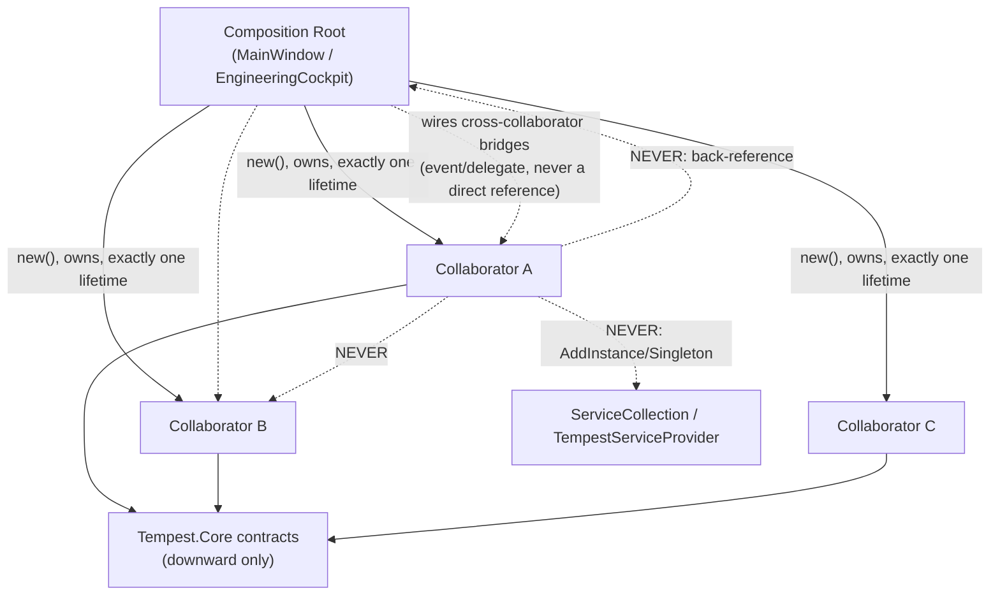

# Desktop Composition Architecture

**Status: Implemented — designed `WP 12.0A` (`ADR-0103`); implemented
`WP 12.0B` (`MainWindow` → nine `Tempest.Desktop.Composition`
collaborators; `EngineeringCockpit` → six per-discipline collaborators).**

## Objective

Define the canonical pattern by which a composition root inside this
platform's presentation/Workspace layers — `MainWindow`,
`EngineeringCockpit`, and any future one — is decomposed once its own
object graph grows past a single responsibility. This document names
the pattern generally, for durable reuse; it is not a line-by-line
refactor plan for any one class. See `ADR-0103` for the complete
decision record and reasoning; this document is that decision's own
architecture-reference realisation, in the shape every other standing
architecture document in this platform already takes (`Diagnostics
Architecture.md`, `Sample Module Architecture.md`, `Fault Injection &
Validation Architecture.md`).

**Scope note.** Named "Desktop" because its motivating evidence and
first realisation (`WP 12.0B`) both sit in `Tempest.Desktop`, but the
pattern itself is not Desktop-specific — it governs any composition
root in the presentation/Workspace layers immediately above the
platform proper (Modules → Platform APIs → Platform Services → Runtime
Host, `ADR-0023`), which today includes `EngineeringCockpit`
(`Tempest.App.Workspace`, consumed by both `Tempest.Desktop` and the
internal-harness `WorkspaceShell`, `ADR-0101`) alongside `MainWindow`
itself.

## Repository Investigation

**`WP11.0A Platform Architecture Review.md` Finding `A-1`, re-verified
directly, unchanged, by this Work Package.** `src/Tempest.Desktop/MainWindow.cs`
is 1,556 lines; its own public constructor spans lines 89–1082 (roughly
1,000 lines) and, read in full, resolves ten-plus platform services
from `ITempestHost.Services`, loads five independent Desktop-local
persisted-state objects, constructs and wires all three docking panels
(explorer/inspector/output — resize, hide, collapse, pin, and Auto-Hide
flyout handling for each), constructs every top-level view (Project
Explorer, Property Inspector, Document Area with its own Object Editor
content-builder closures, Status Bar, Command Palette, Cockpit,
Ribbon), populates roughly 450 lines of per-discipline Ribbon
object-action dispatch handlers (Create/Duplicate/status-transition,
one closure per command across all six Engineering Disciplines), wires
Explorer/Inspector/Editor cross-view coordination, wires undo/redo, and
owns window-open/window-closing lifecycle. `src/Tempest.App/Workspace/EngineeringCockpit.cs`
is 1,398 lines, `internal sealed`, structured differently: not a large
constructor but a large, flat set of computed read-only properties —
six Engineering Disciplines' worth of `Status`/`KpiCards`/
`AttentionItems` contributions, each reading its own discipline's
services directly, all inside one class.

**Both are genuine composition roots, one layer below
`EngineeringWorkspaceComposer`.** Each assembles a bounded object graph
for one nameable concern ("the running desktop window"; "the Cockpit's
own read surface") — the identical shape `EngineeringWorkspaceComposer`
(`WP 10.0B`) already realises one layer up ("register the six
Engineering Disciplines against a `WorkspaceManager`"), both consuming
an already-built platform, never constructing or registering a Platform
Service of their own. `Shell & Composition Framework Architecture.md`
realises the same general composition-root *concept* (`ADR-0009`) at
the platform's own outermost boundary
(`Program.cs`/`TempestHostBuilder`/`TempestHost`) — a structurally
different case (it *does* construct and DI-register Platform Services),
outside this pattern's own scope; see `ADR-0103`'s explicit boundary
statement. **No prior document names the rules for the layer this
document actually governs** — `ADR-0103` closes that gap generally;
this document records the resulting architecture.

**No duplication found.** Nothing under `Tempest.Core` composes a
Desktop-specific or Workspace-read-model object graph; nothing under
`Tempest.App.Composition`/`Tempest.Desktop` already applies a named
decomposition pattern to this problem — `MainWindow`/`EngineeringCockpit`
are the platform's first two instances of the problem this document
solves, not a second attempt at an existing solution.

## Architecture

### Vocabulary

- **Composition root** (this layer): a class or static type that
  consumes an already-built platform — resolving already-registered
  Platform Services, never constructing or registering new ones into
  `TempestHost`'s own DI container — and assembles one bounded, nameable
  object graph from them: constructing and owning every **collaborator**
  that graph needs, resolving platform services exactly once, and
  wiring the small number of cross-collaborator bridges that have no
  single natural owner. Never itself DI-registered, discovered, or
  Host-owned — it is hand-constructed code, exactly as
  `EngineeringWorkspaceComposer` already is (`ADR-0009`'s own general
  composition-root category). **Distinct from `TempestHost`'s own
  composition root** (`Program.cs`/`TempestHostBuilder`/`TempestHost`
  itself, which *does* construct and DI-register Platform Services) —
  that remains entirely `ADR-0009`'s own territory, unaffected by this
  document; see `ADR-0103`'s own explicit boundary statement under
  Decision.
- **Collaborator**: a plain class, `new`-constructed by exactly one
  composition root, with exactly one reason to change, declaring its
  own dependencies via ordinary constructor parameters, holding no
  reference back to its own composition root and no reference to any
  sibling collaborator.

The complete rule set — composition-root responsibilities, collaborator
responsibilities, ownership/lifetime, construction rules, dependency
rules, and the explicit "never DI-register a collaborator" rule — is
defined once, in full, in `ADR-0103`, and is not restated here; this
document assumes it and shows how it reads against real evidence.

### Illustrative application (not a binding specification)

The table below sketches how `ADR-0103`'s pattern reads against
`MainWindow`'s own current responsibilities, as evidence the pattern
actually fits this problem — it is **not** this document's own binding
decomposition spec. `WP 12.0B`'s own Implementation Report records the
real, final collaborator boundaries, which may differ from this sketch
where implementation finds a better cut; that is an implementation-stage
judgement applying `ADR-0103`'s rules, not a deviation from them.

| Illustrative collaborator | `MainWindow`'s current responsibility it replaces | Why it is one collaborator |
|---|---|---|
| A Desktop-specific composition step (mirrors `EngineeringWorkspaceComposer`'s own shape) | Platform-service resolution from `ITempestHost.Services` | One reason to change: which services this window's own collaborators need |
| A Desktop-local session-state loader | Five independent synchronous state loads | One reason to change: what Desktop-local state persists across a session |
| A docking/panel composer | Panel construction and resize/hide/collapse/pin/flyout wiring | One reason to change: how the three docked panels behave |
| A Ribbon object-action handler factory | ~450 lines of per-discipline Create/Duplicate/status-transition closures | One reason to change: what a Ribbon button does per discipline — the single largest, most mechanical extraction (~29% of the file) |
| A workspace-view coordinator | Explorer/Inspector/Editor cross-view wiring | One reason to change: how already-built views react to each other |
| An undo/redo coordinator | The undo/redo stack, its two buttons, `Undo`/`RedoAsync` | One reason to change: undo/redo behaviour |
| A menu factory | `BuildMenuSystem` | One reason to change: the menu's own contents |
| A quick-access-toolbar factory | `BuildQuickAccessToolbar` | One reason to change: the toolbar's own contents |
| A layout-preset coordinator | `ApplyPreset`/`ResetLayout`/`BuildLayoutPresetItem` | One reason to change: named layout presets |

`MainWindow` itself, post-decomposition, retains only what `ADR-0103`
names as irreducibly a composition root's own job: root visual-tree
assembly (it *is* the `Window`), the `Opened`/`Closing` lifecycle
handlers (calling each collaborator's own save/refresh method, never
inlining the work), keyboard-shortcut registration, and the genuinely
cross-collaborator bridges no single collaborator can own.

`EngineeringCockpit` applies the identical pattern along a different,
already-established seam: one collaborator per Engineering Discipline
(Mechanical/Requirements/Calculations/Documents/Verification/
Manufacturing), each owning that discipline's own `Status`/`KpiCards`/
`AttentionItems` contribution and depending on only the services that
discipline actually needs — narrower than today's one-class-needs-every-
discipline's-services shape. `EngineeringCockpit` itself becomes the
composition root: constructs the six discipline collaborators, delegates
its own public surface to them, and retains only genuinely cross-cutting
reads (`ProjectName`, `ContinueWhereILeftOff`, `AvailableCommands`) and
the aggregation of each collaborator's own `KpiCards`/`AttentionItems`
contribution. A discipline collaborator's most natural home is that
discipline's own existing namespace (e.g. `Tempest.App.Workspace.Requirements`,
alongside `RequirementsWorkspaceRegistration`) — consistent with the
one-namespace-per-discipline convention every other Workspace concern
already follows, rather than remaining physically separated from its
own discipline's other code inside a single, ever-growing
`EngineeringCockpit.cs`.

### Dependency Diagram

Every solid arrow is construction/ownership, pointing from the
composition root outward — never the reverse. Every dashed "NEVER"
arrow names a structural rule `ADR-0103` forbids outright: a
collaborator never references a sibling directly, never references its
own composition root, and is never registered in the DI container.

## Lifecycle Interaction

**No new Host Lifecycle phase, no new `HostState`, no new transition.**
A composition root at this layer is constructed by ordinary
presentation-layer code (`Tempest.Desktop`'s own startup sequence for
`MainWindow`; `Workspace`'s own construction for `EngineeringCockpit`),
entirely below and after the Runtime Host has already reached the point
its own services are resolvable — this pattern operates strictly inside
an already-running platform, never as part of Host startup/shutdown
itself.

## Failure Model

**No new category.** A collaborator's own failure is an ordinary
exception at the point it is used, handled exactly as the equivalent
code already is today (a failed command dispatch reports through the
Status Bar/Toast, unchanged) — this pattern is about *object-graph
shape*, not failure handling, and introduces no new failure
classification alongside `ADR-0013`'s existing platform-service/module
boundary or `Failure Behaviour.md`'s own table.

## Testing Strategy

**None required by this document itself** (architecture only,
`WP 12.0A`). For `WP 12.0B`, following this project's own "prefer real
implementations over mocks" convention:

- **Collaborator isolation, proven directly.** Because a collaborator
  declares its own dependencies via ordinary constructor parameters and
  holds no back-reference to its composition root, it is constructible
  and testable in isolation, against real inputs, without constructing
  `MainWindow`/`EngineeringCockpit` at all — a direct, structural
  testability improvement this pattern is expected to demonstrate, not
  merely claim.
- **Behaviour-preservation, proven before refactoring, not after.** Per
  `WP11.0B Architecture Roadmap.md`'s own named risk for `WP 12.0B`:
  characterization tests against current `MainWindow`/`EngineeringCockpit`
  behaviour are captured *before* decomposition begins, so the
  refactor is provably behaviour-preserving.
- **No collaborator is ever exercised through a DI-resolved reference**
  (there is none to resolve, by rule) — every collaborator test
  constructs its subject directly, mirroring how `EngineeringWorkspaceComposer`
  itself is already tested.

## Required ADRs

**`ADR-0103`** — the complete decision record: composition-root and
collaborator responsibilities, ownership/lifetime, construction rules,
dependency rules, the explicit prohibition on DI-registering a
collaborator, and the reasoning rejecting both partial classes and a
declarative/reflective composition framework as alternatives.

## Alternatives Considered

Recorded in full in `ADR-0103`. In summary: DI-registering extracted
collaborators (rejected — misclassifies Desktop-local wiring as a
Platform Service, `ADR-0023`); a declarative/reflective Desktop
composition framework (rejected — solves an extensibility problem this
platform does not have, the identical judgement `ADR-0032` already
applied to Navigation); a `partial class` split (rejected — enforces no
real boundary, shrinks nothing about the actual defect); doing nothing
(rejected, per `WP11.0A`'s own "Before v1.0" disposition for Finding
`A-1`).

## Documentation Impact

**New**: this document; `ADR-0103`; a `WP 12.0A` Academy retrospective.

**Updated**: `ADR Register.md`; `Architecture Document Register.md`;
`Documentation Register.md`; `Academy Register.md`;
`docs/releases/v0.12.0/WorkPackages.md` (`WP 12.0A` row); `PROJECT_STATUS.md`.

**Not required**: no `Host Lifecycle.md`/`Runtime State Machine.md`/
`Failure Behaviour.md` change (see Lifecycle Interaction/Failure Model,
above). No `Platform Service Map.md` entry — a collaborator is, by this
pattern's own explicit rule, never a Platform Service. No
`Interface Register.md`/`Module Register.md`/`Test Register.md`/
`Architectural Dependency Register.md` change — this Work Package
introduces no code; those registers are `WP 12.0B`'s own obligation,
once real collaborator types exist to record.

**Correction, `WP 12.0B` follow-up (governance reconciliation).** The
line above originally also named `Namespace Register.md` as `WP 12.0B`'s
own obligation "once real collaborator types exist to record" — no
longer accurate, corrected in place rather than left standing. Real
collaborator types now exist, but `Namespace Register.md`'s own declared
Scope has never covered `src/Tempest.Desktop/` at all (only
`Tempest.Core`/`Tempest.App`/`Tempest.Samples`/`Tempest.Validation`) — a
pre-existing gap this Work Package's own new `Tempest.Desktop.Composition`
namespace falls into, not one it created. `WP 12.0B`'s own follow-up
review found this, weighed extending that register's scope against
disclosing the gap explicitly, and chose disclosure: see
`Namespace Register.md`'s own `WP 12.0B` (follow-up) "Last Reviewed"
entry for the complete reasoning, `docs/releases/v0.12.0/WorkPackages.md`'s
`WP 12.0B` row, and the `WP12.0B` Academy retrospective — all three now
agree with this document.

## Validation Against Governing Documents

- **`FOUNDATION.md`.** Non-negotiable #1 (architecture precedes
  implementation) — this document and `ADR-0103` exist precisely because
  `WP 12.0B` has not yet written a line of code. Non-negotiable #2
  (every component has exactly one reason to change, enforced
  structurally) — this pattern's entire purpose, and the direct
  argument against partial classes. Non-negotiable #9 (dependencies
  flow downward only) — preserved exactly; no new dependency direction
  is introduced anywhere.
- **`ADR-0009`.** Not modified, not superseded, not narrowed — its own
  subject (a service constructed outside the DI container but still
  made resolvable *through* it, via `AddInstance`, for other
  independently DI-resolved consumers) is untouched. This pattern shares
  its general "some things are built outside DI, at a composition root"
  spirit, applied to a structurally distinct case it does not cover: a
  collaborator with exactly one consumer, never DI-resolvable at all.
  See `ADR-0103`'s own explicit boundary statement.
- **`ADR-0013`.** Its own classification test ("does the rest of the
  platform genuinely need this to exist independently") is reused
  verbatim as the gate against premature DI registration.
- **`ADR-0017`.** Its structural-over-conventional reasoning is the
  direct precedent for rejecting partial classes.
- **`ADR-0023`.** Four-layer model unaffected; this pattern operates
  entirely within the topmost layer's own internal shape.
- **`ADR-0032`.** Its "not every capability needs a new discovery
  mechanism" finding is applied a second time, against a declarative
  Desktop composition framework.
- **`Shell & Composition Framework Architecture.md`.** Its own
  composition-root definition, at the platform's outermost boundary, is
  unmodified and unaffected — this document defines the identical
  concept realised one (and, for `EngineeringCockpit`, two) layer
  further in.

## Related Documents

`ADR-0009`; `ADR-0013`; `ADR-0017`; `ADR-0023`; `ADR-0032`; `ADR-0103`
(this document's own complete decision record); `FOUNDATION.md`;
`Shell & Composition Framework Architecture.md`; `docs/releases/v0.11.0/WP11.0A
Platform Architecture Review.md` (Finding `A-1`); `docs/releases/v0.11.0/WP11.0B
Architecture Roadmap.md` §3/§5; `docs/releases/v0.12.0/WorkPackages.md`
(`WP 12.0A`/`WP 12.0B`);
`docs/academy/03 Work Packages/WP12.0B-desktop-composition-root-decomposition-implementation.md`
(the real, final collaborator boundaries this document's own illustrative
table, above, deliberately left non-binding).
