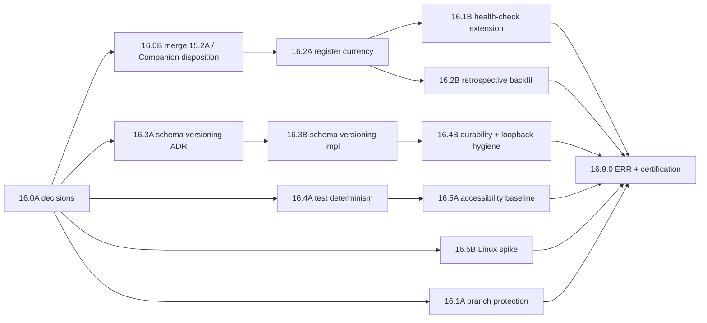

# v0.16.0 — Release Plan: v1.0 Readiness Hygiene

**Date.** 2026-09-04. **Input.** `docs/releases/v1.0.0/v1.0.0 Release
Candidate Audit.md` §5–§6 and its diagram. **Status.** Proposed. Work
Package numbers, scopes, and the recommended answers in §1 are a
recommendation; the Product Owner approves or amends them under
`FOUNDATION.md` §1 before any implementation begins.

**What this release is for.** Every item the audit rated mandatory
under the approved v1.0 definition (`WP11.0B Architecture Roadmap.md`
§1) that is not the v1.0 gate itself. It adds no product capability.
It ends with the first Product Approval verdict since `v0.12.0`. If
`WP 16.0A` widens v1.0's scope, a conditional `v0.17.0` follows; if
not, `v1.0.0`'s own two Work Packages (`WP RC.0A`/`RC.0B`) start
directly after `WP 16.9.0`.

**Branch model.** `feature/v0.16.0` cut from `main` at the `v0.15.0`
tag (`a35365a`), the `WP 13.0.0` precedent. One feature sub-branch per
Work Package where two run in parallel, merged into `feature/v0.16.0`
by non-fast-forward merge. `VERSION` bumps `0.15.0 → 0.16.0` in
`WP 16.9.0`, not before, because `governance-healthcheck.ps1` Check 6
requires the matching folder, which this document creates.

---

## 1. `WP 16.0A` — the decision that sizes everything else

Six questions. Each has a recommended answer and the reason; the
Product Owner's actual answers are recorded in `Decision Register.md`
as `D-0xx` entries and cited by every later Work Package.

| # | Question | Recommended answer | Why |
|---|---|---|---|
| Q1 | Which v1.0 definition governs? | **Definition 2 (`WP11.0B` §1)**, restated verbatim in `Product Roadmap.md` as Phase 5.5. Definition 3 (`TD-84`) becomes the v1.x roadmap, not the v1.0 line. | It is the only approved, scoped definition. The product spine it lacked has since shipped (`v0.14.0`), so it is already a stronger baseline than when written. |
| Q2 | Companion branch (`claude/tempestos-companion-mobile-ubznt3`)? | **Defer to v1.1, formally.** Keep the branch, record the decision, register the `FCR-0092` citation as a Companion-scoped number. Do not merge into v1.0. | 64 commits behind, its own register numbering collides with `main`'s, and it ships a network-facing REST surface that Definition 2 excludes. Merging it pulls C1 (auth/TLS) into v1.0. |
| Q3 | Third-party plugins in v1.0? | **No.** `src/Plugins/` stays empty by design; `TD-56`/`61`/`64` stay "mandatory before enablement," not v1.0 blockers. | `FCR-0002` is still "Identified, not started." The trust platform exists and is tested; enabling it needs no v1.0 commitment. |
| Q4 | REST beyond loopback, and `AT-10` activation? | **No.** Listener stays loopback-only and becomes **off by default** (`Runtime:RestApi:Enabled`, default `false`). | Removes the only open network surface from the default install without deleting the framework. Keeps `TD-13`/`14`/`16` as declared debt, honestly. |
| Q5 | Platform support matrix for v1.0? | **Windows supported; macOS supported (untested in CI, stated); Linux: builds and tests, Desktop launch unsupported unless `WP 16.5B`'s spike succeeds.** | `TD-116` is a deliberate security pin. A timeboxed Avalonia upgrade spike decides between fixing and stating. |
| Q6 | What happens to `WP 15.2A`'s `docs/releases/v0.15.1/`? | **Fold into `v0.16.0`.** Delete the `v0.15.1` folder on merge; list `WP 15.2A` in this release's `WorkPackages.md`. | No `v0.15.1` tag or Release Register row exists, and `WP 15.2A` itself left `VERSION` at `0.15.0`. A phantom release folder is the exact drift the health check exists to catch. |

**Deliverable.** One decision record per question; `Product Roadmap.md`
gains Phase 5.5 with Definition 2 verbatim; `PROJECT_STATUS.md` top
paragraph names the decision. **Effort S. Owner: Product Owner.
Blocks: everything below.**

---

## 2. Execution waves

Waves are ordered by dependency and by file-conflict avoidance, not by
importance. Everything inside a wave can run in parallel on separate
sub-branches.

| Wave | Work Packages | Why together | Exit condition |
|---|---|---|---|
| 0 | `16.0A` | Decision only | Six `D-0xx` records exist |
| 1 | `16.0B`, `16.1A`, `16.3A`, `16.5B` (spike), `16.4A` | No shared files: tests-only, GitHub config, an ADR, a csproj spike, test files | `feature/v0.16.0` carries `WP 15.2A`; branch protection live; `ADR-0120` accepted |
| 2 | `16.2A`, `16.3B`, `16.5A` | `16.2A` owns every register and `PROJECT_STATUS.md` alone; `16.3B` is `Tempest.Core` persistence; `16.5A` is `Tempest.Desktop` views | Registers current; state records versioned; dialogs modal |
| 3 | `16.1B`, `16.2B`, `16.4B` | `16.1B` needs current registers to pass; `16.2B` owns Academy files only; `16.4B` is Core after `16.3B` | New health checks pass on the branch |
| 4 | `16.9.0` | Everything merged | Product Approval verdict recorded |

Critical path: `16.0A → 16.0B → 16.2A → 16.1B → 16.9.0` (all S–M).
The longest single item is `16.2B` (writing ~30 retrospectives), which
is off the critical path and can start as soon as `16.2A` has fixed
the Academy Register's shape.

---

## 3. Work Package briefs

Each brief: objective, in scope, out of scope, touches, acceptance,
effort. "Touches" is the file-conflict map used to build the waves.

### `WP 16.0B` — Integrate off-`main` work

- **Objective.** `main` is the only place finished work lives.
- **In scope.** Merge `feature/wp15.2a-td120-persistence-root-cleanup`
  (non-fast-forward). Apply Q6: move `WP 15.2A`'s report into
  `docs/releases/v0.16.0/`, delete `docs/releases/v0.15.1/`. Apply Q2:
  a decision record for the Companion branch; `Future Capability
  Register.md` gains a note resolving the `FCR-0092` citation as
  Companion-scoped; `TD-82` moves to "Deferred by decision, v1.1."
  Confirm `Tempest.Core.Tests` has no leftover-directory pattern of its
  own (the question `WP 15.2A` disclosed).
- **Out of scope.** Any Companion code. Any register rewrite beyond the
  three rows named.
- **Touches.** `tests/Tempest.Desktop.Tests/` (via merge), `docs/releases/`,
  three register rows.
- **Acceptance.** CI green on `feature/v0.16.0`; `git branch -r` shows
  the Companion branch untouched; `TD-120` Resolved on `main`'s line.
- **Effort.** S if Companion is deferred; L if merged (then this Work
  Package splits into `16.0B` merge and `16.0C` reconciliation, and C1
  enters the plan).

### `WP 16.1A` — Enforce the release gate

- **Objective.** The documented workflow becomes the mechanical one.
- **In scope.** GitHub branch protection on `main` exactly as `WP11.1B
  Engineering Workflow.md` §4 specifies: required checks `CI Gate` and
  `Governance Health Check`, required CODEOWNERS review, merge commits
  only, no force-push, admins included. In `ci.yml`, make the `CI Gate`
  job depend on `governance-health-check` so a governance `Fail` is red
  at the gate, not beside it. Retitle §4 from "Recommended — Not
  Configured" to "Configured" with the date. `TD-45` → Resolved.
- **Out of scope.** Any new check content (that is `16.1B`).
- **Touches.** GitHub settings, `.github/workflows/ci.yml`, one doc.
- **Acceptance.** A deliberately failing test on a throwaway branch
  cannot be merged through the UI; `governance-healthcheck.ps1` exit 1
  turns `CI Gate` red on a throwaway branch; both demonstrations linked
  from the Work Package report.
- **Effort.** S. **Owner:** repository administrator.

### `WP 16.1B` — Health check audits what actually drifts

- **Objective.** `TD-57`'s six registers can never go stale silently again.
- **In scope.** New checks in `scripts/governance-healthcheck.ps1`:
  Interface Register vs. `public interface` declarations under
  `src/Tempest.Core/`; Exception Register vs. classes deriving from
  `Exception`; Namespace Register vs. `namespace` declarations across
  `src/`; Technical Debt Register summary line vs. its own row counts;
  Future Capability Register "Last Reviewed" not older than the newest
  release folder; Governance Index ADR count vs. `docs/adr/`. Fix the
  script's top-level catch (`TD-43`). Each check proven non-vacuous the
  `WP 11.2A` way: broken on purpose, observed to fail, restored.
- **Out of scope.** Auditing prose registers that cannot be derived
  from source (Decision, Risk, Validation) beyond a staleness date check.
- **Touches.** `scripts/`, `.github/workflows/ci.yml` (nothing else).
- **Acceptance.** 13+ checks, 0 Fail on `feature/v0.16.0` after `16.2A`;
  each new check has a recorded induced-failure run.
- **Effort.** M. **Depends on** `16.2A` (otherwise the new checks fail
  immediately, correctly).

### `WP 16.2A` — Register and status currency

- **Objective.** Every governance artefact describes the repository at
  `v0.15.0`, and `PROJECT_STATUS.md` stops carrying eight releases of
  "this field is stale" corrections.
- **In scope.** Re-derive from source: Interface, Exception, DI,
  Namespace, Platform Services, Validation registers (`TD-57`);
  `Feature Register.md` rows for `v0.6.0`–`v0.15.0`; `Release
  Register.md`'s `v0.15.0` row (still reads "in preparation");
  `Repository Metrics Register.md`; `Product Roadmap.md` Phase 5 marked
  delivered and Phase 5.5 added per Q1. `PROJECT_STATUS.md`: the
  sections from "Current Repository Phase" down are moved verbatim to
  `docs/governance/Documentation/PROJECT_STATUS Archive (v0.5.0–v0.15.0).md`
  and replaced by re-derived, one-screen equivalents (`DNB-7`). Close
  `TD-57`.
- **Out of scope.** Academy files (`16.2B`). Rewriting history: the
  archive keeps every retained correction.
- **Touches.** `docs/governance/**` (sole owner this wave), `PROJECT_STATUS.md`.
- **Acceptance.** Every count in every touched register matches an
  `ls`/`grep` re-derivation recorded in the report; `governance-healthcheck.ps1`
  clean; `PROJECT_STATUS.md` under 60 KB.
- **Effort.** M.

### `WP 16.2B` — Academy retrospective backfill

- **Objective.** Release DoD item 4 is true for the first time since `v0.10.0`.
- **In scope.** Retrospectives for `WP 11.0A`, `11.0B`, `11.1A`, `11.1B`,
  `11.2A`, `11.3A`, `11.3B`, `11.4A`, `11.4B`, `11.9.0`; `WP 15.1A`,
  `15.1B`; and the pre-`v0.14.0` programme, one article per change row
  in `docs/releases/v0.14.0/WorkPackages.md`'s second table (≈20, the
  `WP-Z3` precedent). `Academy Register.md` per-article annotations for
  all of them plus `v0.15.0`'s five. `Contributor Learning Path.md`
  closing pointer corrected (stale since `v0.5.0`).
- **Out of scope.** Rewriting existing retrospectives.
- **Touches.** `docs/academy/**` only.
- **Acceptance.** `Academy Index.md` check passes; zero Work Packages in
  any `WorkPackages.md` without a retrospective, verified by a one-off
  script whose output is in the report.
- **Effort.** M–L (volume, not difficulty). Can be split across parallel
  authors by release.

### `WP 16.3A` / `WP 16.3B` — Durable state carries a schema version

- **Objective.** v1.0 data can be read by v1.1.
- **`16.3A` (Architecture, `ADR-0120`).** `EngineeringObjectState` and
  attachment records gain `SchemaVersion`; absent means 1; migrations
  are an ordered chain per Kind (`IStateMigration`), applied on read,
  never on write; enums serialise as strings; a golden-file corpus of
  v1 records is committed and must load after every future bump.
  Decide whether `SettingsDocument<T>` joins the same scheme (recommend
  yes, same seam).
- **`16.3B` (Implementation).** The above in `Tempest.Core.Persistence`
  and `EngineeringDomain`; rehydration (`ADR-0116`) reads through the
  migration chain; corpus tests; a deliberately-broken migration test
  proving an unreadable record logs and skips rather than aborting
  startup (the `TD-87` failure mode). Close `TD-87`.
- **Touches.** `src/Tempest.Core/Persistence/**`, `EngineeringDomain/**`,
  `tests/Tempest.Core.Tests/` equivalents.
- **Acceptance.** All existing 3,088 Core tests unchanged and green;
  golden corpus loads; a v0 (unversioned) record from a `v0.15.0` build
  loads identically.
- **Effort.** S + M.

### `WP 16.4A` — Test determinism

- **Objective.** Three consecutive clean full-suite runs, both
  configurations, are routine rather than lucky.
- **In scope.** `TD-34`: give `CompositeLogSink` an injected error
  writer so the test no longer redirects process-global `Console`; move
  `ConsoleLogSinkTests` into the `"Console output capture"` collection.
  `TD-119`: the one retained fixed wait at `WorkflowInteractionTests.cs:335`
  gets a completion signal or a pinned, tested rationale. `TD-100`: a
  committed PNG fixture is decoded and one pixel asserted. `TD-83`:
  `MainWindow`-level resize at three widths through the real host.
  Run the full suite five times in CI on the branch (a temporary
  matrix) and record the results.
- **Out of scope.** Dialog modality tests (they arrive with the modality
  fix, `16.5A`).
- **Touches.** `tests/**`, `src/Tempest.Core/Logging/CompositeLogSink.cs` (additive constructor).
- **Acceptance.** 5/5 clean runs both configurations in CI; `TD-34`,
  `TD-100`, `TD-83` Resolved; `TD-119` Resolved or Closed-by-decision.
- **Effort.** M.

### `WP 16.4B` — Durability and loopback hygiene

- **Objective.** The "no consequence yet realised" items stop relying on
  there being no users.
- **In scope.** `TD-67`: a write-intent marker before multi-file writes
  and a startup sweep that reports orphans. `TD-97`: attachment content
  is released when its last referencing object is deleted, plus the
  same sweep. `TD-68`: reference-counted `AsyncKeyedLock` entries.
  `TD-69`: `ServiceCollection.Add` throws on duplicate registration
  (opt-out flag for the two known legitimate cases, if any survive
  audit). `TD-62`: OpenAPI route behind the identity + permission
  pipeline. Q4 applied: `Runtime:RestApi:Enabled` default `false`;
  `PHYSICAL_REVIEW.md` §3/§8 updated (port 5080 no longer bound by default).
- **Out of scope.** Authentication (C1). Query capability (`TD-12`).
- **Touches.** `src/Tempest.Core/Persistence/**` (after `16.3B`),
  `DependencyInjection/**`, `Api/**`, `TempestHost.cs`.
- **Acceptance.** One new test per closed item; the DI duplicate guard
  proven against every real registration in `TempestHost.cs` Phase 6.
- **Effort.** M.

### `WP 16.5A` — Accessibility baseline

- **Objective.** The dialog family behaves like dialogs, and a screen
  reader can name every control.
- **In scope (the `TD-65` top four).** Real modal behaviour for
  `ConfirmationDialog`, `MessageDialog`, `InputDialog`, `SettingsDialog`,
  `MacroManagerDialog`, `CommandPaletteOverlay`: focus moves in, is
  trapped, is restored; Escape cancels, Enter confirms. An
  `AutomationProperties.Name` pass over icon-only buttons and
  watermark-only inputs. Live-region announcement for status bar and
  toasts. Digital Thread keyboard operability: Tab between nodes, arrow
  keys pan, plus/minus zoom, 8 px minimum hit targets. Consume the
  declared `FocusRing` tokens. Fix Cockpit health-text contrast on the
  light theme (2.1:1 → 4.5:1). Add the `TD-83` modality test (Tab cannot
  reach content behind an open dialog).
- **Out of scope.** Full WCAG audit; drag-and-drop keyboard alternative
  (`FCR-0073` territory).
- **Touches.** `src/Tempest.Desktop/Views/**`, `DigitalThread/**`,
  `Theming/**`, `tests/Tempest.Desktop.Tests/`.
- **Acceptance.** Headless tests for focus trap/restore on every dialog;
  contrast values recorded; `TD-65` Partially resolved with the
  remaining inventory re-listed.
- **Effort.** M.

### `WP 16.5B` — Linux/X11: fix or state

- **Objective.** `TD-116` has an answer, not a workaround.
- **In scope.** A timeboxed spike (one day): upgrade Avalonia to the
  newest 11.x that binds a `Tmds.DBus.Protocol` at or above `0.94.2`,
  or pin a compatible pair; verify under `xvfb-run` on a Linux runner.
  Success → upgrade lands with the full Desktop suite green and a
  Linux `dotnet run` smoke step added to CI. Failure → Q5's statement
  goes into `README.md`, `PHYSICAL_REVIEW.md` §8, and the Release
  Notes template; `TD-116` → Closed by decision.
- **Touches.** `src/Tempest.Desktop/Tempest.Desktop.csproj`,
  `.github/workflows/ci.yml`, docs.
- **Acceptance.** Either a green Linux launch in CI, or the three
  documents stating the matrix identically.
- **Effort.** S–M.

### `WP 16.9.0` — Engineering Readiness Review and certification

- **Objective.** A §9 Product Approval verdict on a release that is
  actually current.
- **In scope.** The full ERR per `ADR-0106`: five categories, six
  disciplines, three consecutive full-suite runs both configurations,
  every register cross-checked (now machine-assisted by `16.1B`),
  `VERSION` → `0.16.0`, Release Notes, `WorkPackages.md` closeout,
  merge to `main` under the now-enforced gate, tag via
  `scripts/new-release.ps1`, `release.yml` publish, and **the Product
  Approval verdict recorded in `Release Register.md`** — the item every
  release since `v0.12.0` has left blank.
- **Acceptance.** Verdict ∈ {CERTIFIED, CERTIFIED WITH ACCEPTED
  TECHNICAL DEBT} recorded with date and authoriser; if `NOT READY`,
  a `16.9.1` remediation is scoped from the findings, the `WP 12.9.x`
  precedent.
- **Effort.** S–M.

---

## 4. What comes immediately after

- **If Q1 = Definition 2 (recommended):** `WP RC.0A` (physical review on
  Windows, executed and recorded) and `WP RC.0B` (v1.0 readiness review)
  follow directly on `main` at `v0.16.0`; `v1.0.0` is two Work Packages
  away.
- **If Q1 widens scope:** `docs/releases/v0.17.0/WorkPackages.md` is
  written from the audit's §5.2, one Architecture/Implementation pair
  per selected C-item, C1 first if Companion or any non-loopback
  deployment is included.

## 5. Risks to this plan

| Risk | Likelihood | Mitigation |
|---|---|---|
| `16.0A` is not decided and Work Packages start anyway, re-creating the three-definition problem | Medium | Wave 1 is gated on the six `D-0xx` records existing; `16.2A` cites them by number. |
| Companion is merged after all | Medium | Then `16.0B` splits, C1 enters, and this plan's §4 "widens scope" branch applies. Nothing in Waves 2–4 changes. |
| `16.2A` and `16.2B` collide on `Academy Register.md` | High if run concurrently | `16.2A` owns `docs/governance/**` including `Academy Register.md`'s shape; `16.2B` owns `docs/academy/**` and only appends rows to the register after `16.2A` merges. |
| `16.1B`'s new checks fail on `main` before `16.2A` merges | Certain if mis-sequenced | Wave 3 placement; the checks are added as `Warn` on the sub-branch and promoted to `Fail` in the merge commit. |
| The Avalonia upgrade spike drags | Medium | Hard one-day timebox; the "state the matrix" outcome is a complete, acceptable result. |
| Retrospective volume slips the release | Medium | `16.2B` is off the critical path; `16.9.0` may proceed with `16.2B` complete for `v0.11.0` and `v0.15.0` and the pre-`v0.14.0` set disclosed as in progress, but only once, with the count. |

## Related Documents

`docs/releases/v0.16.0/WorkPackages.md`; `docs/releases/v1.0.0/v1.0.0
Release Candidate Audit.md`; `docs/releases/v1.0.0/WorkPackages.md`;
`docs/releases/v0.11.0/WP11.0B Architecture Roadmap.md`;
`docs/releases/v0.11.0/WP11.1B Engineering Workflow.md`;
`docs/architecture/Engineering Readiness Review Architecture.md`;
`docs/governance/Quality/Technical Debt Register.md`.
