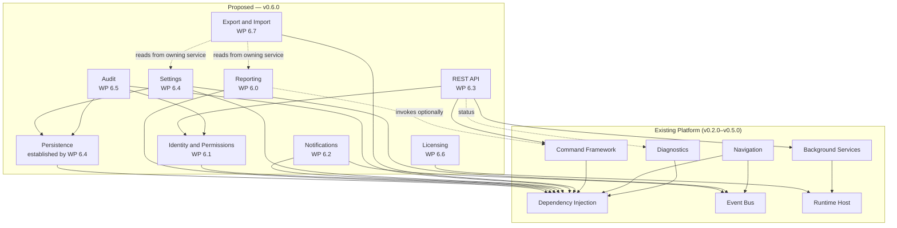

# TempestOS v0.6.0 — Platform Service Dependency Diagram

## Purpose

A single visual reference for how the eight proposed `v0.6.0` services —
plus the new shared Persistence abstraction — depend on each other and
on the existing platform, so the whole release's shape can be checked
for cycles and four-layer-rule compliance at a glance. This complements,
rather than duplicates, the prose dependency lists in `Platform Services
Overview.md` and `docs/architecture/Platform Service Map.md`.

**Convention.** An arrow points from a service to what it *depends on*
(the same direction `docs/architecture/Ownership Matrix.md`'s own
diagrams use) — read "A → B" as "A depends on B." No arrow in this
diagram points upward from an existing, already-implemented platform
service toward anything new in `v0.6.0` — confirming this release adds
services *consuming* the existing platform, never the reverse.

## Full Dependency Graph

Solid arrows are hard, constructor-level dependencies. Dotted arrows are
either optional/invocation-only relationships (Reporting may be invoked
through the Command Framework, but does not require it to function
standalone) or a documented, non-DI data-access relationship
(Export/Import reads through a data-owning service's own public
interface, not via constructor injection of that service into
Export/Import universally — the dotted line represents "may read from,"
not "always depends on").

## Reading the Graph

- **No cycle exists.** Every proposed service's dependencies resolve to
  either the existing platform or another proposed service that is
  itself lower in the graph — Persistence and Identity are the two
  services nothing new in `v0.6.0` depends *back* into a cycle with;
  Settings and Audit both sit strictly above Persistence; Audit sits
  strictly above Identity; the REST API sits strictly above Identity,
  the Command Framework, and Background Services.
- **Licensing is the release's only new leaf-adjacent service**,
  depending solely on the Host at Composition-Root time (mirroring
  Platform Version) — nothing else in `v0.6.0` depends on Licensing at
  the platform-service level; a module checks entitlement through
  `ILicenseProvider` directly, which does not create a platform-service
  dependency edge in this diagram (module-to-service edges are omitted
  throughout, matching `Platform Service Map.md`'s own convention of
  listing "any module" as a consumer in prose rather than in the graph).
- **`WP 6.1` (Identity & Permissions) is the release's single most
  depended-on new service** — both `WP 6.3` (REST API) and `WP 6.5`
  (Audit) require it, confirming the dependency ordering already stated
  in `docs/releases/v0.6.0/WorkPackages.md` (REST API explicitly blocked
  on Identity landing first).
- **`WP 6.4` (Settings) is the release's second most depended-on new
  service**, purely because it is the originating Work Package for the
  shared Persistence abstraction Audit also needs.
- **The REST API is the only proposed service touching three different
  existing platform services directly** (Background Services, Command
  Framework, Diagnostics) plus one new one (Identity) — consistent with
  it being the highest-novelty, highest-risk Work Package in the release
  (`Risk Register.md`).

## Four-Layer Rule Compliance

Every arrow above stays within, or points strictly downward across,
`ADR-0023`'s existing three-tier-plus-Host model: Modules depend on
Platform Services, which depend on Dependency Injection (and, where
named, other Platform Services), which sit above the Runtime Host. No
proposed service in this diagram depends on a Module, and Licensing's
single dependency on the Host reflects its Composition-Root-level
construction timing (identical in kind to Configuration's own
pre-container construction), not a violation of the "Host sits below
Platform Services" ordering — Licensing's *validation* runs at Host
construction time; its DI-public read surface (`ILicenseProvider`) is
registered afterward, exactly like every other Composition-Root-
constructed service (Platform Version, Diagnostics).

## Related Documents

`Release Architecture.md`; `Platform Services Overview.md`; `Public
Interface Catalogue.md`; `Service Lifecycle.md`; `docs/architecture/
Ownership Matrix.md`; `docs/architecture/Platform Service Map.md`;
`ADR-0023`.
