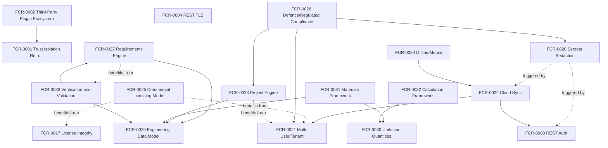

# WP 7.0B — Capability Dependency Report

## Status

Complete. Architecture and planning only — no production code, no
implementation. Reviews all 33 entries in `docs/governance/Future
Capability Register.md` (`FCR-0001`–`FCR-0033`, the five Engineering
Foundation entries added by this Work Package itself) against eight
dimensions, then builds the dependency graph and programme groupings
this Work Package's own controlling instruction requires.

## Part 1 — Per-Capability Assessment

Ratings are qualitative (Low/Medium/High/Unknown), consistent with each
entry's own "Business Value"/"Engineering Effort" fields in `Future
Capability Register.md` — this table does not re-invent a rating, it
projects the register's own fields onto the eight dimensions this Work
Package's own controlling instruction names.

| FCR | Strategic Value | Technical Dependencies | Platform Services Required | Architectural Impact | Commercial Value | Engineering Effort | Academy Impact | v1.0 Timing |
|---|---|---|---|---|---|---|---|---|
| FCR-0001 | High | `IPermissionEvaluator` (shipped) | Identity & Permissions | Low — applies existing mechanism | Low direct; risk-reduction | Medium | Yes, once implemented | Before |
| FCR-0002 | Unknown | FCR-0001 | Plugin Manifest (shipped) | Unknown | Unknown | Unknown | Yes (first real Plugin Register entry) | After (no trigger yet) |
| FCR-0003 | High | Identity & Permissions (shipped) | Identity & Permissions, REST API | Medium — new auth layer | High (enables any real deployment) | Medium-High | Yes | Before |
| FCR-0004 | High | FCR-0003 (paired) | REST API | Low — configuration | High (paired with FCR-0003) | Low-Medium | Low | Before |
| FCR-0005 | Medium | None | None (tooling, not a service) | None | Low direct | Low-Medium | Yes (new pattern) | Before |
| FCR-0006 | Medium | None | Diagnostics | Low — namespace/ADR only | None | Low | Low | Before |
| FCR-0007 | Low | `IPersistenceStore` (shipped) | Settings, Audit | Medium-High — abstraction change | Low direct | Medium-High | Yes | After (no trigger) |
| FCR-0008 | Low | None | Logging | Low | None | Low-Medium | No | After |
| FCR-0009 | Low | None | DI container | Medium | None | Medium | No | After |
| FCR-0010 | Low | None | Plugin Manifest | Low | None | Low | No | After |
| FCR-0011 | Low-Medium | None | Background Services | Low-Medium | None | Low-Medium | No | After |
| FCR-0012 | Low | Reporting (shipped) | Reporting | Medium | Low (no named need) | Medium-High | Yes | After |
| FCR-0013 | Low | Notifications (shipped) | Notifications, REST API | Medium | Low (no named need) | Medium | Yes | After |
| FCR-0014 | Low | Settings, Identity (shipped) | Settings, Identity & Permissions | Low-Medium | Low (no named need) | Low-Medium | Yes | After |
| FCR-0015 | Low | Export/Import (shipped) | Export/Import | Low-Medium | Low (no named need) | Medium | No | After |
| FCR-0016 | Low | Export/Import (shipped) | Export/Import | Medium | Low (no named need) | Medium-High | No | After |
| FCR-0017 | Low | Licensing (shipped) | Licensing | Low-Medium | Medium (protects FCR-0025) | Medium | No | After |
| FCR-0018 | Low | REST API (shipped) | REST API, Command Framework | Low-Medium | Low (no named need) | Medium | No | After |
| FCR-0019 | Low | Audit, REST API (shipped) | Audit, REST API | Low | Low (mitigated already) | Low-Medium | No | After |
| FCR-0020 | Medium | Triggered by FCR-0003 or FCR-0022 | Logging | Low-Medium | Medium | Low-Medium | Yes | Before (if FCR-0003 lands) |
| FCR-0021 | High (long-term) | DI container (no Scoped lifetime today) | Every platform service, indirectly | High — possible DI redesign | High (long-term) | High | Yes | After |
| FCR-0022 | Unknown | FCR-0021, FCR-0003 | Identity & Permissions, REST API | High | Unknown | Unknown, likely High | Unknown | After |
| FCR-0023 | Unknown | FCR-0022 | (depends on FCR-0022's own shape) | Unknown | Unknown | Unknown, likely High | Unknown | After |
| FCR-0024 | Unknown | Command Framework (shipped) | Command Framework | Low — framework already supports it | Unknown | Low (framework side) | Yes | After |
| FCR-0025 | Medium-High (long-term) | Licensing (shipped); loosely FCR-0021, FCR-0017 | Licensing | Medium-High | High (long-term) | Medium-High | Yes | After |
| FCR-0026 | Unknown | FCR-0028, FCR-0020, FCR-0021 | Audit, Identity & Permissions | Unknown, likely High | Unknown | Unknown, likely High | No | After |
| FCR-0027 | Unknown (central to vision) | FCR-0029, benefits from FCR-0033 | Identity & Permissions, Audit, Settings (as a future consumer) | High — first Engineering Module—class capability | Unknown | Unknown | Yes | Before (foundation), module after |
| FCR-0028 | Unknown (central to vision) | FCR-0029; benefits from FCR-0021 | Identity & Permissions, Audit, Persistence | High | Unknown | Unknown | Yes | Before (foundation), module after |
| FCR-0029 | High (enabler) | None | `IPersistenceStore` (plausible, not guaranteed) | High — new data-modelling pattern | Low direct; high as enabler | Unknown | Yes | Before |
| FCR-0030 | High (enabler) | None | None | Medium — new abstraction | Low direct; high as enabler | Medium | Yes | Before |
| FCR-0031 | Medium (enabler) | FCR-0029, FCR-0030 | (depends on FCR-0029's own shape) | Medium | Low direct | Unknown | No | Before |
| FCR-0032 | High (enabler) | FCR-0030 | None | High — new abstraction | Low direct; high as enabler | High | Yes | Before |
| FCR-0033 | Medium-High (enabler) | FCR-0027, FCR-0029 | Audit (adjacent, not reused directly) | Medium | Low direct | Unknown | Yes | Before |

## Part 2 — Dependency Graph

**No cycle exists.** `FCR-0027` and `FCR-0033` have a mutual
*reinforcement* relationship (a Requirements Engine is more complete with
Verification, and Verification needs a requirement to verify against),
but the dependency is one-directional and non-blocking: `FCR-0033`
formally requires `FCR-0027` to exist (verification needs something to
verify against); `FCR-0027` only *benefits from* `FCR-0033`, it does not
require it — a Requirements Engine can ship with weaker, manual
verification tracking initially. Every entry not shown in the graph
(`FCR-0005`–`FCR-0019`, `FCR-0024`) has no dependency on, or from, any
other `FCR` entry — each is independently implementable once its own
Platform Services Required (Part 1) already exist, which every one of
them does, since all are extensions of already-shipped `v0.6.0`
capability.

## Part 3 — Engineering Programmes

Six logical groupings, by shared subject matter and shared dependency
structure:

1. **Platform Hardening Programme** — `FCR-0001`, `FCR-0002`, `FCR-0003`,
   `FCR-0004`, `FCR-0005`, `FCR-0006`, `FCR-0008`, `FCR-0009`,
   `FCR-0010`, `FCR-0011`. Closes disclosed platform-level gaps
   (trust boundary, authentication, transport security, governance
   tooling, minor naming/lifecycle debt) before building outward.
2. **Platform Service Enhancement Programme** — `FCR-0007`, `FCR-0012`,
   `FCR-0013`, `FCR-0014`, `FCR-0015`, `FCR-0016`, `FCR-0017`,
   `FCR-0018`, `FCR-0019`. Extensions to already-shipped `v0.6.0`
   services, each gated on its own named revisit trigger, none met yet.
3. **Enterprise Infrastructure Programme** — `FCR-0020`, `FCR-0021`,
   `FCR-0022`, `FCR-0023`, `FCR-0025`, `FCR-0026`. Multi-user, cloud,
   secrets, commercial licensing, and compliance — deliberately
   sequenced last, per `VISION.md`'s own product principles.
4. **AI/Automation Programme** — `FCR-0024`. A single, standalone,
   already-supported extension point; no programme-level dependency.
5. **Engineering Foundation Programme** — `FCR-0029`, `FCR-0030`,
   `FCR-0031`, `FCR-0032`, `FCR-0033`. The cross-cutting technical
   substrate identified by this Work Package as a prerequisite for any
   discipline-specific Engineering Module — see `WP7.0B Engineering
   Foundation Architecture.md` for the full rationale.
6. **Engineering Discipline Programme (Systems Engineering & Project
   Management)** — `FCR-0027`, `FCR-0028`. The only two Engineering
   Discipline categories with a named platform-level hook (`ADR-0013`'s
   own Future Considerations); both depend on Programme 5 landing first.

## Part 4 — Classification

- **Prerequisite** (must land before Engineering Modules can begin at
  all): `FCR-0029`, `FCR-0030`, `FCR-0032` — the true minimum Engineering
  Foundation (see `WP7.0B Engineering Foundation Architecture.md`).
  `FCR-0001`, `FCR-0003`, `FCR-0004`, `FCR-0005`, `FCR-0006` are also
  Prerequisite, at the Platform level, per `WP 7.0A`'s own recommendation.
- **Enabling** (not strictly blocking, but unlocks or substantially
  strengthens other capabilities): `FCR-0031`, `FCR-0033`, `FCR-0027`,
  `FCR-0028`, `FCR-0021`.
- **Optional** (no other capability depends on them; build only if a
  real, demonstrated need arises): `FCR-0007-0019` (Platform Service
  Enhancement Programme, in full), `FCR-0024`.
- **Long-term** (Enterprise/Future Expansion horizon, furthest from
  today's platform): `FCR-0002`, `FCR-0020`, `FCR-0022`, `FCR-0023`,
  `FCR-0025`, `FCR-0026`.

## Related Documents

`docs/governance/Future Capability Register.md`; `docs/governance/
Capability Categories.md`; `docs/governance/Product Roadmap.md`;
`WP7.0B Engineering Foundation Architecture.md`; `WP7.0B Engineering
Discipline Assessment.md`.
