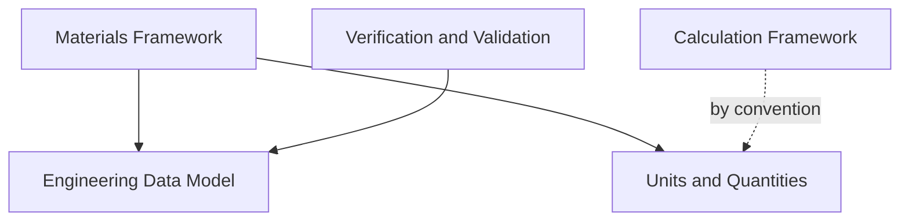

# WP 7.0C — Cross-Framework Dependency Report

## Status

Complete. Validates separation of responsibilities, absence of circular
dependencies, shared abstractions, reuse opportunities, and naming
consistency across the five proposed Engineering Foundation frameworks,
mirroring `docs/releases/v0.6.0/Governance Confirmation.md`'s own role
for that release's nine services.

## Dependency Graph

**No cycle exists.** Engineering Data Model and Units & Quantities are
both terminal (no outgoing dependency to any other Engineering
Foundation framework) — the only two frameworks a real implementation
could begin with in either order or in parallel, confirming `WP7.0B
Engineering Foundation Architecture.md`'s own recommended sequencing.

## 1. Separation of Responsibilities

| Framework | Owns | Explicitly Does Not Own |
|---|---|---|
| Engineering Data Model | Document identity, revisioning, typed references | Interpreting document content; querying beyond direct Id lookup |
| Units & Quantities | Dimensioned value representation, unit conversion | Calculation execution; document storage |
| Materials Framework | Named material catalogue, dimensioned properties | Document revisioning (delegates to Engineering Data Model); materials-science calculation (delegates to Calculation Framework) |
| Calculation Framework | Calculation registration and dispatch, execution records | Any specific formula; document storage of calculation provenance (a plausible, not mandatory, integration) |
| Verification & Validation | Pass/fail/conditional outcome recording against a document | Defining what "a requirement" is; requirements traceability beyond a single document reference |

**Finding: Satisfied.** No two frameworks claim the same responsibility.
Materials' own explicit non-ownership of document revisioning (delegated
to Engineering Data Model) is the clearest instance of the "one
component, one reason to change" principle (`FOUNDATION.md` §2) applied
across this new framework set — confirmed directly in `WP7.0C
Engineering Foundation Contracts.md`'s own Materials section, not merely
asserted here.

## 2. Circular Dependencies

**Check, traced explicitly:**

- Engineering Data Model → (no outgoing edge to any sibling framework).
- Units & Quantities → (no outgoing edge to any sibling framework).
- Materials Framework → Engineering Data Model, Units & Quantities
  (both terminal beyond this point).
- Calculation Framework → Units & Quantities *by convention only*, not
  a hard type constraint (terminal).
- Verification & Validation → Engineering Data Model (terminal).

**Finding: Satisfied — and one likely cycle deliberately avoided.**
`WP 7.0B`'s own dependency graph described `FCR-0033` as depending on
`FCR-0027` (Requirements Engine) and `FCR-0027` as "benefiting from"
`FCR-0033` — a one-directional relationship, but a close one. This
review's own Contract-level design goes further: `Tempest.Core.Verification`
depends on `Tempest.Core.EngineeringData`'s **generic** document concept,
never on a specific `IRequirementsService` type. Had Verification been
designed against a concrete Requirements Engine interface instead, and
had a future Requirements Engine implementation naturally wanted to
depend back on Verification for its own traceability view, a genuine
circular dependency between two Engineering Foundation-adjacent services
would have resulted. This is avoided structurally, not by convention
alone, exactly the discipline `FOUNDATION.md` §2 requires.

## 3. Shared Abstractions

- **`Quantity<TDimension>`** (Units & Quantities) is the one type
  expected to be reused verbatim by both Materials (property values) and
  Calculation (input/output types, by convention) — the clearest
  instance of a genuinely shared abstraction in this framework set.
- **`IEngineeringDocument`/`IDocumentRevision`** (Engineering Data
  Model) is reused by Materials (a material specification *is* a
  document) and referenced by Verification (a verification subject *is*
  a document Id) — the second clearest instance.
- **No shared exception base spans all five frameworks** — each has its
  own abstract exception base (`EngineeringDataException`,
  `MaterialsException`, `CalculationException`), mirroring how
  `PersistenceException`/`LicensingException`/`ExportImportException`
  each remain separate in the existing `v0.6.0` platform, rather than one
  shared root — consistent with this platform's own existing convention,
  not a new one invented here. One exception is deliberately **reused**
  rather than duplicated: Verification's own `EngineeringDocumentNotFoundException`
  is the Data Model's own type, not a parallel one — see `WP7.0C
  Engineering Foundation Contracts.md`'s own Verification section.

## 4. Reuse Opportunities

- **Materials as a worked example, not a new pattern.** Materials
  introduces zero new storage or revisioning concepts — it is presented,
  in `WP7.0C Academy Plan.md`, explicitly as a worked example of building
  on the Data Model, avoiding a redundant Academy article that would
  otherwise repeat content the Data Model's own concept guide already
  covers.
- **A verification action is a plausible Audit consumer, not a
  reinvention of Audit.** `Tempest.Core.Verification` does not build its
  own "who did this, when" mechanism — that already exists
  (`IAuditRecorder`); `IVerificationRecord` answers a different question
  entirely ("was the spec met"), and the two are expected to be used
  together at a calling layer, mirroring every `v0.6.0` sample module's
  own permission-check-then-audit-record pattern.

## 5. Naming Consistency

| Convention | Applied Consistently? |
|---|---|
| `I`-prefixed interfaces, `Async`-suffixed async methods | Yes, across all five frameworks |
| Nullable-return `FindAsync` for "not found is ordinary," throwing methods for "not found is exceptional" | Yes — `IEngineeringDocumentStore.FindAsync`/`IMaterialCatalog.FindAsync` (nullable) vs. `ReviseAsync`/`ExecuteAsync` (throwing) |
| `CancellationToken cancellationToken = default` as the final parameter on every async method | Yes, across all five frameworks |
| Namespace shape `Tempest.Core.<Area>` | Yes — `EngineeringData`, `UnitsAndQuantities`, `Materials`, `Calculations`, `Verification`, each a sibling of `Tempest.Core.Reporting`/`Tempest.Core.Settings`/etc. |
| One minor inconsistency, disclosed | `Tempest.Core.UnitsAndQuantities` is the only multi-word namespace segment without an abbreviation, while `Tempest.Core.Calculations` uses the plural form and `Tempest.Core.Verification` the singular — a genuine, minor naming inconsistency, flagged here rather than silently harmonised, since resolving it is a real (if small) decision for the owning Work Package, not this review's to make unilaterally. |

## Related Documents

`docs/releases/v0.6.0/Governance Confirmation.md` (the precedent this
report's own structure follows); `WP7.0C Engineering Foundation
Contracts.md`; `WP7.0B Engineering Foundation Architecture.md`;
`WP7.0C Required ADR Catalogue.md`.
