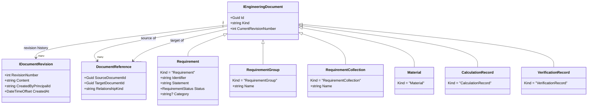
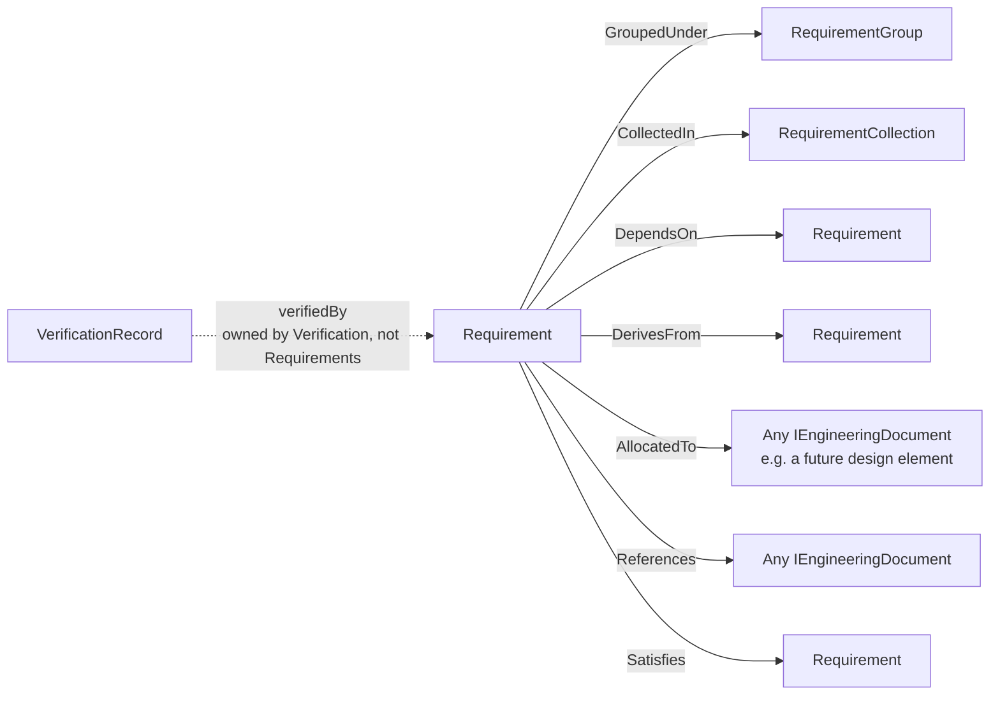
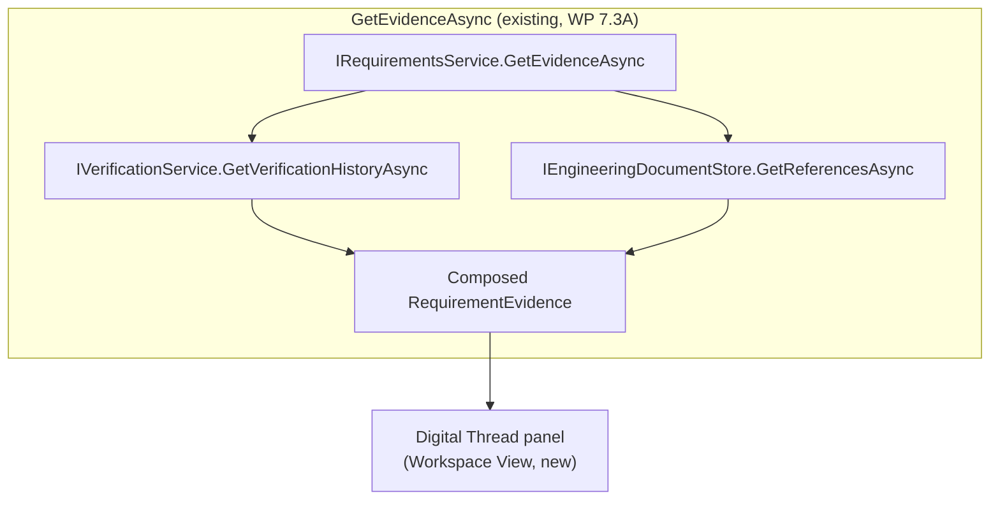
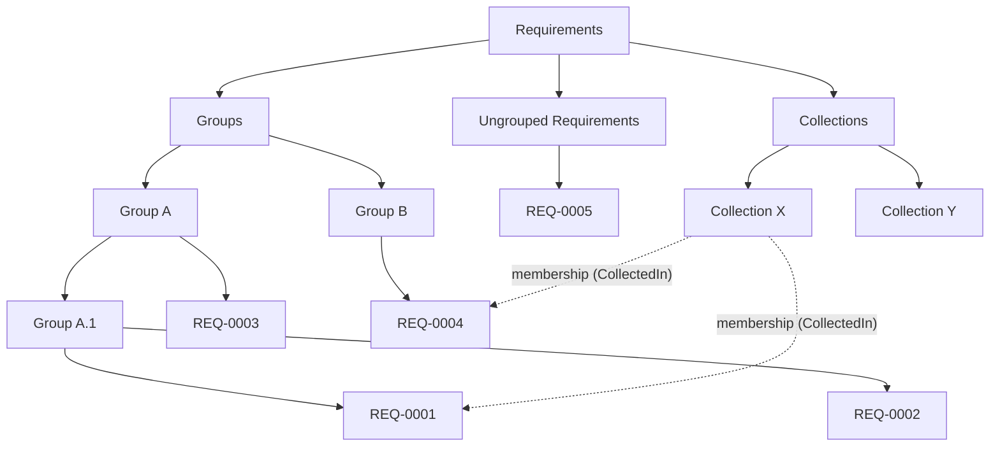
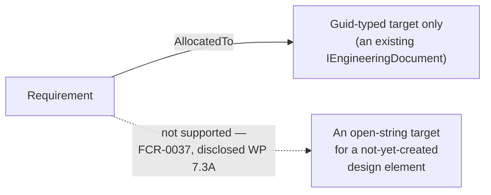

# WP 8.0A — Engineering Workspace — Object Relationship Diagrams

## Purpose

Diagrams of the engineering object model the Workspace presents, and
how its own relationships compose into the digital thread — expanding
`WP8.0A Workspace Architecture Document.md` §6 and §9. Every diagram
below reflects the shipped `Tempest.Core` contracts exactly as they
exist (`WP 7.1A`–`WP 7.3A`); nothing here proposes a new relationship
kind, a new document `Kind`, or a new storage mechanism.

## 1. The Shared Engineering Document Model

Every box below `IEngineeringDocument` in this diagram is a `Kind`
string, not a distinct storage mechanism — the Workspace's own View
layer is what gives each `Kind` a distinct presentation, not a distinct
persistence path (`WP8.0A Workspace Architecture Document.md` §6).

## 2. Requirement Relationships (`RequirementRelationshipKinds`)

Six relationship kinds belong to `Tempest.Core.Requirements`
(`RequirementRelationshipKinds`); the seventh (`verifiedBy`) already
belongs to `Tempest.Core.Verification` and is never duplicated
(`WP7.2C Relationship Model.md`). The Workspace's own Project Explorer
(§3.1 of `WP8.0A Navigation Specification.md`) renders `GroupedUnder`
as tree parentage and `CollectedIn` as the Collections filter view; the
Digital Thread panel (§3 below) renders every kind uniformly as a
navigable entry.

## 3. Digital Thread Composition (What `GetEvidenceAsync` Actually Reads)

The Workspace introduces nothing new here — `GetEvidenceAsync` already
composes verification history and linked references into one read
(`WP7.2B Digital Thread Architecture.md`'s own central claim, proven in
code by `WP 7.3A`). The Digital Thread panel is a **View** over an
**already-existing composed read**, not a new traversal mechanism —
consistent with `ADR-0065`.

## 4. Project Explorer Tree — Requirements Area (Worked Example)

Dotted lines show `CollectedIn` membership — a requirement (`REQ-0001`)
appears once under its own `Group` (solid hierarchy) and is referenced,
not duplicated, from whichever Collection(s) it belongs to (§3.1 of
`WP8.0A Navigation Specification.md`).

## 5. Allocation to a Future Design Element (Disclosed Limitation)

The Workspace's own Allocation view can only ever show a real, existing
target object, matching `IRequirementsService.LinkAsync`'s own shipped,
Guid-only signature. Presenting a pending, not-yet-created allocation
target is not possible until `FCR-0037` (string-based allocation
targets) is implemented — this architecture does not design around a
capability that does not yet exist.

## Related Documents

`WP8.0A Workspace Architecture Document.md`; `WP8.0A Navigation
Specification.md`; `docs/academy/02 Runtime Architecture/
16-requirements-engine.md`; `docs/releases/v0.7.0/WP7.2C Relationship
Model.md`; `docs/releases/v0.7.0/WP7.3A Digital Thread Assessment.md`.
