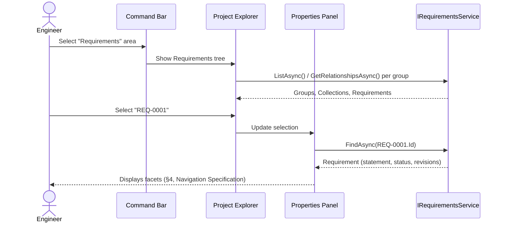
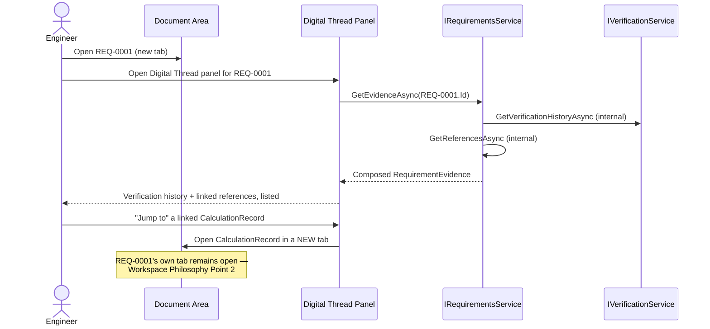
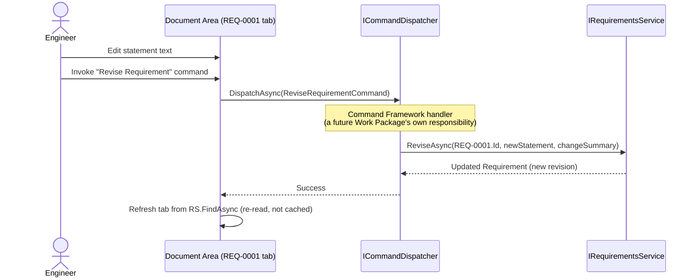
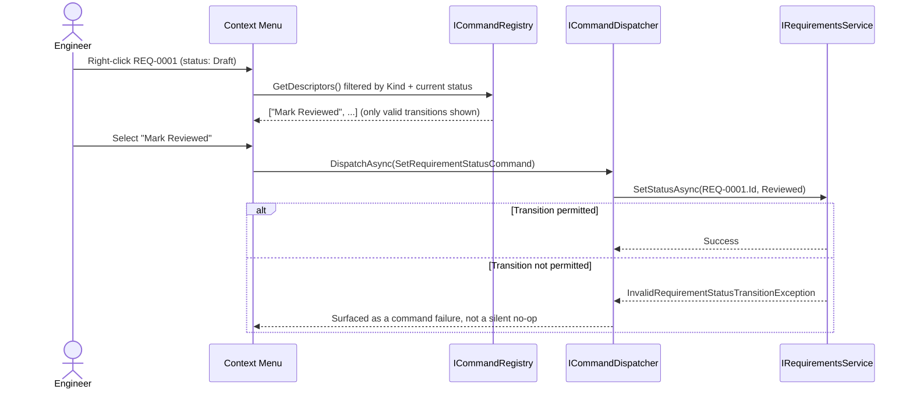
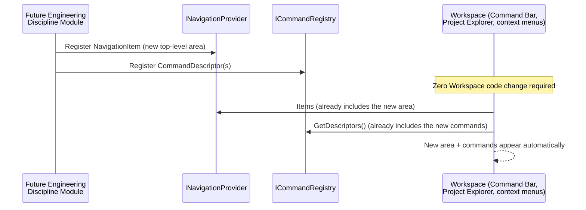

# WP 8.0A — Engineering Workspace — User Workflow Diagrams

## Purpose

Step-by-step diagrams for the five user journeys named in `WP8.0A
Workspace Architecture Document.md` §2, each annotated with exactly
which existing (or reserved) mechanism carries out each step. No new
platform capability is assumed by any diagram below.

## Journey 1 — Browse and Inspect a Requirement

Zero writes. Every step is a direct read against the already-shipped
`IRequirementsService`.

## Journey 2 — Trace the Digital Thread

`GetEvidenceAsync`'s own internal composition (`IVerificationService.
GetVerificationHistoryAsync` + `GetReferencesAsync`) is exactly what
`WP 7.3A` already ships — the Digital Thread panel adds no new read.

## Journey 3 — Revise a Requirement

The View never calls `ReviseAsync` directly (`ADR-0063`) — it dispatches
a Command, and the Command's own handler (not yet designed; a future
Work Package's own scope) calls the service.

## Journey 4 — Change Lifecycle Status

`RequirementStatusTransitions`'s own existing permitted-transition table
(`WP 7.3A`) is the single source of truth for which menu items even
appear — the Workspace does not duplicate that table, only queries
against it indirectly via what the Command Framework allows.

## Journey 5 — A Future Module Contributes Its Own Area

This is the existing extensibility model, unchanged — the only reserved,
not-yet-designed extension point is the object-view contract itself
(`WP8.0A Workspace Architecture Document.md` §10, `ADR-0067` reserved),
since a module's own object `Kind` still needs a View to render it, and
that registration mechanism does not exist yet.

## Related Documents

`WP8.0A Workspace Architecture Document.md`; `WP8.0A UI Architecture.md`;
`WP8.0A Navigation Specification.md`; `WP8.0A Object Relationship
Diagrams.md`.
