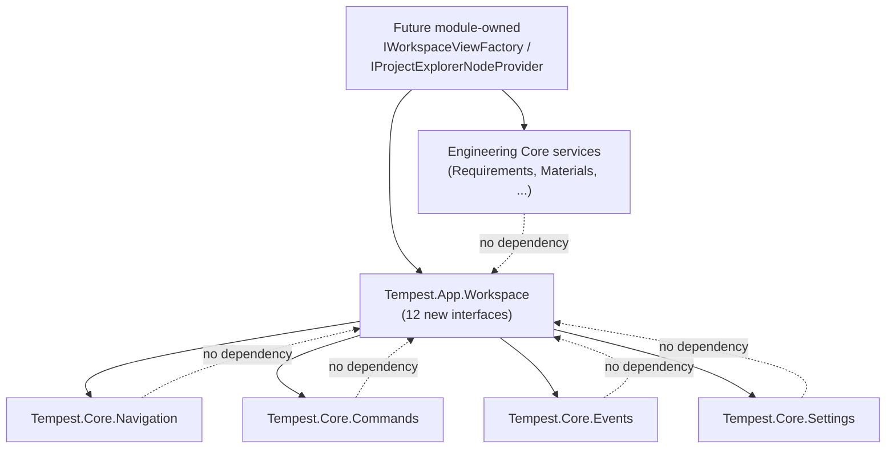

# WP 8.0B — Workspace Contracts — Dependency Rules

## Purpose

The complete layering analysis for `Tempest.App.Workspace` — what it
may depend on, what must never depend on it, and the specific rules
that keep the twelve contracts in `WP8.0B Workspace Contracts.md`
consistent with `FOUNDATION.md`'s own four-layer platform model
(`ADR-0023`) and this project's own dependency-injection discipline.

## 1. Namespace Placement

`Tempest.App.Workspace` is a namespace within `Tempest.App`, not
`Tempest.Core`. This follows directly from `ADR-0062`: the Workspace is
a composition-root concept, not a Platform Service, so its own
interfaces belong in the one assembly that is already permitted to
depend on everything (`Tempest.App` already references `Tempest.Core`
and `Tempest.Samples`) — never in `Tempest.Core`, which every Platform
Service and Module depends on, and which must never depend upward on
anything composition-root-specific.

## 2. Allowed Dependencies

| From | To | Why |
|---|---|---|
| Any `Tempest.App.Workspace` interface | `Tempest.Core.Navigation.INavigationProvider`, `NavigationItem` | `INavigationService` wraps it directly (§6, Workspace Contracts) |
| Any `Tempest.App.Workspace` interface | `Tempest.Core.Commands.ICommandDispatcher`, `ICommandRegistry`, `ICommand`, `CommandDescriptor` | `IWorkspaceCommand` extends `ICommand`; every mutation dispatches through `ICommandDispatcher` (`ADR-0063`) |
| Any `Tempest.App.Workspace` interface | `Tempest.Core.Events.IEventBus`, `IEvent`, `IEventHandler<T>` | `ISelectionService` publishes through it (§7, Workspace Contracts) |
| Any `Tempest.App.Workspace` interface | `Tempest.Core.Settings.ISettingsProvider` | `IWorkspaceState` persists through it (`ADR-0064`) |
| A concrete `IWorkspaceViewFactory`/`IProjectExplorerNodeProvider` implementation (module-owned, not part of this contract) | Whatever Engineering Core service that module's own `Kind` needs (`IRequirementsService`, `IMaterialCatalog`, ...) | The module's own registration code, never `IWorkspace`/`IProjectExplorer`/`IWorkspaceManager` themselves |

## 3. Forbidden Dependencies

| Forbidden | Reason |
|---|---|
| `Tempest.Core.*` depending on `Tempest.App.Workspace.*` | Would invert `ADR-0023`'s own "dependencies flow downward only" rule — the Workspace is above every Platform Service and Module, never beneath one |
| `IWorkspace`, `IWorkspaceManager`, `IProjectExplorer`, or `IWorkspaceView` depending directly on `IRequirementsService`, `IMaterialCatalog`, `ICalculationEngine`, or `IVerificationService` | Would violate `WP8.0A Workspace Architecture Document.md` §1 Point 4 ("the Workspace does not know what an Engineering Discipline Module is") — every such dependency must live inside a registered `IWorkspaceViewFactory`/`IProjectExplorerNodeProvider` instead (§2, Workspace Contracts) |
| Any component depending on `IWorkspaceContext` as a service locator (calling into it to *resolve* `INavigationService`/`ISelectionService`) | `IWorkspaceContext` exposes only two read-only data properties (§8, Workspace Contracts) — it has no method that returns a service reference, by design; a component needing a service takes it via ordinary constructor injection |
| A `IWorkspaceCommand` handler depending on `IWorkspaceView` directly to force its own refresh | The auto-refresh hook (§5, Sequence Diagrams) is generic Workspace infrastructure, triggered by `IWorkspaceCommand`'s own marker interface — a command handler that manually reaches into `IWorkspace.OpenViews` to refresh a view duplicates infrastructure that already exists for every command implementing the interface uniformly |

## 4. Circular Dependency Check

Confirmed, by direct inspection of every dependency named in
`WP8.0B Workspace Contracts.md`: zero cycles.

The dotted lines are the check itself: none of `Tempest.Core.Navigation`,
`.Commands`, `.Events`, `.Settings`, or any Engineering Core namespace
has, or is proposed to gain, any reference back to
`Tempest.App.Workspace` — the arrow only ever points one way.

## 5. `IWorkspaceContext` — Ambient State, Not a Service Locator

`IWorkspaceContext` deserves its own rule, stated explicitly, since
ambient-state patterns have a well-known failure mode (quietly becoming
a service locator over time, one convenience method at a time). The
rule: **`IWorkspaceContext` may only ever grow additional read-only data
properties, never a method that resolves or returns a service
reference.** Any future need for a component to reach a service from
"wherever it currently is" should be satisfied by ordinary constructor
injection at that component's own construction time — exactly the same
discipline `ICurrentPrincipalAccessor` has held to, unmodified, since
`ADR-0044`.

## 6. Reuse Confirmation

Every one of the twelve contracts in `WP8.0B Workspace Contracts.md`
was checked against this project's own existing Platform Service
surface before any new mechanism was proposed. Zero new Platform
Service, zero new persistence mechanism, zero new pub/sub mechanism,
and zero new command-dispatch mechanism were introduced — the complete
list of what *is* reused: `INavigationProvider`, `ICommandDispatcher`/
`ICommandRegistry`, `IEventBus`, `ISettingsProvider`. This is the
seventh consecutive TempestOS capability (after Materials, Calculations,
Verification, Requirements, the Workspace's own architecture phase, and
now its own contract phase) to reach "reuse what exists" as its central
finding — continuing, not merely repeating, the pattern
`WP7.4.0 Architecture Baseline Summary.md` first named across the
Engineering Core.

## Related Documents

`WP8.0B Workspace Contracts.md`; `ADR-0023`; `ADR-0044`; `ADR-0062`;
`ADR-0063`; `ADR-0064`; `ADR-0065`; `ADR-0067`.
