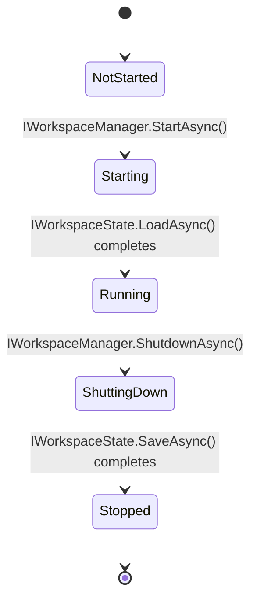
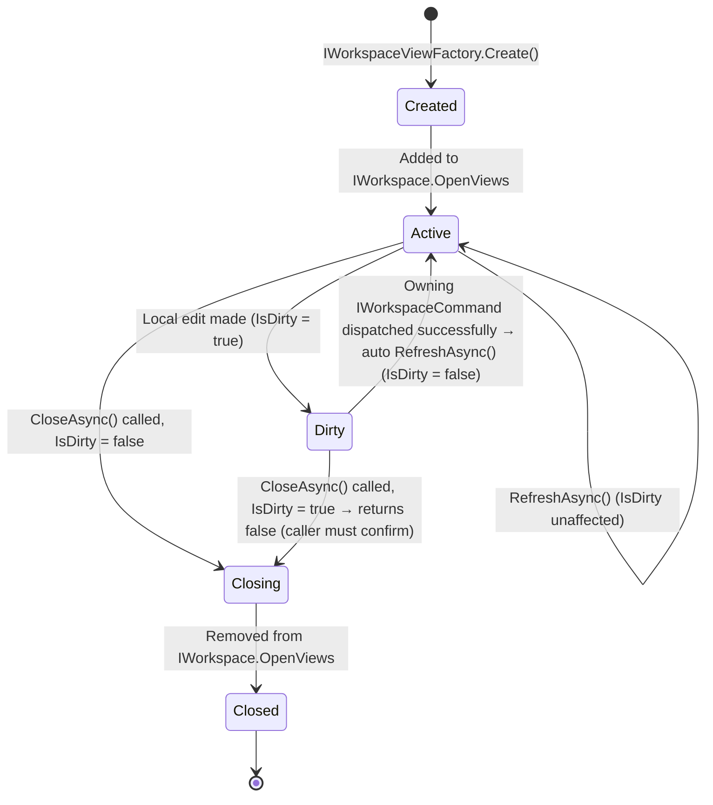
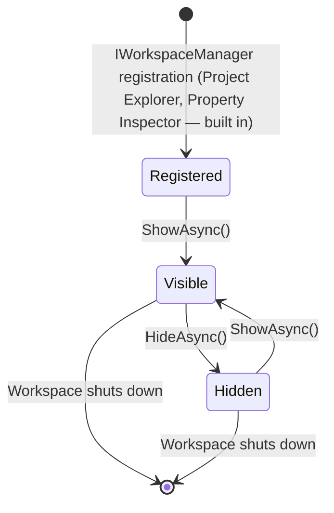

# WP 8.0B — Workspace Contracts — Lifecycle Definitions

## Purpose

The complete lifecycle — every state and every permitted transition —
for the three Workspace concepts that genuinely have one:
`IWorkspace` itself, `IWorkspaceView`, and `IWorkspacePanel`. Mirrors
`RequirementStatusTransitions`'s own established discipline
(`WP 7.3A`): an explicit, closed transition table, not an implied one a
future implementer must infer from prose.

## 1. `IWorkspace` Lifecycle (via `IWorkspaceManager`)

| State | `IWorkspaceManager.Current` | Meaning |
|---|---|---|
| `NotStarted` | `null` | Before `StartAsync` is ever called |
| `Starting` | `null` | Layout/state loading in progress |
| `Running` | The assembled `IWorkspace` | Normal operation — every other lifecycle below only applies here |
| `ShuttingDown` | The assembled `IWorkspace` (still readable) | State being persisted; no new `OpenAsync`/`SelectAsync` call is accepted (an implementation-phase choice: reject or queue, not fixed here) |
| `Stopped` | `null` | `IWorkspaceManager` may be started again — `StartAsync` is not a one-shot operation, mirroring `ITempestHost`'s own restart-tolerant design where applicable |

This mirrors `TempestShell.StartAsync`/`StopAsync`'s own two-phase
shape (`WP 5.0D`) directly, extended with the explicit `Loading`
sub-phase `IWorkspaceState.LoadAsync` (§1, Sequence Diagrams) requires
that `TempestShell` itself never needed, since `TempestShell` persists
no session state of its own.

## 2. `IWorkspaceView` Lifecycle

| Transition | Guard | Consequence |
|---|---|---|
| `Active` → `Dirty` | An edit occurs in the view's own (not-yet-designed) rendering surface | `IsDirty` becomes `true` — not itself a contract-level event, since no view-internal edit contract is named among the twelve required interfaces |
| `Dirty` → `Active` | A `IWorkspaceCommand` whose `TargetObjectId` matches this view's own `ObjectId` dispatches successfully | The Workspace calls `RefreshAsync()` automatically (§5, Sequence Diagrams) — the view never has to poll or subscribe to know its own data changed |
| `Active`/`Dirty` → `Closing` | `CloseAsync()` called | If `IsDirty` was `true`, `CloseAsync()` returns `false` and the view remains open — the caller (a concrete rendering technology's own UI) is responsible for prompting and re-calling `CloseAsync()` once confirmed |

**No `Suspended`/`Background` state exists.** Every `IWorkspaceView` in
`IWorkspace.OpenViews` is considered equally live regardless of whether
its own tab is currently focused — `ActiveView` (§1, Workspace
Contracts) tracks *focus*, not lifecycle state. A background tab still
receives `RefreshAsync()` calls from the auto-refresh hook (§5,
Sequence Diagrams) exactly as the focused one does.

## 3. `IWorkspacePanel` Lifecycle

Unlike `IWorkspaceView`, a panel is never "closed" in the sense of being
destroyed and needing re-creation — `HideAsync()`/`ShowAsync()` toggle
`IsVisible` only, preserving whatever internal state the panel holds
(the Project Explorer's own expanded/collapsed node state, for
instance) across a hide/show cycle. This matches `WP8.0A UI
Architecture.md` §2's own "closing does not lose its own last state;
reopening restores the same width/position it held before closing."

## 4. `IWorkspaceState` — Not a State Machine

`IWorkspaceState` itself has no lifecycle beyond `LoadAsync`/`SaveAsync`
— it is a data snapshot, not a stateful component. `LoadAsync` is
called exactly once, during `IWorkspace` `Starting` (§1); `SaveAsync` is
called during `ShuttingDown` (§1) and, per an implementation-phase
choice not fixed here, optionally on every layout or open-tab change
(debounced) — `WP8.0B Sequence Diagrams.md` §6 deliberately leaves the
exact trigger cadence open, since it has no bearing on any contract
signature.

## Related Documents

`WP8.0B Workspace Contracts.md`; `WP8.0B Sequence Diagrams.md`;
`docs/academy/02 Runtime Architecture/16-requirements-engine.md`
(`RequirementStatusTransitions`, the closed-transition-table precedent
this document follows).
