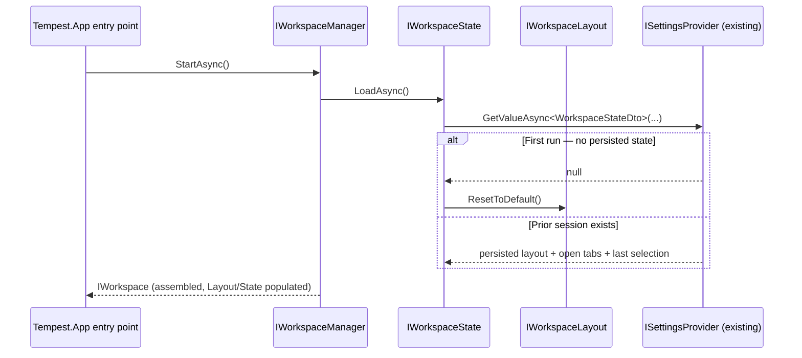
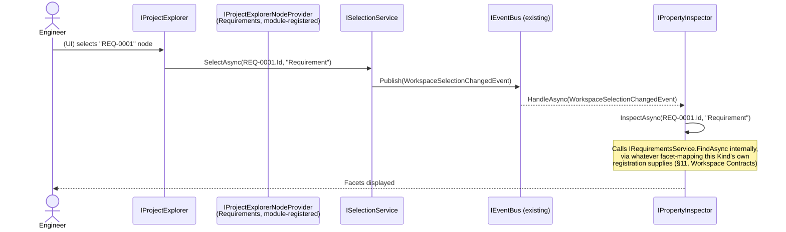
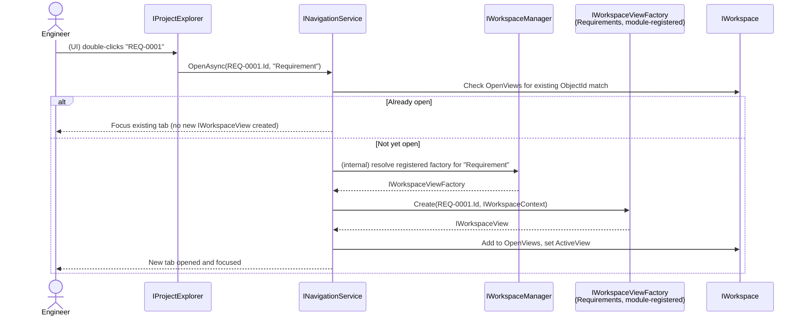
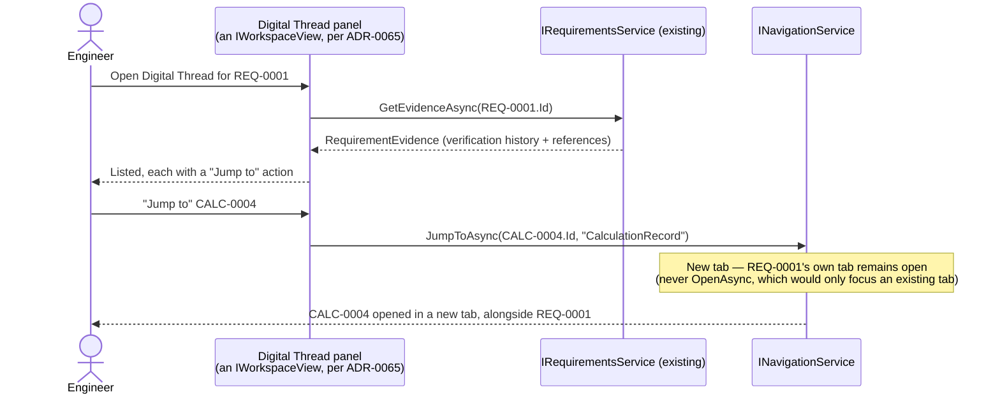
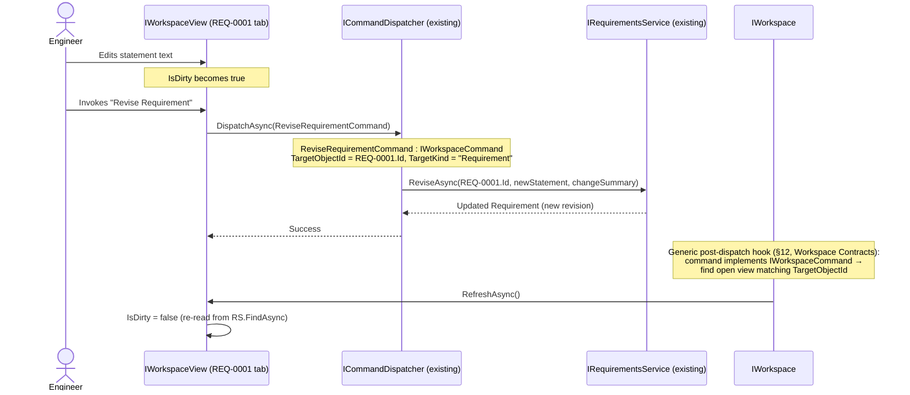
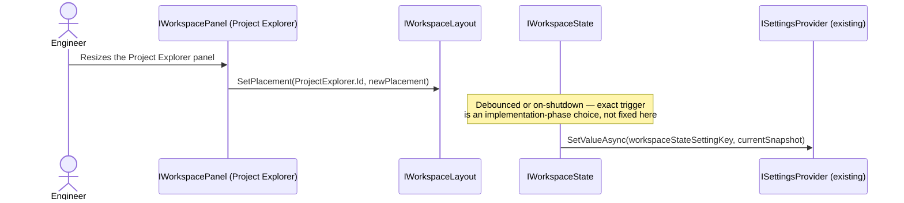

# WP 8.0B — Workspace Contracts — Sequence Diagrams

## Purpose

Sequence diagrams showing exactly how `WP8.0B Workspace Contracts.md`'s
own twelve interfaces interact, for the six operations that exercise
every contract at least once. Each diagram cites the exact method
signature it calls — no diagram below invents an interaction the
contracts document does not already define.

## 1. Workspace Startup

## 2. Select a Requirement in the Project Explorer

Note `IProjectExplorer` itself never calls `IRequirementsService`
directly — `GetRootNodesAsync`/`GetChildrenAsync` (§10, Workspace
Contracts) delegate to the registered `IProjectExplorerNodeProvider` for
the current area.

## 3. Open an Object (with View-Factory Extensibility)

If no factory is registered for `"Requirement"`,
`OpenAsync` throws `WorkspaceViewFactoryNotFoundException` (§Exception
Model, Workspace Contracts) — surfaced to the engineer as "this object
type cannot be displayed," never a silent no-op.

## 4. Digital Thread — Jump to a Linked Calculation Record

## 5. Revise a Requirement (Command Dispatch + Auto-Refresh)

## 6. Layout Change and Persistence

## Related Documents

`WP8.0B Workspace Contracts.md`; `WP8.0B Lifecycle Definitions.md`;
`WP8.0B Dependency Rules.md`; `ADR-0063`; `ADR-0064`; `ADR-0065`;
`ADR-0067`.
