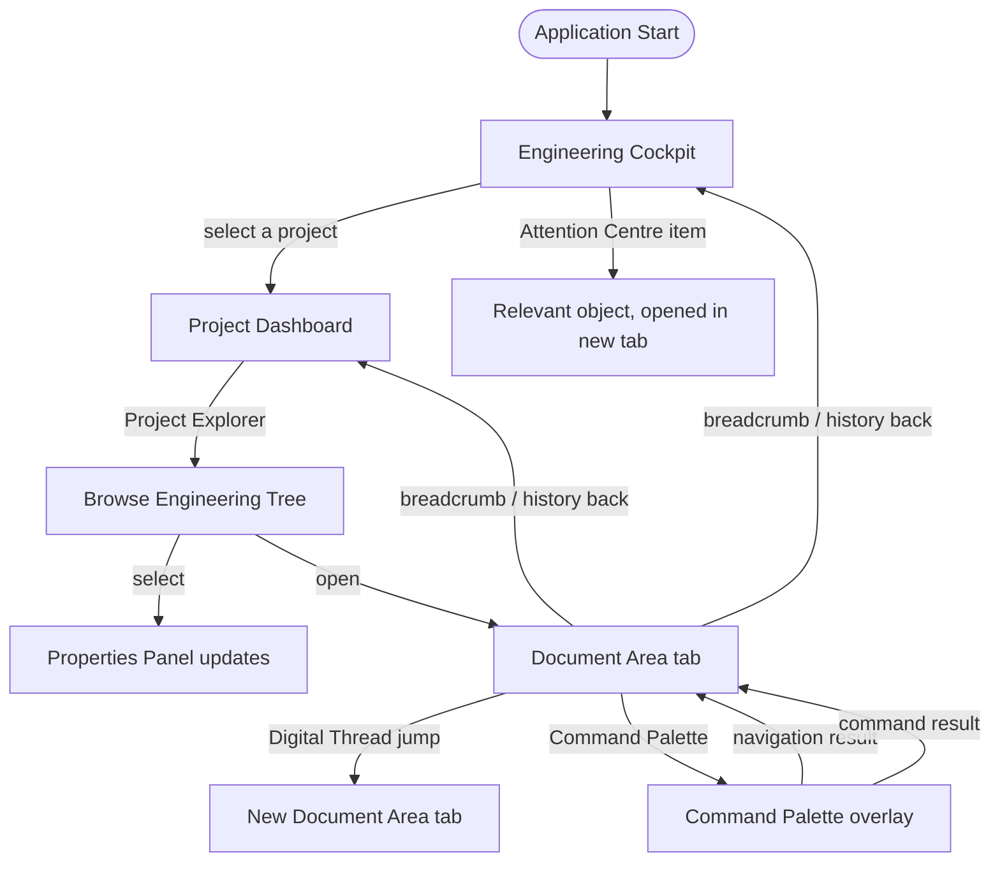

# WP 8.0C — Engineering Workspace UX Specification — Navigation Maps

## Purpose

How a user moves between screens and objects — breadcrumbs, history,
project switching, global commands — and how those movements compose
into a map, not a maze. Builds directly on `WP8.0A Navigation
Specification.md`, which this document extends with target-state
behaviour rather than restates.

## 1. Navigation Model, Restated

`WP8.0A Navigation Specification.md` §1 already establishes the two
governing verbs — **select** (Project Explorer click, updates
Properties only) and **open** (double-click or Enter, adds a Document
Area tab) — unchanged here. This document adds the *history* and
*orientation* layer around those two verbs.

## 2. Global Navigation Flow

**Reading this map:** the Engineering Cockpit is the one node every
other node can return to — confirmed independently by `WP8.0C User
Journey Maps.md`'s own "Cross-Journey Observations." No screen is a
dead end; every screen names, per `Screen Catalogue.md`'s own "What
should I do next?" test, at least one forward path and one path back.

## 3. Breadcrumbs

Every Document Area tab carries a breadcrumb trail showing the path
that led to it: `Project › Area › Object` at minimum, extended with
intermediate grouping (`Project › Requirements › Group: Structural ›
REQ-0014`) where the object's own containment justifies it.

**Behaviour.** Each breadcrumb segment is itself a navigation target —
clicking `Requirements` from a requirement's own breadcrumb returns to
the Requirements area of the Project Explorer, selection restored to
where the user last was in that area (Today: not implemented — WP8.1A's
shell has no breadcrumb; Target: this specification's own addition).

**Digital Thread jumps do not extend the breadcrumb of the tab that
opened them** — since a jump opens a *new* tab (§Interaction
Specification, unchanged pattern), that new tab's own breadcrumb starts
fresh from the jumped-to object's own containment, not the originating
object's path. This keeps breadcrumbs honest about containment, not a
log of how the user arrived.

## 4. Navigation History

**Per-tab, not global.** Each Document Area tab remembers its own small
back/forward history of *selections made within that tab's own area*
(e.g., moving between sibling requirements without opening new tabs) —
not a single global history shared across the whole Workspace, since
tabs are already the Workspace's own mechanism for holding multiple
independent places at once (§Interaction Specification §3, tab
reordering).

**Global "recently viewed"**, distinct from per-tab history: the
Command Palette's own navigation results (§Interaction Specification
§1, "Also reaches navigation") surface recently-opened objects
regardless of which tab or area they came from — this is the
cross-cutting recall mechanism; per-tab back/forward is not intended to
serve that purpose.

## 5. Project Switching and Recent Projects

**Today:** WP8.1A's shell operates against a single implicit project
context (whatever the running `ITempestHost` resolves); no multi-project
switching UI exists.

**Target:** the Engineering Cockpit's own header (`Engineering Cockpit
Specification.md` §1) names the current project and offers a switcher.
Switching:

1. Prompts to save the current layout under its own project scope
   (`Workspace Behaviour Specification.md` §2) if unsaved changes to
   panel arrangement exist.
2. Closes open Document Area tabs belonging to the outgoing project
   (each respecting `IWorkspaceView.CloseAsync`'s own unsaved-edit
   confirmation, unchanged).
3. Loads the incoming project's own last-saved layout, or the default
   layout if none exists.

**Recent projects** are listed on the Engineering Cockpit itself (not
a separate screen) — most-recently-opened first, capped at a small,
fixed number, each entry showing the project's own name and last-opened
timestamp only (no live health preview, which is the Project
Dashboard's own job, not the recent-projects list's).

## 6. Global Commands

Restated from `Interaction Specification.md` §1: any command in
`ICommandRegistry` is a global navigation target the moment it is
discoverable through the Command Palette. This document adds one rule:
**a "Go to Area" command exists per top-level Project Explorer area**
(Requirements, Materials, Calculations, etc.) — so keyboard-first
navigation to a whole area never requires first opening the Project
Explorer panel and clicking into it; Principle 7 (keyboard-first)
applied to area-level, not only object-level, navigation.

## 7. Filtering and Searching, Navigation-Adjacent

Two distinct surfaces, restated from `Screen Catalogue.md` §14 for
completeness in a navigation context:

- **Project Explorer filter** narrows the currently visible tree to
  matching nodes — a *view* change, not a navigation event; selection
  and open tabs are unaffected until the user acts on a filtered
  result.
- **Command Palette search** (§Interaction Specification §1) *is* a
  navigation/command dispatch surface — acting on a result always
  either opens a tab or invokes a command.

## Related Documents

`WP8.0A Navigation Specification.md`; `WP8.0C UX Specification.md`;
`WP8.0C Screen Catalogue.md`; `WP8.0C Interaction Specification.md`;
`WP8.0C User Journey Maps.md`; `WP8.0C Workspace Behaviour
Specification.md` §2 (layout save/restore on project switch).
