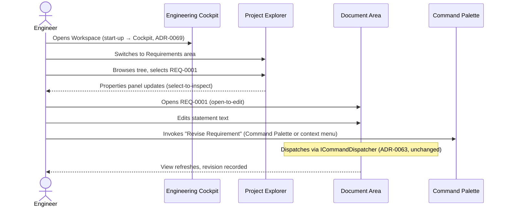
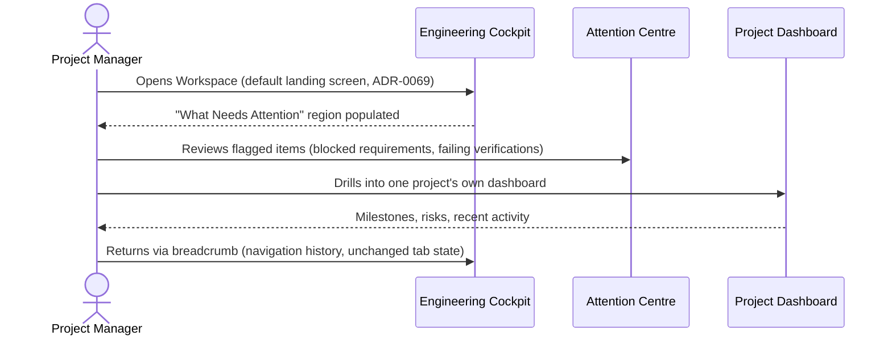
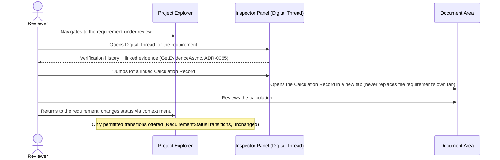
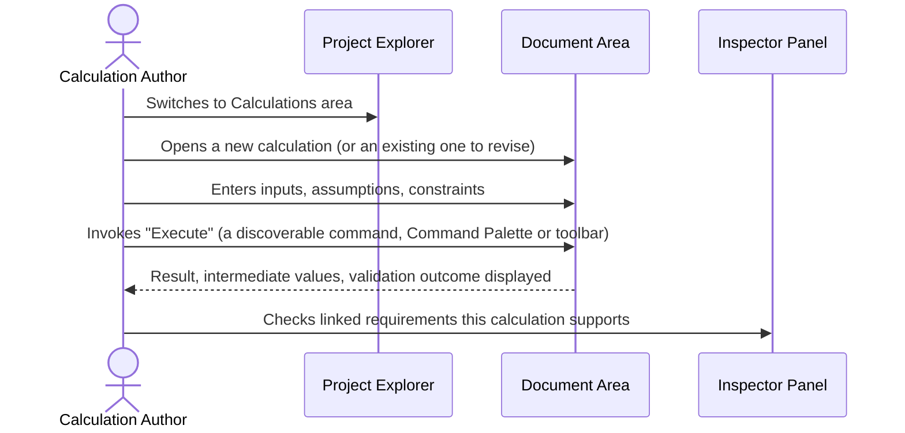
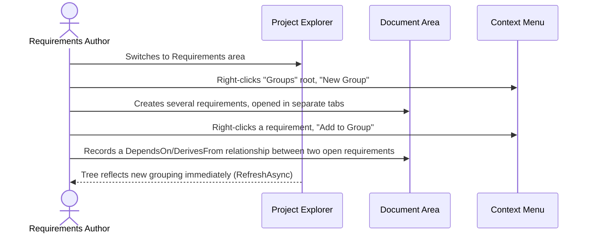

# WP 8.0C — Engineering Workspace UX Specification — User Journey Maps

## Purpose

The five personas' own typical workflows through a project lifecycle
(`WP8.0C UX Specification.md` §2), each as a concrete step sequence.
Every step names the screen it happens on (`Screen Catalogue.md`) and,
where one already exists, the underlying mechanism
(`WP8.0B Workspace Contracts.md`) it would use — proving each journey
is achievable within the architecture already approved, not a wish
list requiring new platform capability.

## 1. Engineer — Author and Revise a Requirement

**Screens touched:** Engineering Cockpit → Project Explorer → Document
Area → Command Palette. **No new capability required** — every step
maps directly to an existing or already-specified mechanism.

## 2. Project Manager — Assess Programme Health

**Screens touched:** Engineering Cockpit → Attention Centre → Project
Dashboard. This is the persona the Engineering Cockpit exists
primarily to serve — see `WP8.0C Engineering Cockpit Specification.md`.

## 3. Reviewer — Verify a Claim

**Screens touched:** Project Explorer → Inspector Panel → Document
Area → context menu. Proves the Inspector/Properties split (`Screen
Catalogue.md` §10) is load-bearing for this persona specifically — a
reviewer's own primary need (evidence, not identity) is exactly what
the Inspector, not Properties, answers.

## 4. Calculation Author — Produce and Validate a Calculation

**Screens touched:** Project Explorer → Document Area → Inspector
Panel. The calculation's own record remains durable and evidentiary
(`Tempest.Core.Calculations`'s own existing design, unchanged) — this
journey only specifies how an engineer reaches and operates it.

## 5. Requirements Author — Author, Group, and Trace Requirements

**Screens touched:** Project Explorer → Document Area → context menus.
Exercises `WP8.0A Object Relationship Diagrams.md` §4's own worked
Project Explorer tree example directly — this journey is that example,
narrated as a user's own actions.

## Cross-Journey Observations

- **Every journey begins at the Engineering Cockpit** (`ADR-0069`) —
  confirming it as the correct default landing screen for all five
  personas, not only the Project Manager it was first motivated by.
- **Every journey's own "jump to another object" step opens a new tab,
  never replaces the current one** — the single most load-bearing,
  cross-cutting interaction pattern in the entire specification,
  already locked in at the architecture stage (`WP8.0A Workspace
  Architecture Document.md` §1 Point 2) and confirmed here to hold
  across every persona, not only the Digital Thread panel it was first
  specified for.
- **No journey requires a capability this platform does not already
  have, or has not already specified** — every step maps to an
  existing Platform Service, an existing Engineering Core method, or an
  already-approved Workspace contract. This specification adds
  *experience*, not new underlying capability.

## Related Documents

`WP8.0C UX Specification.md`; `WP8.0C Screen Catalogue.md`;
`WP8.0C Engineering Cockpit Specification.md`; `WP8.0A User Workflow
Diagrams.md` (the architecture-stage precedent this document extends
with named personas).
