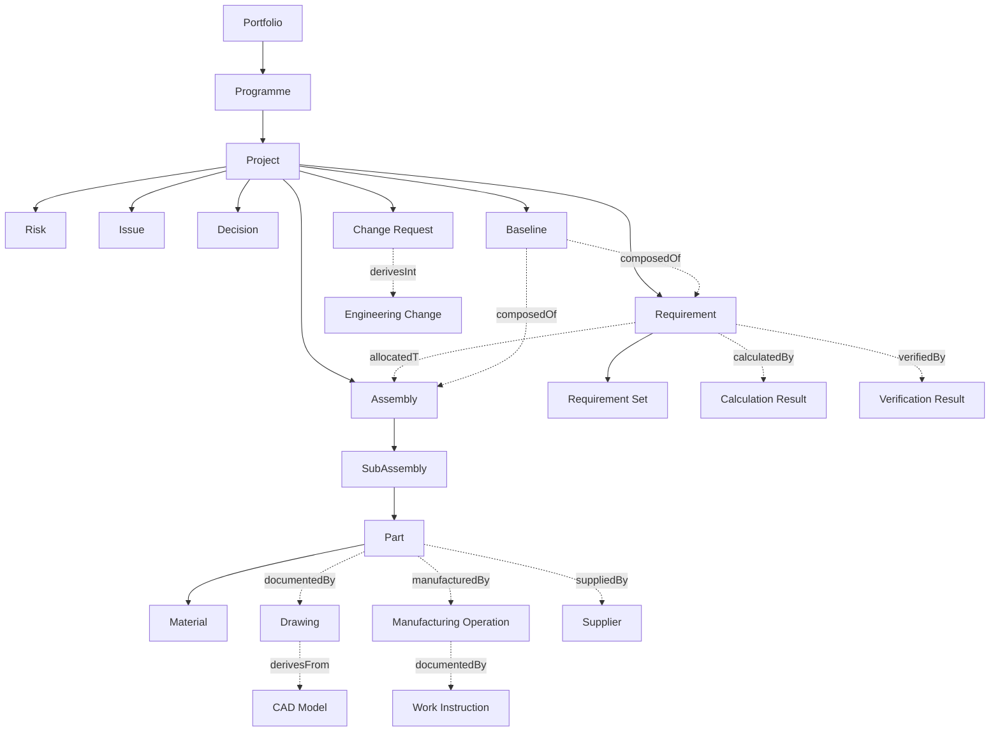
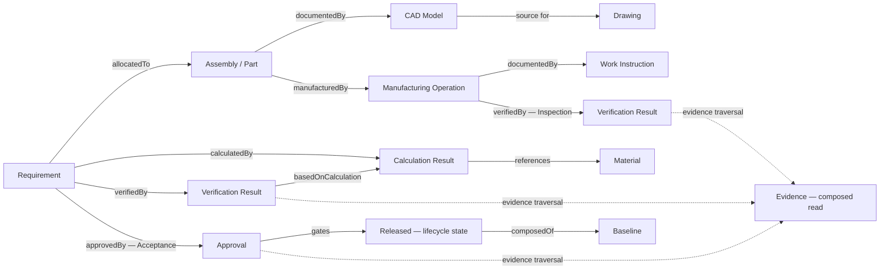
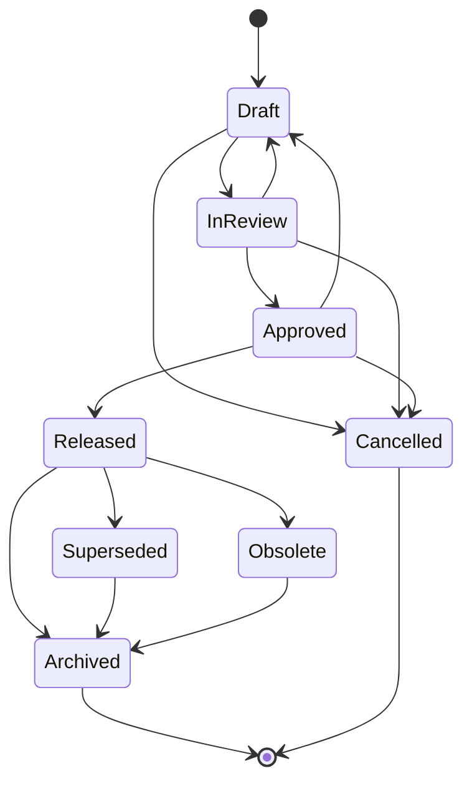
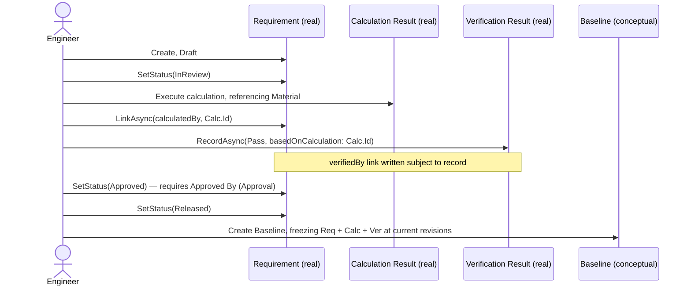
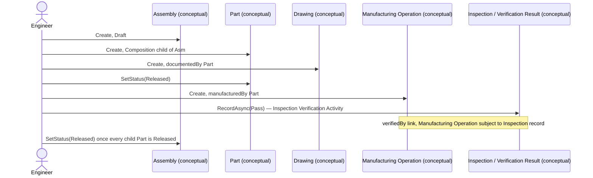

# WP 8.2A — Engineering Domain Architecture — Engineering Object Interaction Diagrams

## Purpose

Diagrams making the Canonical Object Catalogue, Relationship Catalogue,
Lifecycle Specification, and Digital Thread Specification concrete —
conceptual only, no implementation technology implied by any diagram
below.

## 1. Canonical Object Families

Solid arrows: Composition/Aggregation (structural containment). Dotted
arrows: named relationships from `Relationship Catalogue.md` §4 —
directed, but not structural containment.

## 2. Digital Thread Flow

This is the controlling instruction's own named chain (Requirements →
Calculations → CAD → Verification → Manufacture → Inspection →
Acceptance → Release → Evidence), expressed entirely as
`Relationship Catalogue.md` hops — see `Digital Thread
Specification.md` §2 for the prose form.

## 3. Canonical Lifecycle States

Matches `Lifecycle Specification.md` §2 exactly — the canonical table
every object family specialises from (§4 of that document).

## 4. Worked Example: Requirement → Release (Already-Real Chain)

Every step through `Ver` is real, shipped behaviour (`WP 7.3A`/
`WP 7.1D`/`WP 7.1E`); `Approved`/`Released`/`Baseline` steps are
canonical architecture, not yet implemented.

## 5. Worked Example: Physical Chain (Conceptual, Extending the Same Pattern)

Identical shape to §4 — no new mechanism, only different `Kind` values
and relationship kinds, proving the canonical shape (`Engineering
Domain Architecture.md` §3) genuinely generalises across disciplines.

## Related Documents

`WP8.2A Engineering Domain Architecture.md`; `WP8.2A Canonical Object
Catalogue.md`; `WP8.2A Relationship Catalogue.md`; `WP8.2A Lifecycle
Specification.md`; `WP8.2A Digital Thread Specification.md`; `WP8.2A
Configuration Management Specification.md`.
