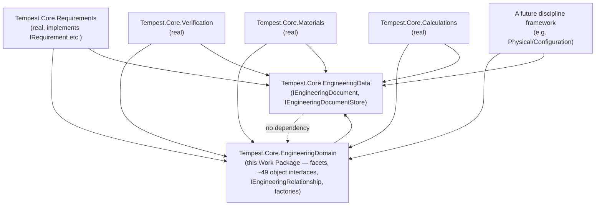

# WP 8.2B — Engineering Domain Contracts — Dependency Rules

## Purpose

The complete layering analysis for `Tempest.Core.EngineeringDomain` —
what it may depend on, what must never depend on it, and the specific
rules keeping every contract in `WP8.2B Interface Catalogue.md`/
`Relationship Contract Specification.md`/`Lifecycle Contract
Specification.md`/`Validation Contract Specification.md`/`Digital
Thread Contract Specification.md` consistent with `FOUNDATION.md`'s own
layering model and `ADR-0072`'s own "backed by the existing store, not
a new one" decision.

## 1. Namespace Placement

`Tempest.Core.EngineeringDomain` is a new namespace within
`Tempest.Core` — not `Tempest.App`, not a per-framework namespace like
`Tempest.Core.Requirements`. It sits **between**
`Tempest.Core.EngineeringData` (below it) and every discipline-specific
framework (`Tempest.Core.Requirements`, a future
`Tempest.Core.PhysicalConfiguration`, and so on — above it): the
Engineering Domain contracts are the shared vocabulary every discipline
framework's own future implementation composes, exactly as
`Tempest.Core.EngineeringData` already is today, one layer further down.

## 2. Allowed Dependencies

| From | To | Why |
|---|---|---|
| Any `Tempest.Core.EngineeringDomain` interface | `Tempest.Core.EngineeringData.IEngineeringDocument`/`IDocumentRevision`/`DocumentReference`/`IEngineeringDocumentStore` | `IEngineeringObject` mirrors `IEngineeringDocument`'s own shape directly (`ADR-0072`); a future implementation realises every contract here as a thin wrapper over this exact store |
| Any `Tempest.Core.EngineeringDomain` interface | `Tempest.Core.UnitsAndQuantities.Quantity<TDimension>`/`Unit<TDimension>` | Every engineering numeric value (Material properties, Tolerances) is proposed as a `Quantity<TDimension>` (`WP8.2A Metadata Specification.md` §4) |
| Any `Tempest.Core.EngineeringDomain` interface | `Tempest.Core.Identity.ICurrentPrincipalAccessor` (indirectly, at implementation time only) | `AuthorPrincipalId`/`ApproverPrincipalId`/`ActorPrincipalId` members resolve from it, mirroring `IDocumentRevision.AuthorPrincipalId`'s own precedent — never referenced by a contract's own signature, only by its own future implementation |
| A future discipline framework (`Tempest.Core.Requirements`, a future Physical/Configuration framework) | `Tempest.Core.EngineeringDomain` | Every discipline-specific interface (`IRequirement`, a future `IPart` implementation) implements the relevant `Tempest.Core.EngineeringDomain` contracts, composing facets exactly as `Interface Catalogue.md` proposes |

## 3. Forbidden Dependencies

| Forbidden | Reason |
|---|---|
| `Tempest.Core.EngineeringData.*` depending on `Tempest.Core.EngineeringDomain.*` | Would invert the layering §1 establishes — the Engineering Data Model is the foundation every domain contract is built on, never the reverse |
| Any `Tempest.Core.EngineeringDomain` interface depending on a discipline-specific type (`Requirement`, `IVerificationRecord`, `CalculationRecord<TResult>`) | Would make the shared vocabulary depend on one of its own consumers — exactly the layering violation `ADR-0072`'s own "never a new storage/type hierarchy" decision exists to prevent generalising incorrectly |
| Any `Tempest.Core.EngineeringDomain` interface depending on `Tempest.App.*` (including `Tempest.App.Workspace`) | Would invert `ADR-0023`'s own "dependencies flow downward only" rule a second time, at the opposite end of the platform — the Engineering Domain is Core-layer; the Workspace is composition-root-layer, strictly above it |
| `IEngineeringRelationship`/`RelationshipCategory` depending on a closed set of per-category interface types | Would silently reopen `ADR-0073`/`ADR-0076`'s own already-locked "one generic interface, open string" decision (`Relationship Contract Specification.md` §2) |
| Any contract in this catalogue referencing `EngineeringDocumentDto`, `IPersistenceStore`, or any other internal `Tempest.Core.EngineeringData` implementation type | Directly violates `WP8.2B Engineering Domain Contracts.md` §1's own "no contract leaks implementation details" principle |

## 4. Ownership Rules

- **A canonical object interface is owned by whichever framework
  implements it** — `IRequirement` is owned by
  `Tempest.Core.Requirements` today; a future `IPart` would be owned by
  its own future framework. `Tempest.Core.EngineeringDomain` itself
  owns nothing but the shared vocabulary — it is never itself the
  implementing assembly for any of the ~49 canonical object interfaces.
- **A facet interface (`IHasMetadata`, `IHasLifecycle`, ...) is owned by
  `Tempest.Core.EngineeringDomain`, permanently** — no discipline
  framework redefines or shadows a facet; every framework composes the
  shared ones exactly as proposed.
- **`IEngineeringRelationship` instances are owned by their own
  `SourceId`'s object**, per `WP8.2A Relationship Catalogue.md` §3's own
  ownership rule, restated at the contract level — never owned by the
  relationship's own storage location, which this catalogue never
  names.

## 5. Layering Rules

The dotted line is the check itself: `Tempest.Core.EngineeringData`
gains no reference to `Tempest.Core.EngineeringDomain` — the arrow only
ever points one way, downward, exactly as `WP8.0B Dependency
Rules.md` §4 already established the identical pattern for the
Workspace three layers up.

**Disclosed note:** `Tempest.Core.Requirements`/`Verification`/
`Materials`/`Calculations` do not depend on `Tempest.Core.
EngineeringDomain` **today** (it does not exist as a compiled namespace
— this Work Package proposes no implementation). The diagram shows the
target layering a future implementation Work Package would produce by
having each framework's own real types additionally implement the
relevant `Tempest.Core.EngineeringDomain` interfaces — not a change to
any framework's own existing `Tempest.Core.EngineeringData` dependency,
which remains exactly as shipped.

## 6. Composition Rules

Every canonical object interface composes `IEngineeringObject` plus
between zero and eight facet interfaces (`Interface Catalogue.md`,
throughout) — never a class inheritance chain, per `ADR-0075`. The
rule, stated precisely: **an interface may inherit from
`IEngineeringObject` and any number of facet interfaces; it may also
inherit from exactly one other canonical object interface (a
specialisation, such as `ISubAssembly : IAssembly` or `ITest :
IVerificationActivity`) but never from two.** This keeps every
inheritance graph in the catalogue a tree of depth at most two, never a
diamond, satisfying "composition over inheritance" as a checkable rule,
not only a stated intention.

## 7. Factory Responsibilities

`IEngineeringObjectFactory`/`IEngineeringRelationshipFactory`
(`WP8.2B Engineering Domain Contracts.md` §6) are each responsible for
exactly one `Kind`/`RelationshipKind` — mirroring
`IWorkspaceViewFactory`/`IProjectExplorerNodeProvider`'s own identical,
already-proven one-factory-per-Kind discipline (`ADR-0067`). A factory
never constructs an object or relationship of a Kind other than its
own declared one; a caller needing to create objects of several Kinds
holds several factories, never one polymorphic factory dispatching
internally on a Kind parameter (the same "no compiled switch over
`Kind`" discipline `WP8.2A Engineering Domain Architecture.md` §0
already states).

## 8. Registration Responsibilities

No registry contract (`IEngineeringObjectFactoryRegistry`, or similar)
is proposed in this Work Package. Registration is a composition-root
concern, mirroring `WP 8.1B`'s own disclosed finding (`ADR-0071`) that
Workspace registration belongs to `Program.cs`, never to a
Host-discovered module reaching into a registry it has no path to — the
identical reasoning applies here: a future implementation Work Package
decides where Engineering Domain factories are registered (most likely
a Platform Service resolved via `ITempestHost.Services`, mirroring
`ICommandRegistry`'s own shape) at implementation time, not at this
contract stage.

## 9. Reuse Confirmation

Every contract in this Work Package's own six companion deliverables
was checked against the existing Engineering Core surface before being
proposed. Zero new Platform Service, zero new persistence mechanism,
zero new relationship-storage mechanism — the complete list of what is
reused: `IEngineeringDocument`, `IEngineeringDocumentStore`,
`IDocumentRevision`, `DocumentReference`, `Quantity<TDimension>`. This
is the eighth consecutive TempestOS capability (after Materials,
Calculations, Verification, Requirements, the Workspace's own
architecture/contract/three-implementation phases, and now the
Engineering Domain's own architecture and contract phases) to reach
"reuse what exists" as its central finding.

## Related Documents

`WP8.2B Engineering Domain Contracts.md` and its six other companion
deliverables; `WP8.2A Engineering Domain Architecture.md`;
`WP8.0B Dependency Rules.md` (the format precedent this document
follows); `ADR-0023`; `ADR-0067`; `ADR-0071`; `ADR-0072`; `ADR-0073`;
`ADR-0075`; `ADR-0076`.
