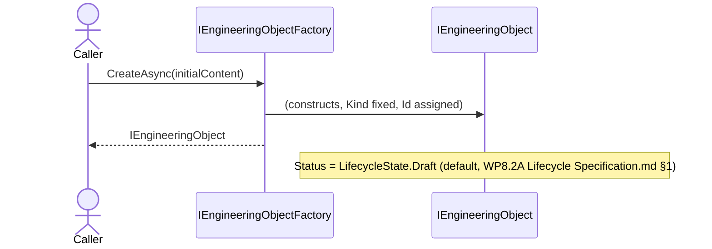
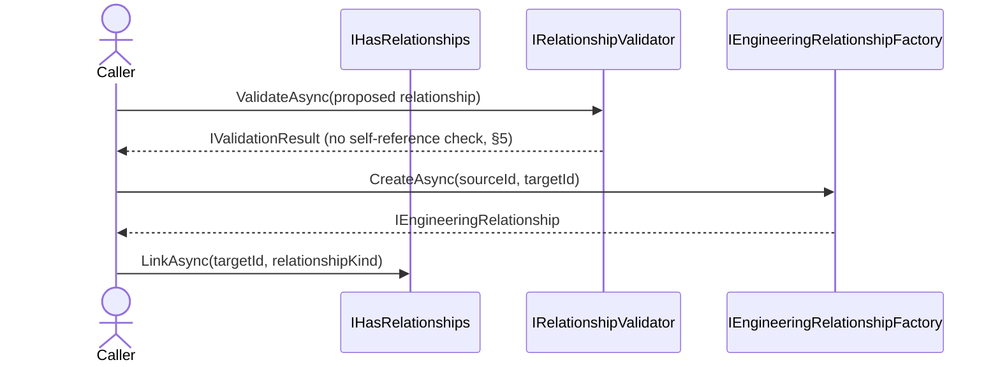
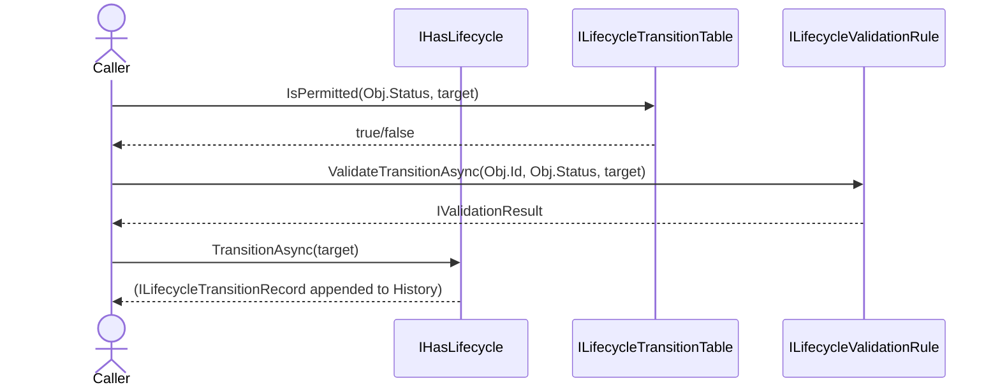
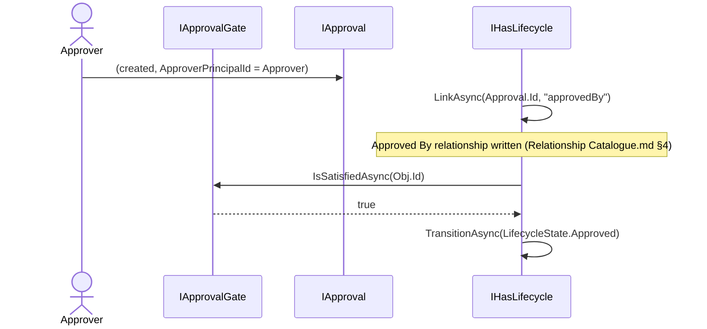
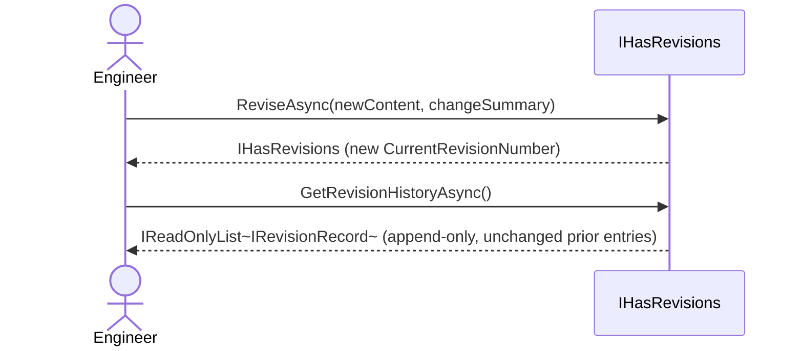
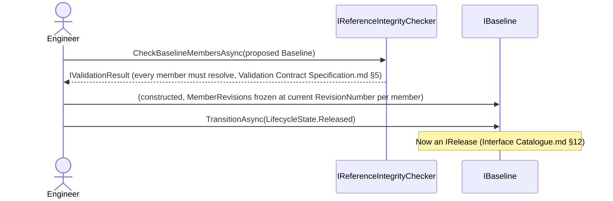
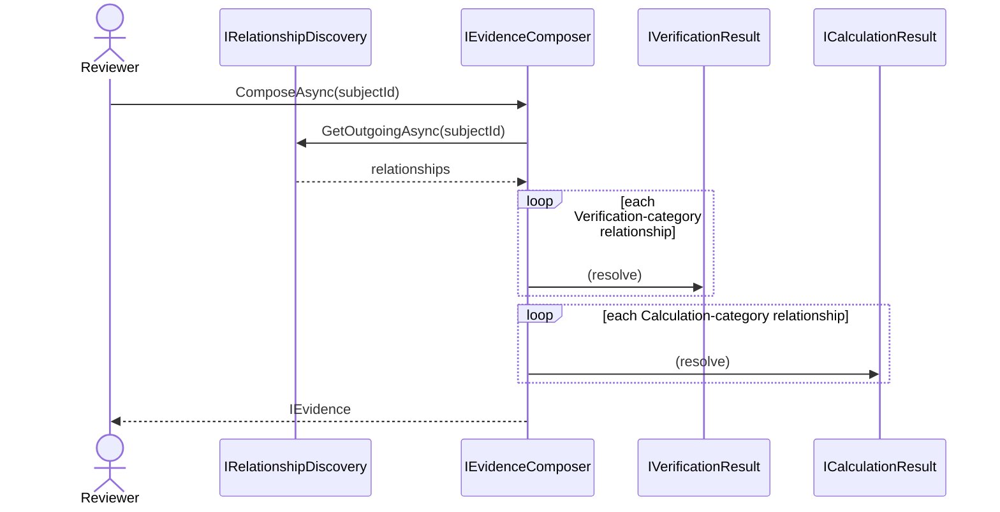
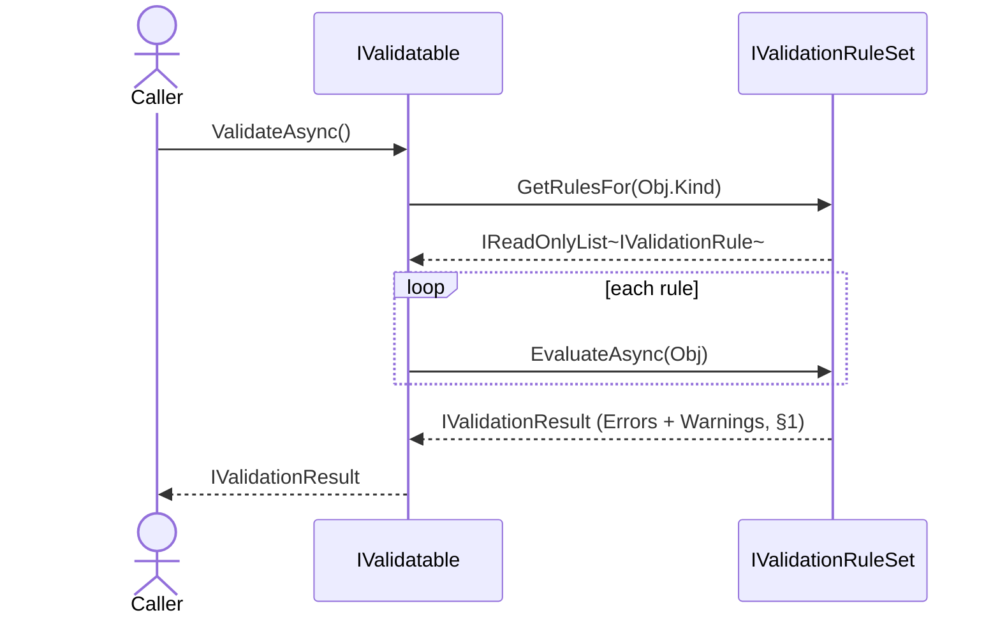

# WP 8.2B — Engineering Domain Contracts — Sequence Diagrams

## Purpose

The eight named scenarios, each as a mermaid `sequenceDiagram` over the
contracts `WP8.2B Interface Catalogue.md`/`Relationship Contract
Specification.md`/`Lifecycle Contract Specification.md`/`Validation
Contract Specification.md`/`Digital Thread Contract Specification.md`
define — conceptual only, no implementation technology implied.

## 1. Object Creation

## 2. Relationship Creation

## 3. Lifecycle Transition

## 4. Approval

## 5. Revision

## 6. Baseline Creation

## 7. Traceability Navigation

## 8. Validation

## Related Documents

`WP8.2B Engineering Domain Contracts.md` and its six other companion
deliverables; `WP8.2A Engineering Object Interaction Diagrams.md` (the
`WP 8.2A` precedent this document extends to the contract layer).
