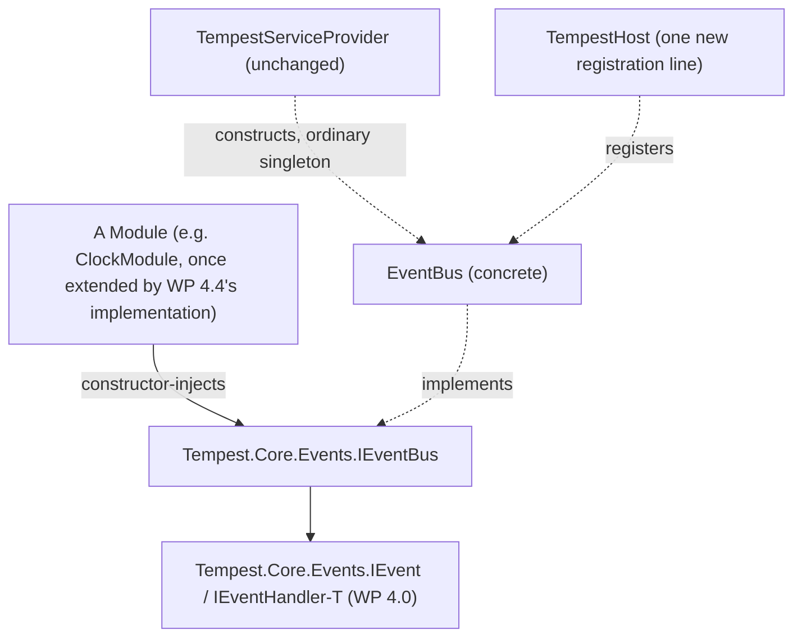

# Event Bus Architecture

**Status: architecture only — WP 4.4. No production code exists yet.**
This document is the design behind ADR-0028, produced the same way
`WP 2.7A` preceded `WP 2.7B` and `WP 4.2`'s own architecture phase
preceded its implementation: architecture first, implementation only once
every open question is actually settled, never implied. It also closes
out the `WP 4.4A`/`WP 4.4B` prerequisite chain: constructor injection into
a discovered module now works (`WP 4.4B`), and this document designs the
one thing that prerequisite chain existed to unblock — the Event Bus
itself.

## Objective

Design `IEventBus` and its implementation completely — dispatch,
subscription, ordering, failure isolation, re-entrancy, registration,
and interaction with plugins and future Background Services — so that
`WP 4.4`'s own implementation, and the `ClockModule` integration that
follows it, can proceed with every open question already answered.

## Repository Investigation

**No `IEventBus` exists anywhere in the repository.** This document was
triggered by exactly that finding: a prior task (`WP 4.4C`, abandoned mid-
investigation, no code committed) set out to extend `ClockModule` to
publish through "the existing Event Bus," assuming ADR-0020's own
placement decision meant the bus itself was already built. It was not.
`grep`-ing the entire `src/` tree for `IEventBus` returns nothing; only
`Tempest.Core.Events.IEvent` and `IEventHandler<T>` exist, both from
`WP 4.0`, both explicitly documented as declaring "no new runtime
behaviour" on their own. `WorkPackages.md`'s own `WP 4.4` entry already
said as much: `WP 4.4A`/`WP 4.4B` resolved a *prerequisite* (constructor
injection into a discovered module), not `WP 4.4` itself.

**What `WP 4.4A`/`WP 4.4B` already established, reused here directly:**
`TempestServiceProvider.Construct` resolves constructor dependencies
recursively for any registered service (verified in `WP 4.4A`); a
discovered module may declare a DI-resolvable constructor by carrying
`ModuleMetadataAttribute` (implemented in `WP 4.4B`); `ClockModule` itself
remains untouched, exactly as every prior work package in this chain
promised, and is not modified by this document either — it is a `WP 4.4`
implementation-phase concern, not this architecture phase's.

**What already exists and does not need to change:** `IEvent`,
`IEventHandler<T>` (`WP 4.0`); `ServiceCollection.Singleton<TService,
TImplementation>()` (`WP 2.4`) — already sufficient to register
`EventBus`, requiring no new DI capability; `Host Lifecycle.md`'s existing
Platform Services Registered phase (Phase 6) — already the right place,
requiring no new phase.

## Architecture

### Is the Event Bus a Platform Service?

Yes — already decided, ADR-0020, not reopened here. `IEventBus` sits in
ADR-0023's Platform Services layer: depended on by Modules (downward
only), depending on nothing module-specific itself.

### Ownership

| Concern | Owner | Notes |
|---|---|---|
| The bus instance itself | `TempestServiceProvider` (ordinary singleton) | Not Host-owned, not Composition-Root/`AddInstance`-registered — see ADR-0028's own reasoning for why neither is needed. |
| Subscriber registration | `EventBus`'s own internal, lock-guarded list | Each subscriber calls `Subscribe`/`Unsubscribe` on itself; the bus does not discover subscribers on its own. |
| Dispatch ordering and failure isolation | `EventBus.PublishAsync` | Sequential, subscription-ordered, per-subscriber isolated — mirroring `ModuleLifecycleManager.RunBatchAsync`'s own established shape. |
| A subscriber's own lifetime | Whoever holds the reference (typically a module, itself a DI singleton) | The bus holds a strong reference once subscribed; it does not manage or know about module lifecycle. |

No orchestration authority of any kind — `IEventBus` cannot register,
initialise, start, stop, or dispose anything, exactly as ADR-0020 already
established and this document does not revisit.

### Component Design

```csharp
namespace Tempest.Core.Events;

public interface IEventBus
{
    void Subscribe<TEvent>(IEventHandler<TEvent> handler) where TEvent : IEvent;
    void Unsubscribe<TEvent>(IEventHandler<TEvent> handler) where TEvent : IEvent;
    Task PublishAsync<TEvent>(TEvent @event, CancellationToken cancellationToken) where TEvent : IEvent;
}

public sealed class EventBus : IEventBus
{
    // Constructed with an optional ILogger?, the universal convention -
    // nothing else. No Composition Root treatment needed (ADR-0028).
    public EventBus(ILogger? logger = null) { /* ... */ }

    public void Subscribe<TEvent>(IEventHandler<TEvent> handler) where TEvent : IEvent { /* ... */ }
    public void Unsubscribe<TEvent>(IEventHandler<TEvent> handler) where TEvent : IEvent { /* ... */ }

    public async Task PublishAsync<TEvent>(TEvent @event, CancellationToken cancellationToken) where TEvent : IEvent
    {
        // Snapshot current subscribers for TEvent under the lock, then
        // dispatch outside it - so a handler that subscribes or
        // unsubscribes during its own HandleAsync call (including to the
        // same event type) does not mutate the list this dispatch is
        // currently iterating, and so a nested PublishAsync call (from
        // within a handler) is free to take its own, independent lock
        // without deadlocking.
    }
}
```

See ADR-0028 for the complete reasoning behind every one of these shapes.
No new exception type is required: a subscriber's own exception is
caught, logged, and never rethrown — there is no failure category here
that escapes containment the way a Host-fatal platform-service failure
does, so no new exception type needs to exist for anything to catch.

### Dependency Diagram



Every arrow from a module points down into `Tempest.Core` (Platform APIs
layer); nothing points back up. `EventBus` itself depends on nothing
module-specific — it never references a concrete module type, only the
generic `IEvent`/`IEventHandler<T>` contracts.

## Lifecycle Interaction

No new `Host Lifecycle.md` phase, no new `HostState`, no new transition.
`EventBus` is constructed and registered during the existing Platform
Services Registered phase (Phase 6) — one new line,
`services.Singleton<IEventBus, EventBus>();`, alongside the existing
`AddDiscoveredModules` call. A module that constructor-injects `IEventBus`
receives it exactly the way it already receives any other DI-resolved
dependency, at Module Initialisation (Phase 8), via
`TempestServiceProvider` — unchanged.

## Failure Model

A subscriber's own exception during `HandleAsync` is caught inside
`PublishAsync`'s own dispatch loop, logged at `Error`, and never
propagates to the publisher or the Host — full stop, no exceptions
(figurative or literal). This is a single, unconditional rule, simpler
than ADR-0013's own two-category model or ADR-0021's three-category one:
every subscriber failure is isolated; none can become Host-fatal. See
ADR-0028's own Decision section for the complete reasoning, including why
this is a deliberate, considered divergence from ADR-0021's own
critical-opt-in shape (RD-0022), not an oversight.

`OperationCanceledException` is never isolated — it propagates directly
out of `PublishAsync` to the publisher, checked between subscribers (never
mid-`HandleAsync`), mirroring `ModuleLifecycleManager.RunBatchAsync`'s own
established cancellation boundary exactly.

## Public Surface

| Type | Kind | New? |
|---|---|---|
| `Tempest.Core.Events.IEventBus` | Interface | Yes — named by ADR-0020, designed in full here |
| `Tempest.Core.Events.EventBus` | Sealed class | Yes — the concrete implementation |

No change to `IEvent`, `IEventHandler<T>`, or any other existing public
type. No new exception type (see Component Design, above).

## Migration Strategy

**Nothing migrates — this is new capability, not a change to existing
behaviour.** No module today depends on `IEventBus` (none can, since it
does not exist); nothing needs to be rewritten when it is built. For
`WP 4.4`'s own implementation, once this design is realised:

1. Implement `IEventBus`/`EventBus` exactly as specified above.
2. Register it in `TempestHost.cs`'s existing Platform Services Registered
   block — one new line, no other change to that method.
3. Extend `ClockModule` (a separate, later step — not this document's own
   concern) to declare `[ModuleMetadata]`, accept `IEventBus` via
   constructor injection, and publish from its lifecycle methods, exactly
   as `WP 4.4C`'s own original brief described — now unblocked, with a
   real bus to publish through.
4. Add a second, small module (`WP 4.4`'s own Deliverable already
   anticipates this — "its companion module... if one does not already
   exist") that subscribes to prove the bus against two real,
   SDK-conformant modules, not a synthetic fixture.

## Testing Implications

Prospective — no test is written by this architecture-only work package.
When implemented, at minimum:

- **Publish with zero subscribers** — a no-op, not an error (per `IEvent`'s
  own existing documentation).
- **Publish with multiple subscribers** — all invoked, in subscription
  order.
- **A throwing subscriber does not prevent a sibling subscriber** from
  receiving the same event, and does not fault the Host — `WP 4.4`'s own
  pre-existing Acceptance Criteria, now precisely specified by this design.
- **Re-entrant publish** — a handler publishing a new event (the same or a
  different type) from within its own `HandleAsync` completes correctly,
  proving the snapshot-based dispatch model is genuinely safe, not merely
  argued to be.
- **Unsubscribe** stops further delivery to that handler without affecting
  other subscribers.
- **Cancellation** propagates to the publisher, uncaught, checked between
  subscribers.
- **Two real, SDK-conformant modules** (mirroring `WP 4.3`'s own
  `ClockModulePipelineTests` composition pattern) — one publishing, one
  subscribing, resolved entirely through constructor injection, with no
  direct reference between them anywhere in the proof.

## Risks

- **`WP 4.4`'s own implementation is the first time any of this design is
  actually exercised** — same category of risk every architecture-only
  phase in this release has carried, mitigated the same way: implement
  against dedicated test modules first, exactly as `WP 4.4B` did for
  `ModuleMetadataAttribute`, before touching `ClockModule`.
- **No automatic unsubscription on module stop/dispose** (ADR-0028's own
  named, accepted gap) — a module author who forgets to unsubscribe keeps
  receiving events for the Host's whole remaining run. Not a defect this
  design introduces; a real, disclosed trade-off.
- **Command Framework (`WP 4.7`) risk** (`Risks.md`, R3) — this document
  restates the Event/Command distinction explicitly, ahead of `WP 4.7`,
  directly addressing that risk's own named mitigation requirement.

## Alternatives Considered

Recorded in full, with reasoning, in ADR-0028's own "Decision" and
"Alternatives Considered" sections, and permanently indexed as RD-0019
(DI-auto-discovered handlers), RD-0020 (deferred/queued re-entrant
publishing), RD-0021 (polymorphic event dispatch), and RD-0022 (a
per-subscriber critical opt-in mirroring ADR-0021).

## Documentation Impact

- **New**: ADR-0028; this document; a `WP 4.4` architecture-phase Academy
  retrospective; four new Rejected Designs entries (RD-0019–RD-0022).
- **Updated**: `Platform Service Map.md`'s Event Bus entry (architected,
  not yet implemented); Engineering Glossary's Event Bus entry (same);
  `WorkPackages.md`'s `WP 4.4` entry; `Risks.md` R3 (annotated, not
  retired — the distinction is now documented, but `WP 4.7` itself has not
  happened yet).
- **Not required**: no `Host Lifecycle.md`/`Runtime State Machine.md`/
  `Failure Behaviour.md` change — no new phase, state, or Host-level
  failure category is introduced.

## Validation Against Governing Documents

- **`FOUNDATION.md`.** One responsibility per component, unchanged (②); no
  new externally-mutable state beyond an ordinary, lock-guarded internal
  list, the same baseline every stateful platform service already has (③);
  the platform-service/module failure boundary is extended, not reopened,
  by a single, simpler-than-precedent isolated-failure rule (④); nothing
  about disposal-order guarantees changes (⑤); dispatch is a batch
  operation with a defined, Atomic-Phase-Principle-consistent cancellation
  boundary (⑥); this is the release's eighth ADR-recorded decision (⑦);
  dependencies flow downward only (⑨).
- **All existing ADRs.** ADR-0009 — not engaged; `EventBus` needs no
  Composition Root treatment (reasoned explicitly, not merely asserted).
  ADR-0013 — extended, not reopened. ADR-0017 — unaffected; `IEventBus`
  carries no orchestration authority, exactly as ADR-0020 already
  established. ADR-0020 — reaffirmed, not altered. ADR-0021 — deliberately
  *not* mirrored for the critical-opt-in question (RD-0022), for a stated,
  reasoned difference, not an oversight. ADR-0023 — preserved; every
  dependency drawn in this document's own diagram points downward.
  ADR-0027 — directly built upon: this design assumes, and reuses without
  re-deriving, `WP 4.4B`'s own proof that constructor injection into a
  discovered module works.
- **`Platform Services Architecture Review.md`.** Consistent with every
  strength that review confirmed; this document explicitly states which
  existing documents do and do not need updating, per that review's own
  Recommendation 3.

## Implementation Recommendation

**Design is sound; `WP 4.4` implementation may now begin.** No further
ADR is anticipated before it does. Recommended order: implement
`IEventBus`/`EventBus` and prove it against dedicated test modules first
(mirroring `WP 4.4B`'s own precedent exactly); only then extend
`ClockModule` (and, if needed, add its companion) to publish and
subscribe for real — the original `WP 4.4C` brief's own objective,
now fully unblocked.
