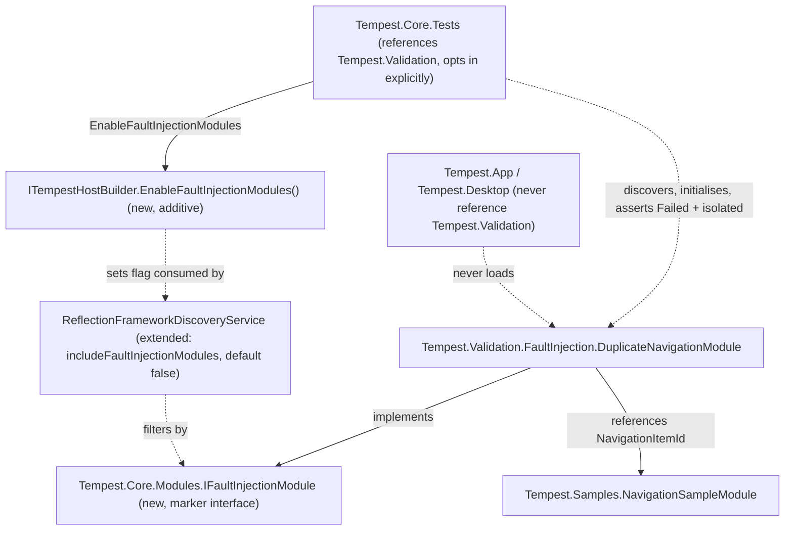

# Fault Injection & Validation Architecture

**Status: designed and implemented — `WP 12.3A`/`WP 12.3B` (ADR-0102).**

## Objective

Remove intentionally-failing modules from the platform's default runtime
while preserving them as first-class, real, tested diagnostics and
fault-injection tools — explicitly enable-able for validation runs,
never discovered during ordinary application startup.

## Repository Investigation

**Exactly one intentionally-failing module existed before this Work
Package: `Tempest.Samples.DuplicateNavigationSampleModule` (`WP 5.0B`).**
Confirmed by direct search: every `throw` statement and every
"deliberately"/"always throws"/"exists solely to" comment across
`src/Samples/Tempest.Samples/` was individually checked; every other hit
is either ordinary input-validation logic (`EngineeringCalculationDefinitions.cs`,
`RequirementExportAdapter.cs`, and similar) or an unrelated data-modelling
comment. This document's mechanism is general — it does not assume this
count stays at one — but the migration performed by `WP 12.3B` moves
exactly this one module.

**`DuplicateNavigationSampleModule` was, until this Work Package, real,
production, always-discovered code — not a dormant fixture.** Traced
directly:

```
Tempest.App.csproj / Tempest.Desktop.Tests.csproj
  └─ ProjectReference → Tempest.Samples.csproj (contains the module)

EngineeringWorkspaceComposer.Build()  (src/Tempest.App/Composition/)
  └─ new TempestHostBuilder()          <- unrestricted: full AppDomain scan
       └─ .Build().RunAsync()

Tempest.Desktop.WorkspaceHost.StartAsync()
  └─ EngineeringWorkspaceComposer.Build(...)   <- the identical composition
```

Both of the platform's real presentation layers (`Tempest.App`'s
`WorkspaceShell`, `Tempest.Desktop`) compose through this exact,
identical, unrestricted path. Since `Tempest.Samples` is referenced by
both, and `ReflectionFrameworkDiscoveryService`'s parameterless
constructor scans every assembly loaded into the current `AppDomain`,
**every real launch of either presentation layer discovered and
initialised `DuplicateNavigationSampleModule`, which always failed.**
Direct evidence this was a live, silent problem, not a hypothetical one:
`tests/Tempest.Desktop.Tests/ModuleLifecycleStabilityTests.cs` — a test
that builds a real `WorkspaceHost` and asserts "no module failed" against
the real `IDiagnosticsProvider` — already had to special-case-exclude
this exact module's Id from every such assertion, with a doc comment
explaining why. `IDiagnosticsProvider.Modules`, the platform's own
health-reporting surface (`Diagnostics Architecture.md`, ADR-0039),
therefore never reported a genuinely healthy platform in real use.

**No duplication found.** No other project, mechanism, or convention in
this repository already solves "keep a deliberately-failing module
real and tested but excluded from ordinary discovery." `Sample Module
Architecture.md` documents the opposite problem (genuine reference
modules that *should* always be discovered); nothing about that design
needed to change.

## Architecture

### Project placement

A new project, parallel to `src/Samples/` and `src/Plugins/`:

```
src/Validation/Tempest.Validation/
  Tempest.Validation.csproj
  FaultInjection/
    DuplicateNavigationModule.cs   (moved from Tempest.Samples, renamed)
```

Namespace `Tempest.Validation.FaultInjection` for this category. Chosen
over the Work Package brief's own suggested `Tempest.Diagnostics`/
`Tempest.Samples.Diagnostics` specifically to avoid colliding with the
two things this codebase already calls "Diagnostics":
`Tempest.Core.Diagnostics.IDiagnosticsProvider` (the read-only
health-reporting platform service, ADR-0039) and
`Tempest.Samples.DiagnosticsSampleModule` (its own living reference
module). "Validation" names what this project's contents actually do —
deliberately prove platform behaviour under controlled failure — with
"Fault Injection" as the specific category realised now.

**Only `FaultInjection` is built.** `Lifecycle`, `Performance`, and
`Compatibility` are plausible future sibling categories (a module that
deliberately misbehaves during `StartAsync`/`StopAsync` ordering, one
that deliberately runs slowly, one that deliberately targets an
incompatible platform version) — named here, per this platform's own
`Diagnostics Architecture.md` "Explicitly deferred" precedent, so a
future contributor does not have to rediscover the extension point, but
none is scaffolded ahead of a real need.

**References `Tempest.Core` and, deliberately, `Tempest.Samples`.**
`DuplicateNavigationModule`'s entire purpose is to collide with
`NavigationSampleModule`'s own registered `NavigationItem.Id` — it
references `NavigationSampleModule.NavigationItemId` directly rather
than duplicating that string as a second literal that could silently
drift out of sync. Both edges point downward only (`Tempest.Samples`
does not, and must not, reference `Tempest.Validation`); see
Alternatives Considered, ADR-0102.

**Never referenced by `Tempest.App` or `Tempest.Desktop`.** The load-bearing
fact: neither project's `.csproj` names `Tempest.Validation`, so its
assembly is never loaded into either process, and `ReflectionFrameworkDiscoveryService`'s
`AppDomain`-wide scan cannot find what was never loaded.

### The discovery/registration mechanism

Project isolation alone is not a sufficient guarantee on its own — see
ADR-0102's Context for the full reasoning (discovery scans the whole
process's `AppDomain`, not only directly-referenced assemblies; the test
suite already legitimately loads `Tempest.Validation` into the same
process as ordinary Host-level tests). Two small, additive pieces close
that gap:

```csharp
namespace Tempest.Core.Modules;

public interface IFaultInjectionModule : IModule
{
}
```

```csharp
public class ReflectionFrameworkDiscoveryService : IFrameworkDiscoveryService
{
    public ReflectionFrameworkDiscoveryService(
        ILogger? logger = null, bool includeFaultInjectionModules = false);

    public ReflectionFrameworkDiscoveryService(
        IEnumerable<Assembly> assemblies, ILogger? logger = null,
        bool includeFaultInjectionModules = false);

    // IsValidModuleType (private): a candidate implementing
    // IFaultInjectionModule is excluded exactly like an interface,
    // abstract class, or open generic type definition, unless
    // includeFaultInjectionModules is true. Applies identically to the
    // AppDomain-scanning overload and the explicit-candidate-type
    // overload.
}
```

```csharp
public interface ITempestHostBuilder
{
    ITempestHostBuilder AddConfigurationSource(IConfigurationSource source);
    ITempestHostBuilder EnableFaultInjectionModules();  // new
    ITempestHost Build();
}
```

`TempestHostBuilder.EnableFaultInjectionModules()` sets one private
field, threaded through `TempestHost`'s existing constructor parameter
list to the `ReflectionFrameworkDiscoveryService` it constructs during
Module Discovery (`Host Lifecycle.md` Phase 4) — the phase, its ordering,
and every other platform service construction on that path are
byte-for-byte unchanged.

`DuplicateNavigationModule` implements `IFaultInjectionModule` in
addition to `ModuleLifecycleBase`:

```csharp
[ModuleMetadata("tempest.validation.faultinjection.navigation-duplicate", "Navigation Duplicate Fault Injection", "1.0.0")]
public sealed class DuplicateNavigationModule : ModuleLifecycleBase, IFaultInjectionModule
{
    // identical InitialiseAsync body to the original DuplicateNavigationSampleModule
}
```

### Dependency Diagram



Every arrow into `DuplicateNavigationModule` is either an existing,
unmodified platform mechanism (Discovery, Registration, Lifecycle,
`INavigationProvider`) or the two additive pieces above — no new Host
Lifecycle phase, no new `HostState`, no new failure category.

## Lifecycle Interaction

**No new Host Lifecycle phase, no new `HostState`, no new transition.**
A fault-injection module flows through exactly the same Discovery →
Registration → Module Initialisation phases every module already does —
only whether Discovery's own type filter admits it as a *candidate* in
the first place changes, and only when explicitly requested.

## Failure Model

**No new category.** `DuplicateNavigationModule`'s failure is, exactly as
`DuplicateNavigationSampleModule`'s already was, an ordinary isolated
module failure (ADR-0013) — logged, marked `Failed`, the batch continues,
the Host still reaches `Running`. This document's own mechanism is
entirely about *whether the module is discovered at all*, never about
how its failure, once discovered, is handled.

## Testing Strategy

Following this project's own established "prefer real implementations
over mocks, real composed pipelines over stubs" convention:

- **Unit-level filter proof** (`ReflectionFrameworkDiscoveryServiceTests.cs`,
  a minimal `SampleFaultInjectionModule` fixture): default construction
  excludes a fault-injection candidate even when passed explicitly in a
  candidate-type list; `includeFaultInjectionModules: true` includes it;
  the `AppDomain`-scanning constructor defaults to excluding it too.
- **Real-module, real-pipeline proof** (`NavigationSampleModuleIntegrationTests.cs`,
  updated in place): the actual duplicate-navigation-isolation scenario
  (ADR-0013/ADR-0032) proven against the real `DuplicateNavigationModule`,
  with the discovery service constructed with
  `includeFaultInjectionModules: true` explicitly.
- **Real-Host, end-to-end proof** (new `FaultInjectionModuleDiscoveryTests.cs`):
  a real `TempestHostBuilder` with a candidate list naming
  `DuplicateNavigationModule` directly (a) without
  `.EnableFaultInjectionModules()` reaches `Running` having discovered
  only the unrelated module — the fault-injection module is invisible
  even though it was named explicitly; (b) with
  `.EnableFaultInjectionModules()`, reaches `Running` having discovered
  and isolated it exactly as before.
- **Negative proof, the actual regression this Work Package fixes**
  (`ModuleLifecycleStabilityTests.cs`, `Tempest.Desktop.Tests`): the
  special-case exclusion for this module's Id is deleted, not merely
  updated — a real `WorkspaceHost`, composed through the identical
  production path `Tempest.App` itself uses, now genuinely reaches
  `Running` with zero modules `Failed`.

## Required ADRs

**ADR-0102** — the genuine architectural decision: fault-injection
modules are isolated by project reference *and* filtered by a
default-excluded discovery marker, neither alone sufficient. See that
ADR's own Alternatives Considered for why an assembly-name string check
in `Tempest.Core` was rejected (violates ADR-0023 downward-dependency
layering), why a second `[ModuleMetadata]`-style attribute was rejected
in favour of a marker interface, and why `Tempest.Validation` references
`Tempest.Samples` rather than duplicating a string literal.

## Alternatives Considered

Recorded in full in ADR-0102. In summary: project isolation alone
(insufficient — a future in-process loader breaks the guarantee
silently); a discovery-time marker alone with no project move
(insufficient — leaves a deliberately-failing module inside the project
whose entire documented purpose is genuine reference modules); assembly-
name string matching inside `Tempest.Core` (rejected — layering
violation); a second declarative attribute instead of a marker interface
(rejected — this is an "is-a" classification question, not an
instantiation-avoidance one, which a marker interface answers more
directly than `ModuleMetadataAttribute`'s own different problem).

## Documentation Impact

**New**: this document; `ADR-0102`; `WP12.3A Fault Injection & Validation
Framework Architecture.md`/`WP12.3B Fault Injection & Validation
Framework Implementation.md` (Academy retrospectives);
`docs/releases/v0.12.0/WorkPackages.md`.

**Updated**: `Sample Module Architecture.md` (a short note that
fault-injection modules are no longer within its scope, pointing here);
`Module Register.md`, `Namespace Register.md`, `Architectural Dependency
Register.md`, `ADR Register.md`, `Test Register.md`, `Repository Metrics
Register.md`, `Documentation Register.md`, `Academy Register.md`;
`PROJECT_STATUS.md`.

**Not required**: no `Host Lifecycle.md`/`Runtime State Machine.md`/
`Failure Behaviour.md` change — no new phase, state, or Host-level
failure category is introduced (see Lifecycle Interaction/Failure Model,
above). No `Platform Service Map.md` entry for `Tempest.Validation`
itself — a module (or a project of modules) is not a Platform Service,
per `Sample Module Architecture.md`'s own already-established precedent
for `Tempest.Samples`; the Map's existing Module Discovery description is
updated only to note the new filter, not restructured.

## Validation Against Governing Documents

- **`FOUNDATION.md`.** One responsibility per component (②):
  `IFaultInjectionModule` classifies; `ReflectionFrameworkDiscoveryService`
  filters; `TempestHostBuilder` opts in — three small, single-purpose
  additions, not one entangled one. No new externally-mutable state (③).
  Module/platform-service failure boundary unchanged (④) — a
  fault-injection module's failure is exercised through, never around,
  ADR-0013's existing policy. Dependencies flow downward only (⑨):
  `Tempest.Validation` depends on `Tempest.Core`/`Tempest.Samples`;
  neither depends back.
- **ADR-0013.** Reaffirmed, not reopened — the module isolation policy
  this entire mechanism exists to keep demonstrating, unmodified.
- **ADR-0023.** The organising constraint behind rejecting the
  assembly-name-string alternative (see ADR-0102).
- **ADR-0027.** The closest existing precedent for a discovery-time
  classification mechanism, directly compared against and consciously
  not reused verbatim (see ADR-0102's own Alternatives Considered) —
  the two problems are related but not identical.
- **`Sample Module Architecture.md`.** Its own scope narrows explicitly
  (fault-injection modules move out); every claim it makes about genuine
  reference modules remains true, unmodified.

## Related Documents

`ADR-0013`; `ADR-0023`; `ADR-0027`; `ADR-0032`; `ADR-0039`; `ADR-0102`;
`Sample Module Architecture.md`; `Diagnostics Architecture.md`; `Module
Dependency Injection Architecture.md`; `Host Lifecycle.md`;
`docs/releases/v0.12.0/WorkPackages.md` (`WP 12.3A`/`WP 12.3B`).
