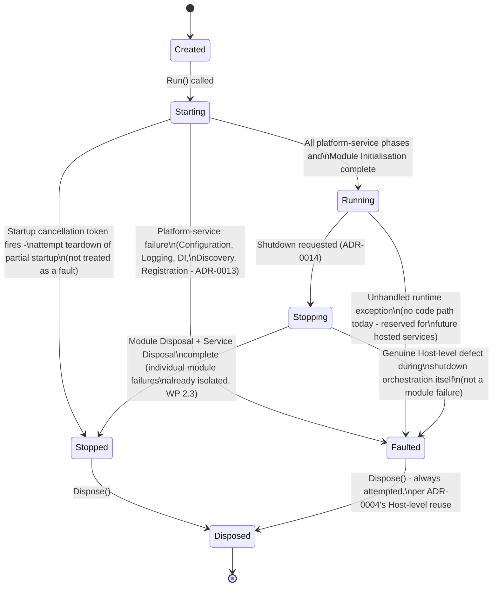

# Runtime State Machine

**Status: architecture only. No production code exists yet.**

## Overview

The Runtime Host has its own state machine, independent of `ModuleState` (see
ADR-0012 for why these are deliberately two separate things). Seven states:
`Created`, `Starting`, `Running`, `Stopping`, `Stopped`, `Faulted`, `Disposed`.

## State Diagram

## States

| State | Meaning |
|---|---|
| `Created` | The Host object exists; nothing has been built. |
| `Starting` | Any of Configuration Built through Module Initialisation is in progress (see *Host Lifecycle.md*). |
| `Running` | Module Initialisation completed; the platform is up. Does not imply every module succeeded — see ADR-0013. |
| `Stopping` | Graceful shutdown in progress: Module Disposal, then Service Disposal. |
| `Stopped` | Graceful shutdown completed normally, or startup was cancelled and partial teardown completed. |
| `Faulted` | A platform-service failure aborted startup, or a genuine Host-level defect occurred during Running or Stopping. |
| `Disposed` | Terminal. Every resource that could be released has had release attempted. |

## Transitions

| From | To | Trigger |
|---|---|---|
| `Created` | `Starting` | The Host's run method is called. |
| `Starting` | `Running` | Every platform-service phase and Module Initialisation completed (regardless of individual module outcomes). |
| `Starting` | `Faulted` | A platform-service failure (Configuration/Logging/DI/Discovery/Registration) — ADR-0013. |
| `Starting` | `Stopped` | The startup `CancellationToken` (ADR-0014) fired; partial teardown attempted; not treated as a fault. |
| `Running` | `Stopping` | A shutdown request (ADR-0014) is observed. |
| `Running` | `Faulted` | An unhandled runtime exception (no producing code path exists yet — reserved for future hosted services). |
| `Stopping` | `Stopped` | Module Disposal and Service Disposal both completed (individual module Stop/Dispose failures already isolated by WP 2.3 do not prevent this). |
| `Stopping` | `Faulted` | A genuine Host-level defect in shutdown orchestration itself, not a module failure. |
| `Stopped` | `Disposed` | Disposal is invoked (the normal path). |
| `Faulted` | `Disposed` | Disposal is invoked — always legal, per ADR-0004's Host-level reuse (WP 2.7 update); disposal must be attempted even after a fault. |

## Terminal States

**`Disposed`** is the only true terminal state — no outgoing transition exists
from it. Both `Stopped` and `Faulted` converge on it, exactly as ADR-0004
established for individual modules (permissive disposal, restricted only
against an already-`Disposed` state) and ADR-0012/ADR-0013 apply that same
philosophy one level up, at the Host.

## Illegal Transitions

The following are explicitly **not** legal, and a future implementation should
reject them (with a dedicated exception, following the established
`InvalidModuleLifecycleTransitionException` pattern from WP 2.3 — see the WP
2.7 Academy review's Recommendations):

- `Created → Running` (must pass through `Starting`).
- `Created → Stopping` / `Created → Stopped` (nothing has started; there is
  nothing to stop).
- `Running → Starting` (no re-entrant or repeated startup — a Host instance
  runs once).
- `Stopped → Starting` / `Stopped → Running` (no restart — **decided**, not
  open: see ADR-0015, *Runtime Hosts Are Not Restartable*. A `TempestHost`
  instance is single-use; a second run means a new `TempestHostBuilder`
  producing a new `TempestHost`, not a transition back to `Starting`).
- `Faulted → Starting` / `Faulted → Running` (a faulted Host cannot resume;
  only `Faulted → Disposed` is legal, mirroring exactly how `Failed` modules
  can still be disposed but never re-initialised).
- Anything `→ Disposed →` anything else (terminal; no exceptions).

## Relationship to `ModuleState`

This state machine and `ModuleState` (WP 2.2/2.3) are deliberately independent
— see ADR-0012. A Host in `Running` can coexist with individual modules in
`Failed`; querying "is the platform up" (Host state) and "is this module
healthy" (`ModuleState`, via `IModuleLifecycleManager`) are two different
questions with two different answers, and this state machine does not attempt
to derive one from the other.
