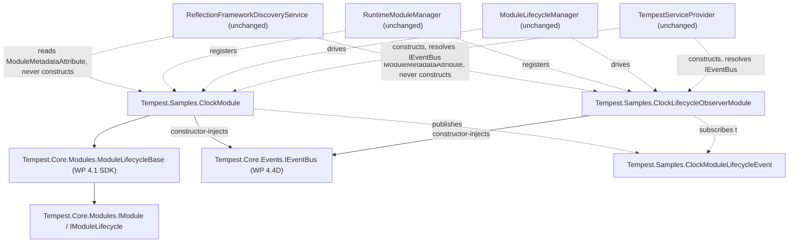

# Sample Module Architecture

**Status: implemented — WP 4.3 (`Tempest.Samples`); extended — WP 4.4E.**
Every design decision below is now backed by working, tested code, not
only design intent — see the WP 4.3 implementation retrospective for what
was built and the two small corrections implementation surfaced (Testing
Strategy, below). **Update, WP 4.4E**: `ClockModule` now carries
`[ModuleMetadata]` (ADR-0027) and constructor-injects `IEventBus`
(ADR-0028), publishing each lifecycle transition through it; a new
companion module, `ClockLifecycleObserverModule`, subscribes. This
document's own original "consumes no platform service" finding was a
statement about the pipeline's limits at the time `WP 4.3` ran, not a
permanent property of `ClockModule` itself — see the WP 4.4E
implementation retrospective for what changed and why nothing here needed
to be redesigned to allow it.

This document was originally `WP 4.3`'s design phase — the same two-phase
discipline `WP 2.7A`/`2.7B` established for the Runtime Host and `WP 4.2`
repeated for the Plugin Manifest: architecture first, implementation only
once every open question is actually settled, never implied.

## Objective

Design one concrete, non-trivial module — built against `WP 4.0`'s
contracts and `WP 4.1`'s SDK, exactly as a third-party module author would
write it — that becomes the **living reference** `WP 4.4` through `WP 4.7`
extend and validate against, rather than each writing its own disposable
test fixture to prove its own subsystem in isolation. This document answers
where the module lives, what it does, how it is proven, and — the single
most consequential finding of this design phase — what it *cannot* yet do,
and why that matters immediately, not eventually.

## Repository Investigation

Before designing anything, this phase checked whether WP 4.3's need is
already met, partially met, or already attempted elsewhere in the
repository — per this work package's own instruction not to design
functionality that already exists.

**`Tempest.App` does not use `TempestHost` at all.** `src/Tempest.App/
Program.cs` constructs `BootstrapService`, `HostingService`, and
`ProjectService` directly, entirely bypassing `TempestHostBuilder`/
`TempestHost` and therefore the whole Discovery → Registration → Lifecycle →
DI pipeline WP 2.1–2.7B and WP 4.0–4.2 built. This is not a new gap this
review introduces — the Platform Service Map's own Host entry already
lists `Tempest.App` under "Consumers (**anticipated**)," not "consumers,"
and has done so since `WP 2.7B`. It matters directly to this design: no
matter how the sample module is built, **proving it runs through "the
ordinary Runtime Host sequence" today means proving it via
`TempestHostBuilder` in a test, not by running the actual executable** —
exactly the same way every existing Host-pipeline behaviour (module
lifecycle, plugin discovery/loading) has been proven so far. Wiring
`Tempest.App` itself to `TempestHost` is a real, valuable, but *separate*
piece of work, named nowhere in `WP 4.3`'s own scope — this design does not
propose it, and flags it only as a pre-existing fact that shapes how
"discoverable exactly as a third-party module would be" can actually be
demonstrated right now.

**Pre-existing "Project" code (`Tempest.Core.Projects`/`.Models`/
`.Repositories`) is bootstrap-era and independent of the module pipeline.**
`ProjectService`, `ProjectModel`, `JsonProjectRepository`,
`ProjectNumberGenerator` already exist, predate the module pipeline
entirely, and are only ever constructed by `Tempest.App`'s own bootstrap
path above — never by anything module-pipeline-related. The Platform
Service Map already names this code as the likely future basis for a
"Project Engine (planned)" platform service, explicitly "Undetermined"
dependencies, no design work done. **This is not a prerequisite for `WP
4.3` and is not reused by it** — see Alternatives Considered, below, for
why coupling the sample module to this legacy code was considered and
rejected.

**No existing test fixture is reusable as the sample module itself.**
`SampleModuleA/B/C`, `HealthyHostTestModuleAlpha/Beta`, and every other
`IModule` fixture across the test suite are `internal`-visibility,
test-only types, explicitly documented at the top of their own files as
representing no real application module. They establish a naming and
shape *precedent* this design follows, but none is a candidate for
promotion — a living reference module must be real, `public` production
code a third party could plausibly have written, which no existing
fixture is or was meant to be.

**The single most significant finding: a normally-discovered module cannot
receive any constructor-injected platform service, full stop — and `WP
4.4`, the very next work package, needs exactly that.** This was already
documented as a known constraint by `WP 4.1` (*Building a Module*, "One
Constraint You Still Need to Know About") and traced to its root cause in
this design phase: `IFrameworkDiscoveryService`'s metadata probe calls
`Activator.CreateInstance(type)` — the zero-argument overload, requiring a
public **parameterless** constructor — unconditionally, for every
candidate `IModule` type, uncaught by any per-candidate isolation. A module
whose only public constructor takes parameters does not merely fail to
receive them: `Activator.CreateInstance` throws before the module is ever
registered, uncaught, propagating all the way to `TempestHost.RunAsync`'s
outer catch — **a Host-fatal crash, not an isolated module failure.**
`TempestServiceProvider.Construct` genuinely could resolve constructor
dependencies (verified directly in `TempestServiceProvider.cs` — every
constructor parameter is resolved recursively, exactly like any other
registered service) — but only for types Discovery's own probe never has
to instantiate zero-argument, which no discovered module type is. `WP
4.4`'s own already-approved deliverable is "the `WP 4.3` sample module
extended to publish an event" through the DI-public `IEventBus` (ADR-0020)
— which requires exactly the constructor injection this constraint
forecloses. This is not a hypothetical future need any longer; it is `WP
4.4`'s immediate next problem, surfaced here so it is not rediscovered by
trial and error mid-implementation. See Risks and Required ADRs, below.

## Architecture

**The sample module is a Module, not a Platform Service.** It sits at the
top layer of ADR-0023's four-layer stack (Modules → Platform APIs →
Platform Services → Runtime Host) and depends downward only, on `WP 4.0`'s
contracts and `WP 4.1`'s SDK — nothing about it is Host-owned, nothing about
it is DI-public, and nothing about it changes any existing service's
behaviour. This one classification answers most of the brief's own
architecture-review questions before they need individual answers:

| Question | Answer |
|---|---|
| New Platform Service? | No. A module is a *consumer* of platform services, never one itself (ADR-0013's own boundary). |
| New Host phase? | No. Modules flow through the existing, unchanged Discovery → Registration → Module Initialisation phases (`Host Lifecycle.md`, Phases 4/5/8) — the same three phases every module before it has used. |
| New DI registration? | No. The sample module is never registered into the `ServiceCollection` itself — `AddDiscoveredModules` already handles this generically for every discovered module's concrete type, unchanged since WP 2.4. |
| Dependency direction change? | No. The module depends on `Tempest.Core` (SDK, contracts); nothing in `Tempest.Core` depends on it — downward-only, exactly as ADR-0023 requires. |
| Lifecycle placement change? | No. `Registered → Initialising → Initialised → Starting → Running → Stopping → Stopped → Disposed`, the same ten-value `ModuleState` machine every module already uses, orchestrated by the same, unmodified `ModuleLifecycleManager`. |
| Failure model change? | No. A sample-module failure is an ordinary isolated module failure, ADR-0013's existing "module failures are isolated" half — ADR-0013 is not reopened, only exercised, for the first time, by real production module code rather than a test fixture. |

**Project placement.** The sample module lives in a new, dedicated project —
`src/Samples/Tempest.Samples/Tempest.Samples.csproj`, namespace
`Tempest.Samples` — referencing only `Tempest.Core` (for `IModule`,
`ModuleLifecycleBase`), exactly as a genuine third-party module author's own
project would. It does **not** live inside `Tempest.Core` itself (that
would prove nothing about the SDK's public surface being sufficient from
outside the platform's own assembly) and does **not** live inside
`src/Plugins/` (that directory is specifically reserved for content loaded
through `Tempest.Core.Plugins`'s Plugin Discovery/Loading — see
Alternatives Considered for why this design does not package the sample
module that way, at least not yet). A new `src/Samples/` directory,
parallel to the existing `src/Plugins/`, is introduced for exactly this
purpose: ordinarily-referenced, ordinarily-discovered reference modules —
this is the one new structural convention this design proposes, and it is
additive only (no existing directory's meaning changes).

## Component: `ClockModule`

**What it is.** A small, self-contained, genuinely useful reference module
with no external dependencies: it tracks its own lifecycle timestamps and
running state entirely in memory, computed for real inside each lifecycle
method — not a "hello world" stub with empty method bodies, but small
enough to stay within this work package's own **S** complexity estimate.

**Why a clock.** Chosen specifically because every later work package this
release names as extending the sample module has an obvious, non-contrived
hook into exactly this concept, without this design needing to guess at or
build any of their functionality now:

- `WP 4.4` (Event Bus) — publish a "started"/"stopped" event from
  `StartAsync`/`StopAsync`.
- `WP 4.5` (Background Services) — a periodic "tick" is the canonical
  background-service example; a clock is the one domain concept that
  makes "runs periodically in the background" self-evidently correct
  rather than invented to fit the example.
- `WP 4.6B` (Navigation) — a status screen showing current uptime.
- `WP 4.7` (Command Framework) — a "get-uptime"/"get-status" command.

None of this is built now — naming the fit is this design's job; building
any of it would be exactly the speculative design this work package is
told to avoid.

**Responsibilities.**

- Owns its own `InitialisedAt`, `StartedAt`, `StoppedAt` timestamps and an
  `IsRunning` flag — real, observable state written by real logic in each
  lifecycle method, not by a constructor or a no-op.
- Exposes `Uptime` (computed from `StartedAt` when `IsRunning`, else
  `null`) as an ordinary public property beyond `IModule`/`IModuleLifecycle`
  — for direct unit testing today, and as the obvious surface a future
  command handler or navigation screen would read.

**Explicit non-responsibilities (as of `WP 4.3`; revised, `WP 4.4E`).**
Originally: consumes no platform service (could not, per the constraint
above); publishes nothing (no Event Bus existed yet); does not read
configuration; does not persist anything; does not know about, or depend
on, any future companion module. **As of `WP 4.4E`**: `ClockModule` now
consumes exactly one platform service, `IEventBus`, and publishes its own
lifecycle transitions through it — the parameterless-constructor
constraint that made this impossible at `WP 4.3` was itself lifted by
`WP 4.4A`/`4.4B` (ADR-0027), a prerequisite this document's own Required
ADRs section named and deferred. Still does not read configuration, still
does not persist anything, and still does not hold any reference to its
own companion module — only to the event type both share (see WP 4.4E's
own architecture note in `Event Bus Architecture.md`).

**Public surface (as implemented, `WP 4.3`; extended, `WP 4.4E`).**

```csharp
namespace Tempest.Samples;

[ModuleMetadata("tempest.samples.clock", "System Clock", "1.0.0")]
public sealed class ClockModule : ModuleLifecycleBase
{
    public ClockModule(IEventBus eventBus)
        : base("tempest.samples.clock", "System Clock", "1.0.0")
    {
        /* eventBus stored; ArgumentNullException.ThrowIfNull(eventBus) */
    }

    public DateTimeOffset? InitialisedAt { get; private set; }
    public DateTimeOffset? StartedAt { get; private set; }
    public DateTimeOffset? StoppedAt { get; private set; }
    public bool IsRunning { get; private set; }
    public TimeSpan? Uptime => IsRunning && StartedAt is { } started
        ? DateTimeOffset.UtcNow - started
        : null;

    public override Task InitialiseAsync(CancellationToken cancellationToken) { /* records InitialisedAt; publishes Initialised */ }
    public override Task StartAsync(CancellationToken cancellationToken) { /* records StartedAt; IsRunning = true; publishes Started */ }
    public override Task StopAsync(CancellationToken cancellationToken) { /* records StoppedAt; IsRunning = false; publishes Stopped */ }
    // DisposeAsync: not overridden - nothing to release, inherits the SDK's no-op default,
    // consistent with every other lifecycle phase this module has nothing real to do in.
}
```

`ModuleMetadataAttribute` (ADR-0027) lets Discovery read `Id`/`Name`/
`Version` without instantiating this type at all, freeing its constructor
to request `IEventBus` — a DI-public platform service — via ordinary
constructor injection, exactly as `Building a Module.md` documents for an
attribute-carrying module. Before `WP 4.4E`, this module's sole public
constructor was zero-argument, exactly `Building a Module`'s pre-4.4B
documented shape, because that was the only shape the pipeline's
then-current constraint allowed — not a permanent design choice, as
`WP 4.4E` demonstrates.

## Dependency Diagram



Every arrow *from* `ClockModule`/`Observer` points down into `Tempest.Core`
(Platform APIs/Services layer) or across to the shared event type — never
to each other's own module type, per ADR-0020. Every arrow *into* either
module is an existing, unmodified platform service treating it exactly
like any other discovered module — Discovery, Registration, and Lifecycle
are unaffected in kind by `WP 4.4E`; only Discovery's own *mechanism* for
reading these two modules' metadata changed (attribute, not construction),
per ADR-0027, already proven by `WP 4.4B` against dedicated test modules
before this document's own real consumer used it.

## Lifecycle Interaction

No new phase, no new state, no new transition. `ClockModule` flows through
exactly the same phases every module already does:

| Phase (`Host Lifecycle.md`) | What happens to `ClockModule` |
|---|---|
| 4. Module Discovery | Found by `ReflectionFrameworkDiscoveryService`'s unchanged `AppDomain` scan (once `Tempest.Samples` is referenced by whatever assembly is loaded — the test project, for now; see Testing Strategy). **As of `WP 4.4E`**: read via `ModuleMetadataAttribute` (ADR-0027) — Discovery never constructs `ClockModule` or its companion. |
| 5. Module Registration | Registered like any other descriptor; no plugin-awareness, no special-casing (`RuntimeModuleManager` is unaffected by this design in any way). |
| 8. Module Initialisation | `ModuleLifecycleManager` resolves one instance via `TempestServiceProvider.GetService(typeof(ClockModule))` then calls `InitialiseAsync` then `StartAsync`, exactly as for any other module. **As of `WP 4.4E`**: construction resolves `IEventBus` via ordinary constructor injection, not zero-argument construction — `TempestServiceProvider.Construct` already supported this (proven `WP 4.4A`); nothing here changed to allow it. |
| 10–11. Shutdown / Module Disposal | `StopAsync` then (the inherited no-op) `DisposeAsync`, in the same reverse order every other module already follows. |

A `ClockModule` failure (there is realistically nothing in this design that
can throw, but the platform's own failure model does not change based on
that) is isolated exactly per ADR-0013 — logged, marked `Failed`, the batch
continues, the Host still reaches `Running`.

## Failure Model

No new category. `ClockModule`'s failure, if one ever occurred, is an
ordinary isolated module failure (ADR-0013). Nothing in this design
introduces a new failure mode, a new exception type, or a new classification
question — the existing module-failure model already covers it completely.

## Testing Strategy

**A concrete, non-obvious risk this design phase found and corrected in
advance, rather than leaving for implementation to rediscover:** a
Host-level integration test using a real, *unrestricted* `TempestHostBuilder()`
(no `discoveryCandidateTypesOverride`) would perform a genuine, full
`AppDomain.CurrentDomain.GetAssemblies()` scan, and the test assembly
already contains a fixture (`InvalidIdModule`, `ModuleFixtures.cs`) with a
deliberately invalid, empty `Id` — a real `ModuleDiscoveryException`,
faulting a genuinely unrestricted scan for reasons having nothing to do
with `ClockModule`. This exact hazard was found and avoided once already,
during `WP 4.2`'s own test-writing (see that retrospective's Section 6) —
this design applied the same lesson before implementation began rather
than after a flaky or failing test was discovered. **Correction, made
during implementation**: this design originally also attributed part of
the same risk to `internal`-visibility `IModule` fixtures being
unconstructible via reflection across the assembly boundary without
`InternalsVisibleTo`. Implementation found this half of the claim to be
incorrect — every existing `TempestHostTests` test already constructs
`internal` fixtures such as `HealthyHostTestModuleAlpha` via
`Activator.CreateInstance` from `Tempest.Core`, successfully, with no
`InternalsVisibleTo` needed for that purpose; `Activator.CreateInstance`
does not require the *type* to be public, only its constructor. The
`InvalidIdModule` empty-`Id` fixture is the sole confirmed hazard — the
scoping strategy below remains correct, only the reasoning for one part of
it is now stated accurately rather than repeating the original,
overstated claim.

- **Discovery, proven precisely.** `new ReflectionFrameworkDiscoveryService([typeof(ClockModule).Assembly])`
  — scoped to exactly `Tempest.Samples`'s own compiled assembly, mirroring
  `PluginAssemblyLoaderTests.LoadPlugins_LoadedAssembly_IsVisibleToUnchangedModuleDiscovery`'s
  own proven pattern from `WP 4.2` — proves real, unmodified Discovery
  finds a real, production-built module, without the full-`AppDomain`
  hazard. Also proven discovering `ClockModule` alongside another,
  unrelated real module type (`SampleModuleA`) via the internal
  `DiscoverModules(IEnumerable<Type>)` seam, for isolation.
- **Full lifecycle, proven by composing the real pipeline directly.**
  `ITempestHost` deliberately exposes no way to reach a specific module's
  own resolved instance (ADR-0017) — so proving `ClockModule`'s own
  timestamps end up correct requires composing Discovery,
  `RuntimeModuleManager`, `ServiceCollection.AddDiscoveredModules`,
  `TempestServiceProvider`, and `ModuleLifecycleManager` directly in the
  test, exactly mirroring `ModuleLifecycleManagerTests`' own established
  composition-root pattern — then resolving `ClockModule` a second time
  from the same provider (a singleton, so the same instance
  `ModuleLifecycleManager` itself drove) to assert its timestamps and
  ordering. **Correction, made during implementation**: this design
  originally proposed asserting these properties through
  `TempestHostBuilder` itself; implementation found `ITempestHost`'s
  public surface does not expose this, by design, and used the composition
  above instead — a stronger proof of the same claim, since it exercises
  the identical, real, public pipeline pieces `TempestHost` itself
  composes internally, not a wrapper around them.
- **Host-level, black-box.** A separate, `TempestHostBuilder([typeof(ClockModule)])`
  test — the same `discoveryCandidateTypesOverride` seam every existing
  `TempestHostTests` already uses — proves the Host itself reaches
  `Running` then `Stopped` with `ClockModule` registered, alongside
  another module, with no special-casing, matching exactly how every
  existing `TempestHostTests` test already proves Host-level behaviour.
- **Unit-level.** `ClockModule`'s own lifecycle method bodies tested
  directly (construct, call `InitialiseAsync`/`StartAsync`/`StopAsync` in
  order, assert each timestamp/flag), mirroring `ModuleLifecycleBaseTests`'
  own existing style.
- **SDK validation, incidentally.** Because `ClockModule` is written exactly
  as *Building a Module* documents, a passing test suite is itself evidence
  that guide remains accurate — the same "documentation examples actually
  compile and run" bar `Testing.md` already sets for `WP 4.1`.

## Public Surface Summary

| Type | Kind | New concept introduced? |
|---|---|---|
| `Tempest.Samples.ClockModule` | Sealed class, extends `ModuleLifecycleBase` | No — an ordinary SDK-built module |
| `Tempest.Samples` (namespace/project) | New project, `src/Samples/` | Structural convention only (see Architecture, above) — not a new abstraction |
| `Tempest.Samples.ClockLifecycleObserverModule` *(WP 4.4E)* | Sealed class, extends `ModuleLifecycleBase`, implements `IEventHandler<ClockModuleLifecycleEvent>` | No — an ordinary SDK-built module, the companion this document's own Alternatives Considered deferred |
| `Tempest.Samples.ClockModuleLifecycleEvent` / `ClockModuleLifecycleTransition` *(WP 4.4E)* | Sealed class implementing `IEvent`; enum | No — an ordinary event data type, using `WP 4.0`'s existing `IEvent` contract exactly as documented |

No new interface, no new exception type, no new base class. The SDK
(`WP 4.1`) is used exactly as documented, unmodified. `WP 4.4E` adds one
event type and one companion module, both ordinary applications of
already-existing contracts (`IEvent`, `IEventHandler<T>`, `IEventBus`),
not new abstractions in their own right.

## Risks

- ~~**The parameterless-constructor-only constraint blocks `WP 4.4`'s own
  next deliverable, concretely and immediately.**~~ **Resolved — ADR-0027
  (`WP 4.4A`/`4.4B`), realised against `ClockModule` itself by `WP 4.4E`.**
  `ClockModule` now carries `[ModuleMetadata]` and constructor-injects
  `IEventBus`; the constraint this design worked within no longer applies
  to it.
- **`Tempest.App` still does not exercise `TempestHost`**, so this design's
  own proof of "discoverable exactly as a third-party module would be" is
  necessarily a test-suite proof, not an end-to-end running-application
  demonstration — a pre-existing condition, not introduced by this work
  package, but worth stating plainly rather than implying more than the
  implementation will actually show.
- ~~**A companion module is deliberately not designed here.**~~ **Resolved
  — `WP 4.4E`**: `ClockLifecycleObserverModule` now exists, subscribing to
  `ClockModule`'s published events, holding no reference to `ClockModule`
  itself.

## Required ADRs

**None for `WP 4.3` itself.** Every decision in this design is a direct,
low-risk application of already-established convention (the SDK, ADR-0013,
ADR-0023) — none meets Engineering Governance §5's bar (a genuine
alternative existed *and* the decision establishes a convention future work
depends on) the way, for example, ADR-0025/0026 did for Plugin Manifest.

**One ADR was identified as required before `WP 4.4` can complete its own,
already-approved deliverable** (extending the sample module to publish an
event via the DI-public `IEventBus`): a decision on how a discovered
module can obtain a constructor-injected, DI-public platform service
without breaking Discovery's own zero-argument metadata probe. **Resolved
and implemented — WP 4.4A/4.4B, ADR-0027**, *A Declarative
`ModuleMetadataAttribute` Decouples Discovery From Construction*: an
optional, class-level attribute lets a module declare its metadata
without being instantiated, leaving it free to declare a DI-resolvable
constructor; every module without the attribute — including `ClockModule`
itself, unmodified — keeps today's exact behaviour, verified directly:
`ClockModule` was not touched by `WP 4.4B`'s implementation, and every
test covering it continues to pass. See `Module Dependency Injection
Architecture.md` for the complete design. No further ADR is expected
before `WP 4.4` proceeds.

## Alternatives Considered

**Coupling the sample module to the existing bootstrap-era Project code**
(`ProjectService`/`ProjectModel`/`JsonProjectRepository`). Considered,
since it is the only genuinely "realistic" domain concept already in the
repository. Rejected: `WP 4.3`'s own Dependencies (`WorkPackages.md`) name
only `WP 4.0`/`4.1`/`4.2` — not this code; the Project code is itself
undesigned, legacy debt with its own future migration path (Platform
Service Map's "Project Engine (planned)" entry), and coupling the module
every later work package extends to unrelated legacy file-I/O would make
the living reference substantially more complex than this work package's
own **S** estimate, and would drag WP 4.4–4.7's own extensions into
business logic none of them need to demonstrate their own subsystem.

**Packaging the sample module through `WP 4.2`'s Plugin Manifest system**
instead of an ordinary project reference. Seriously considered — `WP 4.3`'s
own approved scope explicitly names this as optional "if ready," and it now
is. Rejected *for now*, not permanently: `Tempest.App` does not run
`TempestHost` today regardless of packaging choice (see Repository
Investigation), so the main real-world benefit — proving a plugin loads in
a genuinely running process — is not available either way yet, and the
remaining benefit (proving the Plugin Manifest system against a real,
non-synthetic assembly rather than a `PersistedAssemblyBuilder`-built test
double) is already substantially covered by `WP 4.2`'s own test suite. The
added cost — genuine build/publish tooling to stage a compiled module and a
hand-authored `plugin.manifest.json` into `Plugins/<name>/`, which does not
exist yet in any form — is disproportionate to that incremental benefit for
an **S**-complexity work package. Recorded permanently, not just noted
here — see Rejected Designs, below.

**A companion module, built now.** Considered, since `WP 4.3`'s own scope
explicitly anticipates one "where a scenario genuinely requires a second
party." Rejected for this design: the only named scenario requiring a
second party (`WP 4.4`'s publish/subscribe proof) needs `IEventBus`, which
does not exist yet — building a companion module with nothing to subscribe
to would be exactly the speculative abstraction this work package is told
to avoid. `WP 4.4`'s own Deliverables already account for adding one "if it
does not already exist" — deferring costs nothing. **Built, `WP 4.4E`**:
`ClockLifecycleObserverModule`, once `IEventBus` actually existed
(`WP 4.4D`) and had something real to subscribe to.

## Documentation Impact

- **New**: this document; a `WP 4.3` Academy retrospective (architecture
  phase); one new Rejected Designs entry.
- **Not required**: no `Platform Service Map.md` entry — a module is not a
  platform service, and adding one here would set a precedent that every
  future module needs its own Map entry, which is not this document's
  intent (Module SDK's own entry is a deliberate, singular exception,
  annotated "not Host-orchestrated," for the SDK infrastructure itself, not
  for anything built with it). No `Host Lifecycle.md`/`Runtime State
  Machine.md`/`Failure Behaviour.md` change — nothing about the Host's own
  sequence, states, or failure model changes.
- **Update on implementation**: `WorkPackages.md`'s `WP 4.3` entry (status
  note, mirroring the `WP 4.2A`–`C` precedent); `CHANGELOG.md`; a second,
  implementation-phase Academy retrospective once code exists (mirroring
  "WP4.2-plugin-manifest-architecture.md" → "WP4.2-plugin-manifest-
  implementation.md").

## Validation Against Governing Documents

- **`FOUNDATION.md`.** Every one of the nine non-negotiable principles
  holds: this design adds one component with exactly one reason to change
  (②); introduces no new mutable, externally-writable state (③); does not
  touch the platform-service/module failure boundary, only exercises its
  already-decided module half for the first time with real code (④);
  introduces nothing needing disposal-order guarantees beyond what already
  exists (⑤); introduces no batch or interruption boundary questions (⑥);
  identifies, rather than silently works around, the one open architectural
  question it found (⑦, ⑧); depends downward only (⑨).
- **`Platform Services Architecture Review.md`.** Consistent with every
  strength that review confirmed — clean dependency direction, one
  responsibility per component, no accidental abstraction — and responds
  directly to that review's own Recommendation 3 (treat documentation
  structural completeness as a checked item) by explicitly stating what
  does *not* need a new Map/Glossary entry, rather than leaving the
  question implicit.
- **Existing ADRs.** ADR-0003 (side-effect-free constructors) — respected;
  `ClockModule`'s constructor only assigns literals via the base call.
  ADR-0006 (constructor injection only) — respected; no property/method
  injection proposed anywhere, including in the Required ADRs section's own
  brief sketch of possible future directions. ADR-0013 — exercised, not
  reopened. ADR-0017 — unaffected; nothing about this design gives a module
  a path back into Discovery/Registration/Lifecycle. ADR-0023 — the
  organising principle this entire document applies.
- **`Platform Service Map.md`.** No entry added or required — see
  Documentation Impact.

## Implementation Recommendation

**Implemented — WP 4.3.** Every step below is complete:

1. ~~Create `src/Samples/Tempest.Samples/Tempest.Samples.csproj`~~ — done,
   referencing `Tempest.Core` only.
2. ~~Implement `ClockModule` exactly as specified above~~ — done, unchanged
   from this document's own public-surface listing.
3. ~~Add it to the solution and the test project's references~~ — done
   (`TempestOS.slnx`; `Tempest.Core.Tests.csproj`).
4. ~~Write the test tiers named in Testing Strategy~~ — done: 18 new
   tests across `ClockModuleTests.cs` (unit-level), `ClockModuleDiscoveryTests.cs`
   (scoped Discovery), and `ClockModulePipelineTests.cs` (real composed
   pipeline + Host-level black-box).
5. ~~No companion module, plugin packaging, or constructor dependency was
   added — exactly as recommended; each remains deferred to a later work
   package or blocked on `WP 4.4`'s own identified ADR.~~ **Update,
   `WP 4.4E`**: the constructor dependency (`IEventBus`) and the companion
   module (`ClockLifecycleObserverModule`) are both now built — plugin
   packaging remains deferred, per RD-0015, unaffected by this update.

No platform change of any kind was required at `WP 4.3`. **`WP 4.4E`
required exactly one platform-adjacent change**: registering `IEventBus`
during `TempestHost`'s existing Platform Services Registered phase
(`WP 4.4D`, already complete before `WP 4.4E` began) — Discovery,
Registration, `ModuleLifecycleManager`, and `TempestHost`'s own lifecycle
sequencing are byte-for-byte unchanged by `WP 4.4E` itself. See the
WP 4.3 and WP 4.4E implementation retrospectives for full results.
