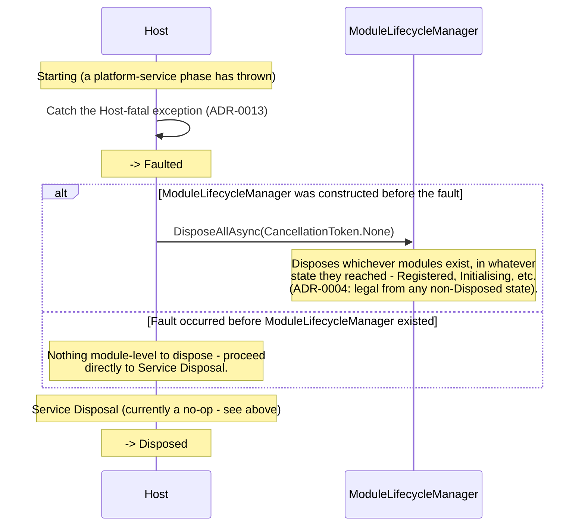

# Shutdown Sequence

**Status: architecture only. No production code exists yet.**

## Overview

Shutdown has two entry points, not three, since ADR-0018: a **controlled
shutdown** via `Stopping` — entered either from `Running` (a graceful,
post-startup shutdown request) or from `Starting` (startup cancellation, or an
early shutdown request arriving before `Running` is reached — ADR-0018,
resolving what was previously an open question) — and a **post-fault
teardown**, entered only when a genuine platform-service failure aborts
startup (ADR-0013), going directly to `Faulted` rather than through
`Stopping`. Both converge on the same underlying steps — Module Disposal,
then Service Disposal — but the controlled-shutdown path uses one, single,
shared procedure regardless of which state it was entered from, while the
post-fault path is a separate, distinct case (a fault is not a cancellation or
a shutdown request, and is never routed through `Stopping`).

## Sequence Diagram

```mermaid
sequenceDiagram
    participant Host
    participant Lifecycle as ModuleLifecycleManager
    participant Registry as RuntimeModuleManager
    participant Provider as TempestServiceProvider
    participant Logger as ILogger

    Note over Host: Running (graceful path) OR Starting (cancelled/early<br/>shutdown request - ADR-0018) - this diagram is identical either way
    Host->>Host: Shutdown request, or startup cancellation, observed
    Note over Host: -> Stopping

    Host->>Lifecycle: StopAllAsync(shutdownToken)
    Note over Lifecycle: Modules stopped in descending Id order.<br/>Individual failures isolated (WP 2.3): logged,<br/>marked Failed, does not abort the batch.
    Lifecycle-->>Host: (returns; some modules may have failed to stop cleanly)

    Host->>Lifecycle: DisposeAllAsync(CancellationToken.None)
    Note over Lifecycle: Disposal is attempted for every module<br/>regardless of Stop outcome (ADR-0004) -<br/>including modules that never started at all.
    Lifecycle-->>Host: (returns; individual disposal failures isolated)
    Note over Host: Module Disposal complete

    Host->>Provider: (Service Disposal - see note)
    Note over Provider: No IDisposable/IAsyncDisposable exists on<br/>ConfigurationProvider, LoggerFactory, ConsoleLogSink,<br/>or TempestServiceProvider today - this step is<br/>currently a no-op, defined for when it isn't (see<br/>Architectural Debt Assessment, WP 2.7 Academy review).
    Note over Host: Service Disposal complete

    Host->>Logger: Information("Shutdown complete")
    Note over Logger: Best-effort - a sink failure here must not<br/>prevent Host Disposed from being reached (see<br/>Failure Behaviour.md, "Logging failure").

    Note over Host: -> Stopped -> Disposed
```

## Post-Fault Teardown (Startup Failure)



## Cancellation During Shutdown

`StopAllAsync`/`DisposeAllAsync` each accept a `CancellationToken` (WP 2.3).
The shutdown sequence above passes `CancellationToken.None` to
`DisposeAllAsync` deliberately: **disposal must always be attempted to
completion, even if the shutdown-triggering signal itself was a cancellation**
— an operator asking the platform to stop should not also be able to
interrupt cleanup halfway through and leave resources unreleased. This is a
new, explicit clarification, not previously stated at the `ModuleLifecycleManager`
level (WP 2.3 supports passing any token to `DisposeAllAsync`; it does not, by
itself, mandate which one a caller should choose) — the Host's own sequence is
the first place this policy is decided.

`StopAllAsync`, by contrast, is passed the shutdown token — if a second,
more urgent signal arrives while modules are still stopping (an operator
escalating from "please stop" to "stop now"), that token can still observe it
and the batch aborts early (WP 2.3's existing `OperationCanceledException`
propagation), after which the Host proceeds directly to `DisposeAllAsync`
regardless — disposal is never skipped, only Stop may be cut short.

## Exception Handling

- Individual module Stop/Dispose failures: already isolated by
  `ModuleLifecycleManager` (WP 2.3) — logged, marked `Failed`, batch continues.
  No Host-level handling needed.
- A genuine Host-level defect during shutdown orchestration itself (not a
  module failure) is logged and does not prevent the sequence from reaching
  `Host Disposed` — every remaining step is still attempted; see *Failure
  Behaviour.md*, "Shutdown exception."
- Logging itself failing during shutdown must not prevent `Host Disposed`
  from being reached — see *Failure Behaviour.md*, "Logging failure," and the
  Architectural Debt Assessment (WP 2.7 Academy review) regarding the current
  gap between this requirement and `Logger`'s actual implementation.

## Final Termination

`Host Disposed` is the sequence's terminal point — see *Runtime State
Machine.md*. No further transitions are possible; a subsequent run requires a
new `TempestHost` instance — restart is not supported, decided by ADR-0015,
*Runtime Hosts Are Not Restartable*.
