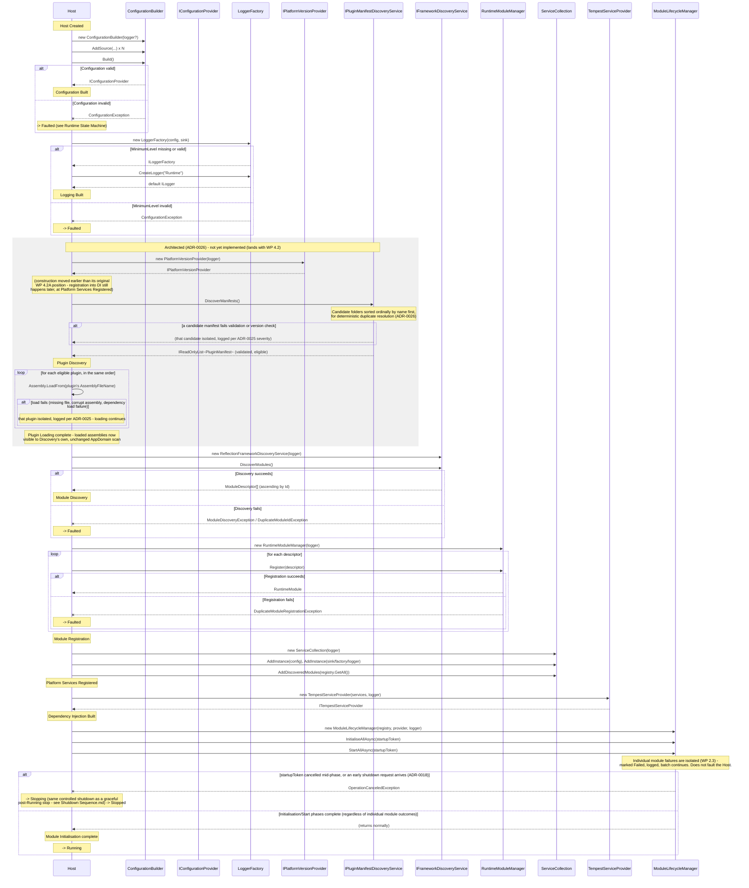

# Startup Sequence

**Status: implemented — WP 2.7B (`Tempest.Core.Runtime`).** `TempestHost.RunAsync`
implements this sequence, including its cancellation and failure paths,
exactly as diagrammed below.

**Update, WP 4.2C:** the Plugin Discovery / Plugin Loading steps shown
between Logging Built and Module Discovery are architected — ADR-0026 —
but not yet implemented; they land with Plugin Manifest (`WP 4.2`).

## Relationship to *The Startup Sequence* (Academy)

`docs/academy/02 Runtime Architecture/02-the-startup-sequence.md` already
documents the Configuration → Logging → DI portion of this sequence in
narrative form, with its own reasoning (why "freeze" is conceptual, why
logging slots in where it does). This document is that sequence's complete,
diagrammatic superset — it starts from the same steps, then continues through
Discovery, Registration, Module Initialisation, Running, and every failure
path, which the Academy document deliberately left collapsed into a single
"Runtime starts" step. The two documents must agree with each other; this one
extends the Academy one, and does not contradict it — see ADR-0011 for the one
place a literal reading of an illustrative phase order needed correcting.

## Sequence Diagram

## Notes on the Diagram

- Every `--x` arrow (an exception crossing back to the Host) is Host-fatal per
  ADR-0013, **except** individual module failures inside
  `InitialiseAllAsync`/`StartAllAsync`, which `ModuleLifecycleManager` already
  isolates internally and which never reach the Host as an exception at all —
  the Host only ever observes those via `IModuleLifecycleManager.GetState`/`Modules`
  afterward, not as a thrown exception during this sequence — and **except**
  `OperationCanceledException`, which is never a fault (ADR-0013, ADR-0018)
  and always routes to `Stopping`, never `Faulted`.
- The startup `CancellationToken` (ADR-0014) is threaded through every
  `async` call in this diagram, not only the lifecycle calls shown — omitted
  from the other steps above for readability, since none of Configuration,
  Logging, Discovery, or Registration currently perform genuinely
  cancellable work.
- `AddDiscoveredModules` and the `AddInstance` calls for configuration/logging
  all happen against the *same* `ServiceCollection`, before it is ever handed
  to `TempestServiceProvider`'s constructor — see ADR-0011 for why this
  ordering is load-bearing, not incidental.
- Plugin-scoped failures (a malformed manifest, an incompatible version, a
  missing or corrupt assembly) never appear as a `--x` arrow to the Host in
  this diagram — per ADR-0025, they are isolated to that one plugin,
  logged at their assigned severity, and excluded, exactly how an
  individual module's failure never appears as a thrown exception during
  Module Initialisation either. Only a genuine defect in Plugin
  Discovery's or Plugin Loading's own orchestration is Host-fatal.

## Failure Paths Summary

| Phase | Exception(s) | Outcome |
|---|---|---|
| Configuration Built | `ConfigurationException` | Host-fatal → `Faulted` |
| Logging Built | `ConfigurationException` | Host-fatal → `Faulted` |
| Plugin Discovery — per-plugin (malformed manifest, duplicate identity, incompatible version) *(architected, ADR-0026)* | `InvalidPluginManifestException`, `DuplicatePluginIdException`, `IncompatiblePluginVersionException` | Isolated (ADR-0025) — that plugin excluded; phase continues |
| Plugin Discovery — Host-level defect *(architected, ADR-0026)* | (unattributable internal exception) | Host-fatal → `Faulted` |
| Plugin Loading — per-plugin (missing/corrupt assembly, dependency load failure) *(architected, ADR-0026)* | `PluginAssemblyNotFoundException`, `PluginAssemblyLoadException` | Isolated (ADR-0025) — that plugin excluded; phase continues |
| Plugin Loading — Host-level defect *(architected, ADR-0026)* | (unattributable internal exception) | Host-fatal → `Faulted` |
| Module Discovery | `ModuleDiscoveryException`, `DuplicateModuleIdException` | Host-fatal → `Faulted` |
| Module Registration | `DuplicateModuleRegistrationException` | Host-fatal → `Faulted` |
| Platform Services Registered | `ArgumentException` (malformed registration) | Host-fatal → `Faulted` |
| Dependency Injection Built | (not expected to throw under normal conditions) | — |
| Module Initialisation — individual module | (isolated internally by `ModuleLifecycleManager`) | Module `Failed`; Host continues to `Running` |
| Module Initialisation — startup cancelled, or early shutdown request | `OperationCanceledException` | Host-fatal: no — `Starting → Stopping → Stopped` (ADR-0018), same procedure as a graceful shutdown |

See *Failure Behaviour.md* for the full failure model, including shutdown-time
and logging-time failures this diagram does not cover.
