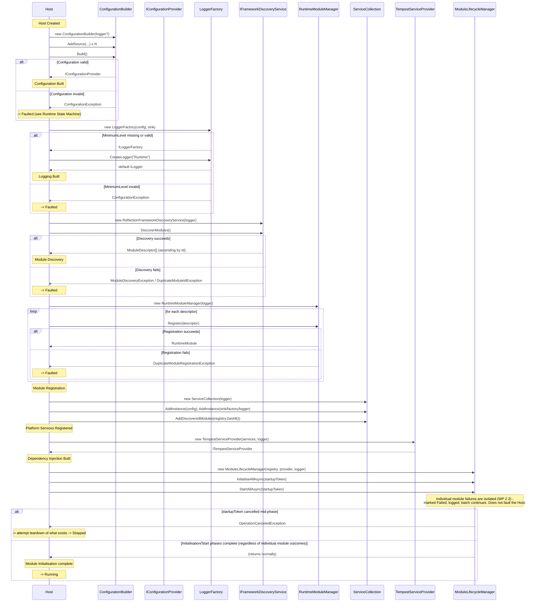

# Startup Sequence

**Status: architecture only. No production code exists yet.**

## Relationship to *The Startup Sequence* (Academy)

`docs/academy/02 Runtime Architecture/02-the-startup-sequence.md` already
documents the Configuration → Logging → DI portion of this sequence in
narrative form, with its own reasoning (why "freeze" is conceptual, why
logging slots in where it does). This document is that sequence's complete,
diagrammatic superset — it starts from the same steps, then continues through
Discovery, Registration, Module Initialisation, Running, and every failure
path, which the Academy document deliberately left collapsed into a single
"Runtime starts" step. The two documents must agree with each other; this one
extends the Academy one, and does not contradict it — see ADR-0011 for the one
place a literal reading of an illustrative phase order needed correcting.

## Sequence Diagram

## Notes on the Diagram

- Every `--x` arrow (an exception crossing back to the Host) is Host-fatal per
  ADR-0013, **except** individual module failures inside
  `InitialiseAllAsync`/`StartAllAsync`, which `ModuleLifecycleManager` already
  isolates internally and which never reach the Host as an exception at all —
  the Host only ever observes those via `IModuleLifecycleManager.GetState`/`Modules`
  afterward, not as a thrown exception during this sequence.
- The startup `CancellationToken` (ADR-0014) is threaded through every
  `async` call in this diagram, not only the lifecycle calls shown — omitted
  from the other steps above for readability, since none of Configuration,
  Logging, Discovery, or Registration currently perform genuinely
  cancellable work.
- `AddDiscoveredModules` and the `AddInstance` calls for configuration/logging
  all happen against the *same* `ServiceCollection`, before it is ever handed
  to `TempestServiceProvider`'s constructor — see ADR-0011 for why this
  ordering is load-bearing, not incidental.

## Failure Paths Summary

| Phase | Exception(s) | Outcome |
|---|---|---|
| Configuration Built | `ConfigurationException` | Host-fatal → `Faulted` |
| Logging Built | `ConfigurationException` | Host-fatal → `Faulted` |
| Module Discovery | `ModuleDiscoveryException`, `DuplicateModuleIdException` | Host-fatal → `Faulted` |
| Module Registration | `DuplicateModuleRegistrationException` | Host-fatal → `Faulted` |
| Platform Services Registered | `ArgumentException` (malformed registration) | Host-fatal → `Faulted` |
| Dependency Injection Built | (not expected to throw under normal conditions) | — |
| Module Initialisation — individual module | (isolated internally by `ModuleLifecycleManager`) | Module `Failed`; Host continues to `Running` |
| Module Initialisation — startup cancelled | `OperationCanceledException` | Host attempts teardown → `Stopped` (not `Faulted`) |

See *Failure Behaviour.md* for the full failure model, including shutdown-time
and logging-time failures this diagram does not cover.
